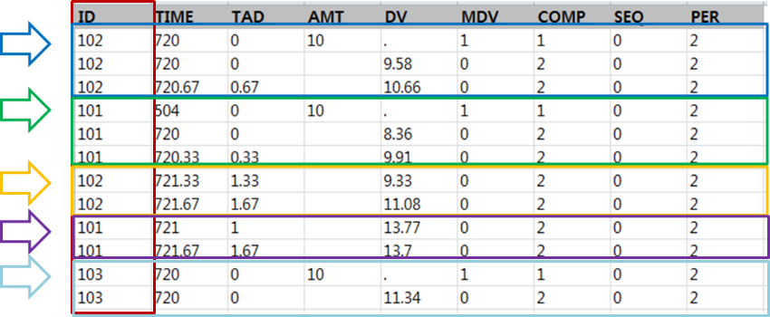

# NONMEM 데이터셋 {#nonmem-dataset}

\Large\hfill
이소진
\normalsize

---

NONMEM을 사용할 때 필수적으로 갖추어야 하는 파일이 몇 가지 있다. 그 중에 가장 우선적으로 만들어야 하는 파일은 데이터셋 또는 데이터 파일이다. 이 단원에서는 제어구문 파일에서 데이터셋을 어떻게 불러들여오는지에 대한 필수 제어구문 작성 방법, 데이터셋 작성 방법, 그리고 각각의 구성 요소들 (항목 또는 데이터 항목)에 대해 설명하고자 한다.

## 필수 제어구문 작성 방법

제어구문 파일의 작성시 모델링을 위한 본격적인 제어구문 작성에 앞서, 기본적으로 파일의 제목과 사용할 데이터셋, 그리고 데이터셋의 구성 내용을 설명해주는 제어구문이 필요하다. 이는 각각 \$PROB, \$DATA, \$INPUT 레코드에 작성하며, 이는 제어구문 파일의 맨 앞 세 줄로 각각 한 줄씩 기입한다. (코드 \@ref(exm:input))\index{\$DATA}\index{\$INPUT}

### \$PROB 레코드 작성

제어구문 파일 첫 줄의 필수 제어구문은 \$PROBLEM 으로 사용자가 전체 파일에 대한 제목 또는 서술적 명칭을 붙이는 공간이다. 모델을 점점 더 복잡하게 만드는 과정에서 제어구문 파일마다 \$PROBLEM 레코드에 새로운 목적 또는 모델에 대한 설명을 남겨놓는 것이 모델링 과정을 정리함에 있어 도움이 된다.\index{\$PROBLEM}

### \$DATA 레코드 작성
\index{\$DATA}

\$DATA는 NONMEM이 분석에 사용해야 할 데이터셋이 어디에 있는지, 파일 이름이 무엇인지, 어떤 형식의 파일인지 나타낸다. 데이터 파일 이름을 적고, 파일 경로 또는 하부 경로 구분 표시를 필요에 따라 표기한다(예를 들어 파일 이름 앞에 `../` 를 표기할 경우, 이는 제어 데이터셋 하위 폴더에 있음을 의미하며, `../` 가 없이 바로 파일 이름을 기입할 경우, 이는 제어구문 파일과 데이터셋이 동일한 폴더 안에 있음을 나타낸다). 데이터셋의 첫번째 행은 데이터 항목 레이블을 기재하는 줄이며 이는 문자로 구성된다. 데이터셋에서 문자로 구성된 부분을 제거하는 것이 필요하며, 이를 위하여 대게 `IGNORE=@` 또는 `IGNORE=#`을 파일 이름 뒤에 기재하여 문자가 포함된 행을 제거한다. 또한, 부가적인 옵션인 IGNORE 또는 ACCEPT를 사용하여 데이터를 부분집합화(Subsetting) 시켜, 데이터셋의 원하는 부분을 선택적으로 불러들여올 수 있다 (예를 들어 성별이 1 이거나 나이가 60 세 이상인 대상자의 데이터를 제거하고자 할 경우, `IGNORE=(GEN.EQ.1,AGE.GE.60)` 구문을 사용하여 가능하다).\index{\$DATA}\index{ACCEPT}\index{IGNORE}

```{r tab}
tab <- readxl::read_excel('data-raw/02-table-01.xlsx') %>% 
  mutate(DV = round(as.numeric(DV), 4)) %>%
  mutate(DV = ifelse(is.na(DV), '.', DV))
knitr::kable(tab, caption = "제어구문에 적합한 데이터셋의 예", booktabs=TRUE)
```

### \$INPUT 레코드 작성
\index{\$INPUT}

\$INPUT 레코드에는 데이터셋에 기재된 데이터 항목의 종류와 순서를 명시한다. 이를 우리가 작성한 데이터셋을 NONMEM 이 올바르게 읽도록 도와준다. 데이터셋에 모델링에 필요하지 않은 데이터 항목이 있을 경우, 변수 뒤에 `=DROP` 이라는 한정어를 써주어 해당 항목을 제거할 수 있다. \$DATA 레코드에서 "IGNORE" 또는 "ACCEPT" 구문을 사용하여 데이터를 제거 또는 선택하는 과정은 \$INPUT 에서 `=DROP`을 사용하여 불필요한 항목을 제거하는 과정보다 먼저 실행된다. 데이터셋 작성 시 기존 NONMEM에 내장된 데이터 항목 레이블 이외의 다른 이름을 사용할 경우, "내장된 변수명=새 이름" (예를 들어, AMT=DOSE) 구문을 사용하여 내장된 레이블 명(예를 들어, AMT)을 사용자가 지정한 이름(예를 들어, DOSE)으로 대체할 수 있다.\index{\$DATA}\index{\$INPUT}\index{ACCEPT}\index{AMT}\index{DROP}\index{IGNORE}

\index{\$INPUT}\index{AMT}\index{ID}\index{MDV}\index{TIME}\index{\$DATA}\index{IGNORE}
```{example, input, echo=TRUE}
\$PROB, \$DATA, \$INPUT 제어구문 작성의 예\index{\$DATA}\index{\$INPUT}
```
\vspace{-5ex}
```perl
$PROB HO_IV_1comp
$DATA ../HOdata_IV.csv IGNORE=@
$INPUT ID TIME AMT DV MDV SEX AGE WT HT
```

## PREDPP에 쓰는 데이터셋
\index{PRED}\index{PREDPP}

PREDPP는 집단 약동학 데이터 분석에 적합하도록 NONMEM Project Group 이 제작한 NONMEM subroutine 인 PRED의 일반적인 편리한 버전이며, PRED Population Pharmacokinetics 를 줄인 말로 PREDPP 라고 불리운다. PREDPP Library의 subroutine (예를들어 ADVAN1, ADVAN2, ADVAN3 등)을 선택하여 사용자는 원하는 기본 모델을 선택할 수 있다.\index{ADVAN1}\index{ADVAN2}\index{ADVAN3}\index{PRED}\index{PREDPP}

PREDPP를 사용할 경우, 데이터셋 작성 시 반드시 고려해야하는 사항이 있다. 데이터는 시간 순차적 이벤트(time-ordered events) 로서 투약 이벤트(dosing event) 와 관측 이벤트(observation event)로 만들어져 있다. 투약과 관측 정보는 같은 레코드(또는 같은 행)에 적을 수 없으며, 각각 다른 레코드로 기입한다. 각 데이터 레코드 당 이벤트가 일어난 시간을 반드시 입력해야 한다. 또한, 실제 이벤트가 일어난 순서와 데이터셋에 기입된 데이터 레코드 순서는 동일해야 한다 (만약 투약 이벤트가 관측 이벤트 보다 먼저 일어난 경우, 투약 이벤트 레코드를 먼저 기입하고 그 다음 관측 이벤트 레코드를 기입한다). 반면, PRED를 사용할 경우, 투약 레코드와 관측 레코드는 따로 구분하여 작성하지 않으며, 투약 용량(AMT)을 모든 데이터 레코드들에 마치 공변량과 같이 기재해 준다. 이번 단원에서는 PREDPP 용 데이터셋을 작성하는 법을 설명한다.\index{AMT}\index{PRED}\index{PREDPP}

\index{PRED}\index{PREDPP}
```{r pred-predpp, fig.cap = "Comparison between dataset for PRED and PREDPP"}
knitr::include_graphics("figures/02-fig-02.png")
```

## 데이터셋 소개

데이터셋은 다양한 프로그램으로 만들 수 있다. 대게 excel을 사용하여 CSV 파일로 만들며, 복잡하거나 양이 많은 데이터의 경우 R과 같은 소프트웨어를 사용하여 데이터를 정리하여 데이터셋을 생성할 수 있다. 데이터셋은 여러가지 변수로 구성된다. 데이터셋 변수(Variables of the dataset)는 다른 말로 데이터 항목(Data item) 이라고도 부른다. 이 중, 집단모델링을 위해 데이터셋에 필수적으로 포함되어야 하는 변수가 존재한다. 예를 들어 PREDPP를 이용할 때 ID, DV, TIME, AMT는 데이터셋에 필수적으로 갖추어야하는 변수들이다.\index{집단모델 / population model}\index{dependent variable(DV) / 종속변수(DV)}\index{population model / 집단모델}\index{AMT}\index{ID}\index{PRED}\index{PREDPP}\index{TIME}

많이 쓰이는 기본적인 데이터셋의 형태는 그림 \@ref(fig:NONMEM-dataset)과 같다. 첫 행은 데이터 항목의 이름을 기재하며 이를 데이터 항목 레이블(Data item label)이라고 부른다. 첫 행에는 ID, TIME, AMT, DV, MDV 순으로 데이터 항목이 기재되어 있다. 모든 데이터는 ID 별, TIME 별 오름차순으로 정렬하며, 각각의 이벤트 또는 결과값을 기재하고 이를 데이터 레코드 (Data record) 라고 부른다. 하나의 행에는 한 시점에 해당하는 하나의 이벤트(Event)를 기록한다.\index{dependent variable(DV) / 종속변수(DV)}\index{AMT}\index{ID}\index{MDV}\index{TIME}

```{r NONMEM-dataset, fig.cap="Basic example of dataset for NONMEM"}
knitr::include_graphics("figures/02-fig-03.png")
```

## 데이터셋 배열

데이터 레코드는 두 종류로 나뉜다. 하나는 투여한 용량 정보를 나타내는 투약 레코드(Dosing record)이며, 다른 하나는 시간에 따른 약동학 또는 약력학 데이터로 관측 레코드(Observation record) 라고 부른다. 각 대상자별 데이터 레코드 기입 시, 투약 레코드와 관측 레코드를 시간에 따라 순차적으로 입력한다. NONMEM 은 데이터셋을 정렬하는 기능이 없으므로, 일정한 순서(ID 별, TIME 별 순차적으로) 로 정리하여 기입하는 것이 중요하다. 만약, 데이터셋 작성시 시간에 따라 순차적으로 기입을 하지 않는다면, NONMEM에서 모델링 수행 시 에러가 나게 된다.\index{ID}\index{TIME}

NONMEM은 아스키코드를 인식하기 때문에 데이터 레코드 입력 시 숫자만을 사용해서 기입해야 한다. 그림 \@ref(fig:example-dataset)에서 첫 번째 열에 기입된 데이터 항목인 ID 를 살펴보면, ID 앞에 #을 추가한 것을 볼 수 있다. 이와 같이 데이터 항목 레이블 앞에 #을 쓰는 명령문은 '#이 기입된 행을 무시하라' 라고 해석될 수 있다. 또한, 데이터 값이 없는 Null 데이터와 같은 경우는 해당 값이 없으므로 작성시 "." 으로 표현할 수 있다. 만약, 빈칸으로 남겨두게 되면, 아직 기입을 하지 않은 값인지 또는 존재하지 않는 값인지 헷갈릴 수 있기 때문에 대부분의 경우 null 데이터를 "."로 표현하는 것을 추천한다. 이전 NONMEM의 버전에서는 데이터 항목의 수와 데이터 레코드 수에 제한이 있었으나, version 7.2 부터는 그 수에 제한이 없다.\index{ID}

```{r example-dataset, fig.cap = "Example of dataset", out.width="50%"}
knitr::include_graphics("figures/02-fig-04.png")
```

데이터 항목 레이블 명명 시 간단한 규칙이 있다. NONMEM 7 에서부터 레이블은 알파벳 1-24 자 (A-Z), 숫자 (0-9), 그리고 "\_"를 사용해서 만들 수 있다. 단, 첫째 글자는 알파벳이 라야 한다. 데이터셋 상의 데이터 항목 순서는 사실 중요하지 않다(예를 들어, ID를 첫 열에 기입할지 또는 TIME을 첫 열에 기입할지 등). 다만 모든 데이터 레코드는 사용자에 의해 일정하게 약속된 데이터 항목 순으로 기입되어야 하며, 제어구문 파일의 \$INPUT 레코드 작성 시 해당 순서에 따라 데이터 항목 레이블을 기입해주면 된다. 데이터 항목 레이블 행은 각 열을 명시함으로써 사용자가 입장에서 데이터를 알아보기 편하도록 삽입한 것이라고 볼 수 있다.\index{\$INPUT}\index{ID}\index{TIME}

NONMEM 실행 시 데이터셋을 불러들여올 때, 데이터 항목 레이블 행 (첫 행)은 불러들이지 않으며, 이는 크게 두 가지 방법으로 가능하다. 첫째로, 데이터셋의 데이터 항목 레이블 행의 첫 열에 #를 추가 (예를 들어, #ID)하여 데이터 항목 레이블 행을 제거할 수 있다. 이 경우, 제어구문 파일에 별도의 제어구문을 작성할 필요는 없다. 두번째로 제어구문 파일 \$DATA 레코드에 IGNORE 구문을 사용하여 데이터 항목 레이블 행을 제거할 수 있다. `IGNORE=@`을 사용하면 알파벳으로 시작되는 데이터 레코드 행이 제거되며, `IGNORE=#` 명령문을 삽입하고, 데이터셋에 #을 데이터 항목 레이블 행의 첫 열에 추가(예를 들어, #ID)하면 데이터 항목 레이블 행을 제거할 수 있다.\index{\$DATA}\index{ID}\index{IGNORE}

각각의 데이터 항목에 대해 아래 설명되어 있다. 데이터 항목은 NONMEM이 인식하는 이미 지정 된 이름으로 설정하여 작성한다. 이와 같은 변수의 이름은 사용자와 NONMEM이 이미 약속하여 사용하는 것이며, 데이터셋에 새 변수를 추가하고자 할 때 이미 지정된 이름은 사용하지 않는 것을 추천한다.

## 지정된 데이터 항목 레이블 Reserved Labels

NONMEM 에서는 이미 약속하여 쓰는 데이터 항목의 이름들이 있다. (표 \@ref(tab:reserveditems)) 대상자 인식 번호, 관측값, 관측값의 존재 유/무, 시간, 용량, 투여속도, 추가 투여 횟수, 투여 간격, 항정 상태 도달 유/무, 구획을 각각 ID, DV, MDV, TIME, AMT, RATE, ADDL, II, SS, CMT 로 명시하여 쓰게 된다.\index{dependent variable(DV) / 종속변수(DV)}\index{ADDL}\index{AMT}\index{CMT}\index{ID}\index{MDV}\index{RATE}\index{SS}\index{TIME}

```{r reserveditems}
readxl::read_excel("data-raw/fig-tab.xlsx", sheet='16', range="B2:D12") %>% 
  knitr::kable(caption="List of reserved (pre-defined) data item labels",
               booktabs=TRUE) %>%
  column_spec(1, width = "2cm") %>% 
  column_spec(2, width = "2cm") %>% 
  column_spec(3, width = "8cm")
```

### ID
\index{ID}

ID는 대상자를 식별하기 위해 반드시 필요한 변수이다. 보통 임상 시험에서는 환자 고유 식별 번호를 알파벳을 넣어 부여하지만 NONMEM 데이터셋 작성시 아이디는 항상 숫자로 적어준다. ID는 오름차순으로 연속적으로 배열하는 것이 가장 이상적이며, 개인의 기록은 시간순으로 정렬한다. 따라서 ID 별, TIME 별 오름차순으로 정렬한 데이터 셋이 가장 많이 쓰인다. 그림 \@ref(fig:id-dataset)과 같이 앞에 사용된 같은 ID가 연속적으로 배열되지 않고 뒤에 다시 나오는 경우(예를 들어 그림 \@ref(fig:id-dataset)의 ID=101, 102), 이는 동일한 사람으로 인식되지 않으며 다른 사람으로 취급된다. 즉, NONMEM 은 ID=101, 102, 103 를 3명으로 인식하지 않고, 5명으로 인식한다. 따라서 같은 대상자의 데이터 레코드는 같이 그룹화하여 기입해주어야 한다.\index{ID}\index{TIME}

\index{ID}
```{r id-dataset, fig.cap="Example of dataset with noncontinuous ID arrangement (NOT appropriate)"}

```

### DV

DV는 Dependent Variable을 뜻하며 데이터셋 구성 시 필수적인 변수이다. DV는 관측값을 기입하는 데이터 항목으로, PK 또는 PD 관측값을 기입한다. PK 모델링시 DV는 우리가 임상시험에서 얻은 원 데이터(raw data)의 약물 농도 값이며, PD 모델링시 DV는 효력 파라미터의 관측값을 나타낸다. 데이터셋에 구획(CMT) 이라는 변수를 추가하여 PK 와 PD 관측값에 구획을 지정할 수 있다. 이를 통해 동일 데이터셋에 PK와 PD 데이터를 함께 나타낼 수 있다. 하나의 데이터 레코드는 하나의 관측값을 가진다. 용량 정보를 나타내는 투약 레코드에서 DV 값은 존재하지 않으며 빈칸 또는 "." 으로 처리한다. 관측 레코드에서는 DV 값이 존재하는 경우 관측값을 기재하고, 관측값이 존재하지 않을 경우 빈칸 또는 "."으로 처리한다.\index{dependent variable(DV) / 종속변수(DV)}\index{CMT}

### MDV
\index{MDV}

MDV는 Missing Dependent Variable(결측치)을 뜻하며 데이터 레코드에 관측값이 존재하는가를 나타내는 변수이다. 결측치가 존재할 경우, 즉 관측값이 없는 경우, MDV 는 1로 처리된다. 대표적인 예로 투약 레코드 작성 시, 해당 시간에서의 관측값은 존재하지 않는 경우가 대부분이다. 따라서 MDV 는 1로 기입된다. 결측치가 존재하지 않을 경우, 즉 관측값이 존재하는 경우, MDV 는 0으로 처리된다. 예를 들어 관측 레코드 작성 시, 약물농도 관측값이 있는 경우 이를 DV에 기재하고 MDV는 1로 처리한다.\index{dependent variable(DV) / 종속변수(DV)}\index{MDV}

PREDPP 사용시 MDV는 데이터셋에서 필수적으로 필요한 변수는 아니며, MDV가 없이 데이터셋이 작성되어 모델링이 수행되었을 경우, NONMEM 에서는 MDV 값을 자체적으로 생성하여 부여한다.\index{MDV}\index{PRED}\index{PREDPP}

### EVID
\index{EVID}\index{ID}

EVID는 EVent Identification Data를 뜻하며 데이터 레코드의 유형에 대해 설명해 주는 변수이다. 데이터셋에 꼭 들어가야 하는 변수는 아니다. 데이터셋 내에 EVID 변수를 포함시키지 않았을 경우, 모델링 수행 시 NONMEM은 이를 자동으로 생성하여 부여한다. 이는 실행결과(output) 파일에서 확인이 가능하다. EVID 변수는 인위적으로 농도가 재설정되는 경우에 쓸 수 있다. 예를 들어, 교차 시험에서 두 기간(period) 간의 농도가 중첩되지 않는 경우 사용할 수 있다. EVID 관련해서는 NONMEM Users Guide - Part V의 EVID Data Item 섹션에 자세히 설명되어 있다.\index{EVID}\index{ID}

### TIME
\index{TIME}

TIME은 시간을 나타내며, 모든 데이터 레코드에 해당 값을 기재해 주어야하는 변수이다. 이전에는 음의 값을 가질 수 없었지만, NONMEM 7.4부터는 음의 값을 가질 수 있다. 그림 \@ref(fig:time-dataset)와 같이 데이터셋 작성 시 대상자 별로 시간이 순차적으로 증가하는 순서로 기입해야 하며, 감소하거나 뒤섞인 순서로 기입을 해서는 안된다(다만, 재설정 되는 투약 이벤트가 있는 경우는 예외일 수 있다).\index{TIME}

TIME 은 십진법시간(Nominal time) 또는 시계시간(Clock time) 으로 작성될 수 있으며, 일정한 형식으로 통일하여 작성한다. 시계시간으로 기재 시 NONMEM Data Preprocessor 가 이를 자동적으로 십진법시간으로 변환하여 사용한다. 데이터셋에서 작성되는 TIME의 첫번째 데이터 레코드는 0 또는 0이 아닌 숫자로 기입이 가능하며, 0이 아닐 경우 PREDPP에서는 다른 레코드의 TIME과의 차를 구하여 상대적인 시간(relative time)을 산출하여 사용한다.\index{PRED}\index{PREDPP}\index{TIME}

TIME 외에 DATE라는 날짜를 기입하는 데이터 항목을 추가하여 사용할 수 있다. 이는 데이터셋 작성 시 필수적인 변수는 아니지만, 여러 날에 거친 이벤트 레코드를 기입하기에 유용하다. 데이터 항목 레이블의 변수 이름은 DATE, DAT1, DAT2, DAT3로 지정되어 있으며, 코드 \@ref(exm:date-dataset-chunk)과 같이 해당 변수명에 따라 날짜에 대해 특정 기입 형식을 따른다. DATE 변수를 추가하여 데이터셋에 달력 날짜를 기입하였을 경우(구분자로 / 또는 - 사용) 제어구문 파일의 \$INPUT에 반드시 `DATE=DROP`이라는 제어구문을 입력해야 한다. 이로써 숫자가 아닌(non-numeric) 구분자가 포함된 DATE를 Data Preprocessor가 받아들이지 않도록 제거해야 한다, 제거하지 않을 경우 에러가 일어난다.\index{\$INPUT}\index{DAT1}\index{DAT2}\index{DAT3}\index{DATE}\index{DATE=DROP}\index{DROP}\index{TIME}

\index{TIME}
```{r time-dataset, fig.cap="Example of TIME in dataset - Allowed(sequential) vs. NOT allowed(non-sequential)"}
knitr::include_graphics("figures/02-fig-07.png")
```

```{example, date-dataset-chunk, echo=TRUE}
DATE label and its format\index{DATE}
```
\vspace{-5ex}
```r
DATE  month day year
DAT1  day month year
DAT2  year month day
DAT3  year day month
```
\index{DATE}\index{DAT1}\index{DAT2}\index{DAT3}

### AMT
\index{AMT}

AMT, RATE, ADDL, II, SS는 용량과 관련된 데이터 항목들이다.\index{ADDL}\index{AMT}\index{RATE}\index{SS}

AMT는 Amount를 의미하며 투여된 양을 나타내는 변수로서, 투여 레코드에 기록한다. 용량 정보를 표현하기 위해 AMT 와 함께 RATE, ADDL, SS, II 와 같은 데이터 항목을 사용하여 용량 정보를 구체적으로 나타낼 수 있다(투여 경로는 CMT 데이터 항목을 사용하여 나타낼 수 있다).\index{ADDL}\index{AMT}\index{CMT}\index{RATE}\index{SS}

AMT는 양의 숫자로 기입되야 하며, 모든 투여 레코드에 대해 일관된 단위로 기입되어야 한다. 투여 레코드에는 투여된 용량이 존재함으로 AMT 값이 항상 존재하지만, 관측 레코드에서는 AMT 값은 존재하지 않는 결측치로 표시되어야 한다 (즉, 결측치를 의미하는 `.` 또는 빈칸으로 처리해야 한다).\index{AMT}

AMT 작성 시, 투여 용량의 단위와 관측된 약물 농도의 단위를 통일시켜야 한다. 이는 크게 두가지 방법으로 가능하다. 첫번째로, 데이터셋 안에서 AMT와 DV의 단위를 통일시키는 방법이 있다. 예를 들어, 투여 용량 단위가 mg이고, 약물 농도 단위가 ng/mL 인 경우, 투여 용량에 1000을 곱하여 데이터셋 AMT에 바로 기재할 수 있다. 두번째 방법은 제어구문 파일 작성 시 scaling factor 를 사용하여 수식을 기입하여 단위를 통일하는 방법이다. 예를 들어, 투여 용량 단위가 mg이고, 약물 농도 단위가 ng/mL 인 경우, 제어구문 파일에 `S=V/1000`을 기입하여 사용할 수 있다.\index{scaling parameter / 척도 파라미터}\index{scaling parameter / 척도 파라미터}\index{AMT}

### RATE
\index{RATE}

RATE 은 단위 시간 당 주입된 양(AMT per unit TIME)을 나타내며, 즉 정맥주입(infusion) 시 투여속도를 나타내는 변수이다. AMT와 함께 구체적인 투약 레코드를 나타내기 위해 사용되며, 투여속도를 나타내는 경우 양의 숫자로 기입된다. 그림 \@ref(fig:AMT-RATE)와 같이 약물 100 mg 을 한 시간동안 정맥 주입했을 경우 RATE 은 100 mg/h 가 된다. 만약, 약물 100 mg 을 30 분 동안 정맥주입 했을 경우 RATE는 100 mg/ 0.5 h 로 200 mg/h가 된다.\index{AMT}\index{RATE}\index{TIME}

\index{AMT}\index{RATE}
```{r AMT-RATE, fig.cap="Example of AMT and RATE in dataset - drug 100mg IV infusion over 1 hr vs. 0.5 h"}
knitr::include_graphics("figures/02-fig-09.png")
```

그 외 RATE는 0, -1, -2 의 값을 가질 수 있다. RATE가 0 인 경우는 투여경로가 정맥 주입이 아니라는 뜻이다. 만약, 정맥주사(bolus)와 정맥주입(infusion)이 함께 이뤄진 경우, 정맥주사 투약 레코드의 RATE는 0으로 기입한다. RATE가 -1 인 경우는 투여 속도를 예측하는 경우이며, 제어구문 파일 \$PK 부분 작성 시 해당 파라미터를 표현하는 제어구문을 작성해야 한다(예를 들어, `R1=THETA(1)`). 이 값은 이전 투약 레코드 시간과 현재 투약 레코드 시간 사이에 주입된 약물의 속도를 나타낸다. RATE가 -2 인 경우는 투여시간을 추정하고자 하는 경우이며, 위와 마찬가지로 제어구문 파일 작성 시 \$PK 부분에 해당 파라미터를 나타내는 제어구문을 작성해 주어야 한다(예를들어, `D1=THETA(1)`). 이 값은 약물의 투여 지속시간을 나타낸다. 이와 같이 약물 투여속도(rate) 와 투여 지속시간 (duration)은 다른 PK 파라미터들과 마찬가지로 모델링을 통해 예측될 수 있다.\index{\$PK}\index{D1}\index{R1}\index{RATE}

예를 들어, 시간에 따라 직선적으로 빠르게 증가하는 약물의 농도가 관측될 경우, 이는 0차 흡수를 보인다고 설명될 수 있으며 이를 설명하기 위해 데이터셋 상의 RATE를 -2로 기입하여, 투여 지속시간을 추정하는 경우가 많다.\index{RATE}

### ADDL & II
\index{ADDL}

ADDL(Additional Dose)은 이벤트 레코드의 시작시간부터 일정한 투여 간격을 두고 추가적으로 투여된 약물의 투여 횟수를 말한다 즉, 제일 첫 투여를 제외한 추가적인 투여 횟수를 나타낸다 (ADDL = N-1, N = 총 투여 횟수). 데이터셋 작성시, ADDL 은 II(Interdose Interval) 데이터 항목과 함께 사용되며, 이는 투여 시간간격을 나타낸다. 투여정보를 TIME과 AMT만으로 나타낼 경우, 한 번의 투여 이벤트당 하나의 투약 레코드를 작성하게 된다. 하지만, ADDL과 II를 함께 사용하여 투약정보를 작성할 경우, 여러 건의 투약 레코드를 한 줄의 투약 레코드로 표현할 수 있다.\index{ADDL}\index{AMT}\index{TIME}

그림 \@ref(fig:dosing-dataset)과 같이 예를 들어 ID 302 대상자에게 약물 10mg 을 24시간 간격(0시간부터 96시간 까지)으로 총 5회 투여했을 경우, 투약 레코드는 TIME과 AMT를 사용하여 다섯 줄로 설명 가능하다. 하지만, 같은 투약정보를 ADDL과 II를 사용하여 한 줄로, 24시간 간격으로 4번의 추가 용량을 투여(총 다섯 번 투여), 간단하게 나타낼 수 있다.\index{ADDL}\index{AMT}\index{ID}\index{TIME}

\index{ADDL}\index{AMT}\index{TIME}
```{r dosing-dataset, fig.cap = "Example of Dosing record in dataset - using TIME, AMT vs. using TIME, AMT, ADDL, II"}
knitr::include_graphics("figures/02-fig-10.png")
```

### SS
\index{SS}

SS(steady-state)는 시스템의 항정상태 도달 여부를 나타내며, 투약 레코드 기입에 쓰인다. SS는 0, 1, 또는 2의 값을 가질 수 있다. SS 가 0일 경우 항정상태가 아닌 경우의 투약을 나타내며, SS가 1 인 경우는 항정상태에서의 투약을 나타낸다. SS가 1인 경우 이전 투약기록을 모두 무시하고, 항정상태로 재설정하여 투약 정보를 전달한다. SS가 2인 경우는 항정상태를 나타내지만, 앞의 경우와는 다르게 이전 투약 레코드를 무시하지 않는다. 즉, 이 경우는 시스템을 재설정하지 않는다는 점이 다르다. 따라서 이전 투약 레코드와 현재 항정상태에서의 투약 레코드를 종합하여 시간에 따른 농도 값을 예측한다. 표 \@ref(tab:dosing-rec)에는 SS를 사용한 다양한 투약 레코드의 예시와 설명이 나와있다.\index{SS}

```{r dosing-rec}
readxl::read_excel("data-raw/fig-tab.xlsx", sheet='22', range="B2:H6") %>% 
  mutate(Description = gsub("\r\n", "", Description)) %>% 
  knitr::kable(caption = 'Example of various dosing records and its description',
               #format='markdown',
               booktabs=TRUE) %>% 
  column_spec(7, width = "6cm")
```

### CMT
\index{CMT}

CMT(compartment)는 구획을 지정해 주는 데이터 항목이며, 필수적인 항목은 아니다. 정맥 주입 후 투약과 관측이 기본 구획에서 일어나는 경우 CMT 데이터 항목은 필요하지 않다. 하지만, 예를 들어 PK 데이터와 PD 데이터를 함께 데이터셋에 입력하고자 한다면 데이터셋에 CMT 데이터 항목을 추가하여 PK 데이터 관측 구획과 PD 데이터 관측 구획을 따로 지정하여 구분시킬 수 있다.\index{CMT}

### Covariates

Covariates는 공변량이며 PK 또는 PD 파라미터에 영향을 주는 영향 인자라고 생각할 수 있다. NONMEM은 공변량에 대한 정보가 없으며, 이는 사용자가 공변량 분석(Covariate analysis) 과정을 통해 선정한다. 예를 들어 성별, 나이, 인종, 몸무게, BMI 또는 실험결과값 등을 공변량으로 선정할 수 있으며, 이 정보를 데이터셋에 포함시킬 수 있다. 데이터셋 내의 공변량 정보도 다른 데이터 레코드와 마찬가지로 숫자로 적어주어야 한다. 따라서, 예컨데 남자는 0, 여자는 1과 같이 기입한다.

---

2장은 다음 문헌을 전반적으로 참고하여 작성되었다. [@kelly; @nonmem]
