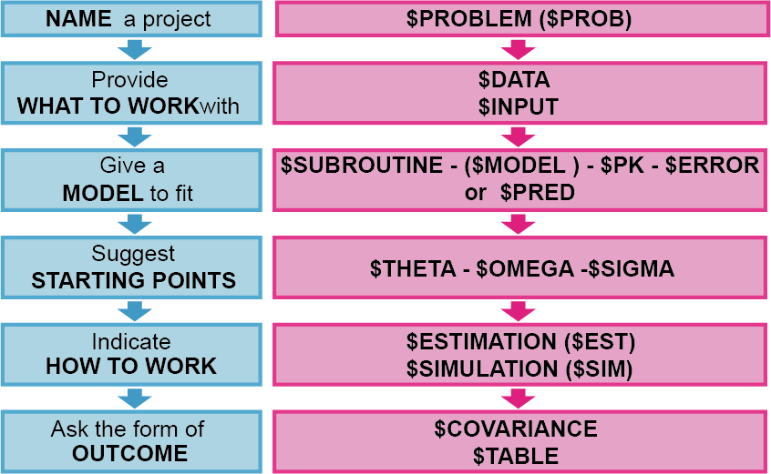
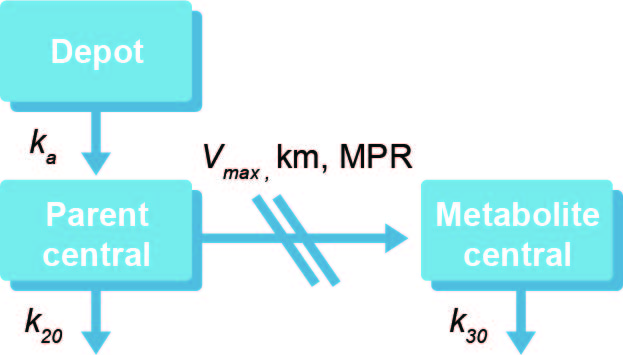

---
output:
  pdf_document: default
  html_document: default
---

# NONMEM 모델 종류 별 제어구문 소개 {#control-stream}

\Large\hfill
배수현
\normalsize

---

이 장에서는 NONMEM을 구동하기 위한 주요 요소들에 대하여 설명하고, 모델의 종류와 그에 따른 NM-TRAN 제어구문에 대하여 소개한다. NONMEM 시스템은 크게 NM-TRAN (NonMem TRANslator), PREDPP (PREDiction of Population Pharmacokinetic models), NONMEM (NONlinear Mixed Effect Models)의 3가지의 요소로 이루어져 있다. PREDPP는 집단약동학 모델링을 통한 특정 파라미터 추정을 위한 서브루틴이며, FORTRAN 서브루틴으로 구성되어 있다. NM-TRAN은 데이터셋과 적절한 FORTRAN을 차례로 호출하여 특정 모델을 실행시켜, 제어구문에 명시된 방법으로 다양한 결과를 출력할 수 있도록 해준다. NONMEM은 파라미터 추정을 위해 사용되는 비선형 혼합효과 모델을 일컫는다. NONMEM 실행을 위해서는 사용자가 직접 작성한 NM-TRAN 제어구문과 문법과 형식에 맞추어 작성된 데이터셋 파일이 필요하다.\index{NM-TRAN 제어구문 / NM-TRAN control stream}\index{NM-TRAN control stream / NM-TRAN 제어구문}\index{NM-TRAN control stream / NM-TRAN 제어구문}\index{FO}\index{NM-TRAN}\index{PRED}\index{PREDPP}

## 제어구문의 구성

NM-TRAN 제어구문(이하 제어구문)은 내장된 레코드와 일련의 코드 블록으로 이루어져 있다. 블록의 첫 시작은 `$`기호를 사용하여 사용할 레코드를 명시하고, 그와 관련된 코드를 나열하면 된다. 레코드의 명칭은 최소 세글자 이상이면 사용할 수 있다. 예를 들어, \$PROBLEM은 \$PROB, \$PRO로 줄여서 사용할 수 있다. 또한, NONMEM 7.2 이전 버전에서는 제어구문의 모든 부분을 대문자로 작성해야만 했으나, 7.2 이상 버전에서는 대문자와 소문자를 혼용하여 작성이 가능하다. 제어구문 내에서 세미콜론을 사용하여, 부연 설명을 작성할 수 있다. 세미콜론을 사용한 행은 텍스트로 간주되어, 모델 실행시 NM-TRAN이 읽어들이지 않는다.\index{NM-TRAN 제어구문 / NM-TRAN control stream}\index{NM-TRAN control stream / NM-TRAN 제어구문}\index{NM-TRAN control stream / NM-TRAN 제어구문}\index{\$PROBLEM}\index{NM-TRAN}

제어구문은 그림 \@ref(fig:nm-tran)처럼 프로젝트의 제목을 기입하는 \$PROBLEM, 분석할 데이터셋 파일의 경로를 표시하는 \$DATA와 각 데이터의 특성을 정의하는 \$INPUT, 집단 약동학 모델링 또는 PK/PD 모델링을 위한 PREDDPP (\$SUBROUTINE, \$MODEL, \$PK, \$ERROR) 또는 \$PRED, 모델 파라미터 추정을 위한 초기 추정값을 설정하는 \$THETA, \$OMEGA, \$SIGMA, 추정방법을 명시하는 \$ESTIMATION 또는 \$SIMULATION 모델 실행 후 결과 출력을 표시하는 \$COVARIANCE와 \$TABLE로 이루어져 있다. 각 부분에 대해서는 \@ref(control-record)절에서 자세히 다루기로 한다.\index{\$COVARIANCE (\$COV, \$COVAR)}\index{\$DATA}\index{\$ERROR}\index{\$ESTIMATION (\$EST)}\index{\$INPUT}\index{\$MODEL}\index{\$OMEGA}\index{\$PK}\index{\$PRED}\index{\$PROBLEM}\index{\$SIGMA}\index{\$SIMULATION (\$SIM)}\index{\$SUBROUTINE}\index{\$TABLE}\index{\$THETA}\index{PRED}

```{r nm-tran, fig.cap = "(ref:nm-tran)"}
 # 3.1
```

(ref:nm-tran) NM-TRAN 제어구문의 구성\index{NM-TRAN 제어구문 / NM-TRAN control stream}\index{NM-TRAN control stream / NM-TRAN 제어구문}\index{NM-TRAN control stream / NM-TRAN 제어구문}\index{NM-TRAN}

## PREDPP와 PRED
\index{PRED}\index{PREDPP}

제어구문에 사용되는 각 레코드의 자세한 설명에 앞서, PREDPP와 PRED에 대하여 알아보자. PRED는 prediction의 약자로 추정값을 얻기위한 서브루틴을 일컫는다. PK와 PK/PD 모델 분석 뿐만 아니라, 어떠한 값이라도 수식만 주어진다면 PRED를 사용하여 추정할 수 있다. 
PRED는 NONMEM 내에 구축되어 있는 모델이나 시간 또는 구획에 대한 약속된 처리 구문이 정해져 있지 않기 때문에, 모델의 유연성(flexibility)이 높으며, 사용자가 원하는 식을 이용하여 원하는 파라미터의 값을 추정할 수 있다. 
PREDPP는 PRED for population pharmacokinetics의 줄임말로 집단 약동학 분석을 위한 PRED 서브루틴으로 NONMEM에 내장되어 있다. PREDPP를 사용하여 모델 파라미터를 추정할 경우 \$SUBROUTINE과 사용하고자 하는 ADVAN과 TRANS(사용하는 ADVAN에 따라 필수적으로 사용하거나 사용하지 않을 수 있다)를 결정하여야 하며, 사용하고자 하는 ADVAN에 따라 \$MODEL, \$PK, \$ERROR의 레코드를 함께 사용하여야 한다. 반면, PRED 서브루틴을 사용하는 경우에는 \$PRED를 이용하여 모델을 정의할 수 있다. 자세한 내용은 다음 장에서부터 차례로 다루기로 한다.\index{\$ERROR}\index{\$MODEL}\index{\$PK}\index{\$PRED}\index{\$SUBROUTINE}\index{PRED}\index{PREDPP}\index{TRANS}

## 제어구문에 쓰이는 레코드 {#control-record}

코드 \@ref(exm:one-comp)은 1구획 약동학 모델 분석을 위한 제어구문의 예이다. 위의 제어구문은 각 레코드의 정의와 사용 규칙을 이해하는데 도움이 될 것이다.

```{example, one-comp, echo = TRUE}
1구획 약동학 모델의 제어구문
```
\vspace{-5ex}

```perl
$PROB 1-compartment model
$INPUT ID TIME AMT RATE DUR DV MDV WT AGE SEX HT RF ALB CLCR
$DATA test.csv IGNORE=@
$SUBR ADVAN1 TRANS2
$PK
  V  = THETA(1)*EXP(ETA(1))
  CL = THETA(2)*EXP(ETA(2))
  S1 = V
$ERROR
  IPRED = F
  W     = SQRT(THETA(3)**2 + THETA(4)**2 * IPRED**2)
  IRES  = DV - IPRED
  IWRES = IRES / W
  Y     = IPRED + W * EPS(1)
$THETA
  (0, 400)
  (0, 100)
  0.0001 FIX
  0.5
$OMEGA
  0.02
  0.02
$SIGMA
  1 FIX
$ESTIMATION NOABORT MAXEVAL=9999 METHOD=1 INTER PRINT=5
$TABLE ID TIME AMT RATE MDV DV IPRED IRES CWRES 
       ONEHEADER NOPRINT FILE=sdtab1001
$TABLE ID TIME AMT DV CL V ETA1 ETA2 
       ONEHEADER NOPRINT FILE=patab1001
$TABLE ID RF SEX 
       ONEHEADER NOPRINT FILE=catab1001
$TABLE ID WT AGE HT ALB CLCR 
       ONEHEADER NOPRINT FILE=cotab1001
```

\index{conditional weighted residuals / 조건부 가중 잔차}

### \$PROBLEM, \$DATA, \$INPUT
\index{\$DATA}\index{\$INPUT}\index{\$PROBLEM}

\$PROBLEM은 제어구문의 첫 레코드이다. 제어구문에 대한 전반적인 특징을 간략하게 서술할 수 있으며, 일반적으로 프로젝트명 또는 분석하고자 하는 약물의 이름, 분석에 사용한 모델 등을 자유롭게 기술한다. 새로운 모델을 만들 때, 그 목적에 부합하는 \$PROBLEM을 사용자가 정한 규칙에 따라 체계적으로 기술하면, 추후 하나의 프로젝트에서 다양한 모델을 포함하고 있는 제어구문들을 체계적이고 질서있게 정리할 수 있다.\index{\$PROBLEM}

\$DATA는 제어구문에서 분석하고자 하는 데이터 파일의 경로를 표시하는데 쓰인다. 컴퓨터 내에서 데이터 파일과 제어구문이 위치하고 있는 폴더를 표시하며, 다음과 같이 쓸 수 있다:\index{\$DATA}

```
$DATA test.csv IGNORE=@
```

또는

```
$DATA ../test.csv IGNORE=@
```

위의 첫번째 경우는 데이터 파일 제어구문이 같은 폴더에 위치하고 있으며, NONMEM 실행 후 생성되는 다양한 결과파일들이 같은 폴더에 저장된다. 아래의 경우는 제어구문이 데이터파일이 위치하고 있는 폴더의 하위폴더에 위치하게 되며, 이때의 결과파일들은 제어구문이 있는 폴더에 생성된다.

$DATA에서 IGNORE와 ACCEPT 등의 옵션을 이용하여 데이터셋의 변수를 임의적으로 추가 또는 제외하거나 부분집합화를 할 수 있다. 특히, `IGNORE=#`를 사용하면 제어구문은 첫 번째 열에 \#이 포함된 행을 읽어들이지 않고, `IGNORE=@`을 사용하면 숫자가 아닌 모든 문자가 포함되어 있는 열을 읽어들이지 않는다. 즉, 모델 추정을 위한 데이터로 사용하지 않는다. IGNORE 옵션은 특정 레코드를 배제하기 위한 목적으로 사용되며, 아래의 예와 같이 다양한 방법으로 데이터셋을 부분집합화 할 수 있다:\index{\$DATA}\index{ACCEPT}\index{IGNORE}

```
$DATA test.csv IGNORE=# IGNORE=(SEX.EQ.1)
```

또는

```
$DATA test.csv IGNORE=# IGNORE=(WEIGHT.LE.40)
```

또는

```
$DATA test.csv IGNORE=# IGNORE=(WEIGHT.LE.40, SEX.EQ.1)
```

하나의 IGNORE 옵션에 100개 이상의 다른 조건 구문을 추가할 수 있으며, 새 조건 구문을 추가할 때에는 콤마(,)를 사용하여야 한다. 또한, `.AND.` 또는 `.OR.`을 사용하여 추가 구문의 조건을 결정할 수 있다. ACCEPT 옵션도 IGNORE와 동일한 방법으로 사용 가능하다. 다만, `IGNORE=#` 또는 `IGNORE=@`를 제외하고 IGNORE과 ACCEPT 옵션은 함께 사용할 수 없다.\index{ACCEPT}\index{IGNORE}

\$INPUT은 데이터셋의 변수를 순서대로 명시하여 데이터 파일을 읽어들이도록 한다. 변수 목록은 50개를 넘을 수 없으며, 특정 변수는 NONMEM에서 지정한 변수명을 사용하여야 한다. 대표적인 변수명들은 ID, TIME, AMT, DV, MDV, ADDL, II, RATE, CMT, SS 등이 있다. `=DROP`구문을 사용하여 NONMEM 분석에 사용되지 않을 변수를 제외시킬 수 있으며, 지정된 변수명으로 작성되어 있지 않은 변수는 지정변수명=사용변수명으로 사용할 수 있다. 예를 들어, 혈중약물농도값을 데이터셋에서 CON으로 변수명을 지정하였다면, \$INPUT에서 변수명을 `CON=DV` 또는 DV로\index{dependent variable(DV) / 종속변수(DV)}\index{\$INPUT}\index{ADDL}\index{AMT}\index{CMT}\index{DROP}\index{ID}\index{MDV}\index{RATE}\index{SS}\index{TIME}
작성하여야 한다.

### \$SUBROUTINE, \$MODEL, \$PK, $DES
\index{\$DES}\index{\$MODEL}\index{\$PK}\index{\$SUBROUTINE}

\$SUBROUTINE은 PREDPP에 내장되어 있는 ADVAN 루틴을 선택하여 원하는 모델과 파라미터를 추정할 수 있게 한다. ADVAN 서브루틴은 특수 ADVAN과 일반 ADVAN으로 구성되어 있으며, ADVAN의 선택에 따라 \$MODEL, \$DES를 사용해야 하거나 그렇지 않을 수 있다.\index{특수 ADVAN / specific ADVANs}\index{specific ADVANs / 특수 ADVAN}\index{specific ADVANs / 특수 ADVAN}\index{\$DES}\index{\$MODEL}\index{\$SUBROUTINE}\index{PRED}\index{PREDPP}

#### 특수 ADVAN
\index{특수 ADVAN / specific ADVANs}\index{specific ADVANs / 특수 ADVAN}\index{specific ADVANs / 특수 ADVAN}

특수 ADVAN은 1,2,3 구획 약동학 분석에 최적화 되어있는 서브루틴이다. ADVAN1, ADVAN2, ADVAN10은 1구획 약동학 모델을 따르는 경우, ADVAN3과 ADVAN4는 2구획 약동학 모델, ADVAN11과 ADVAN12는 3구획 약동학 모델에 각각 사용한다. 특수 ADVAN을 사용할 경우, 추정하고자 하는 파라미터에 따라 TRANS를 선택하여야 한다. 각 ADVAN에 따른 TRANS 서브루틴은 표 \@ref(tab:advan-trans)에 자세히 나와있다.\index{특수 ADVAN / specific ADVANs}\index{specific ADVANs / 특수 ADVAN}\index{specific ADVANs / 특수 ADVAN}\index{ADVAN1}\index{ADVAN2}\index{ADVAN3}\index{ADVAN4}\index{ADVAN10}\index{ADVAN11}\index{ADVAN12}\index{TRANS}
\index{TRANS}

```{r advan-trans}
readxl::read_excel("data-raw/fig-tab.xlsx", sheet='28', range="B2:E23") %>% 
  kable(booktabs=TRUE, align = 'l',
        caption = "특수 ADVAN과 그에 따른 TRANS 서브루틴") %>%
  column_spec(3, width = "5.0cm") %>% 
  column_spec(4, width = "4.5cm") %>% 
  column_spec(1, width = "1.8cm") %>% 
  column_spec(2, width = "1.5cm") %>% 
  collapse_rows(columns = c(1,4), latex_hline = "major", valign = "top")
```
\index{특수 ADVAN / specific ADVANs}\index{specific ADVANs / 특수 ADVAN}\index{specific ADVANs / 특수 ADVAN}

특수 ADVAN과 그에 따른 TRAN를 선택을 통해 이미 분석하고자 하는 모델과 파라미터를 결정하였기 때문에, \$MODEL과 \$DES 레코드는 사용하지 않으며, \$PK를 통해 각 파라미터의 대표값과 개인간 변이, 그리고 각 파라미터와 관계있는 공변량을 정의한다. \$PK는 코드 \@ref(exm:two-comp-pk)과 같이 작성한다.\index{개인간 변이 / between-subject variability, initerindividual variability(IIV)}\index{between-subject variability, initerindividual variability(IIV) / 개인간 변이}\index{특수 ADVAN / specific ADVANs}\index{specific ADVANs / 특수 ADVAN}\index{specific ADVANs / 특수 ADVAN}\index{\$DES}\index{\$MODEL}\index{\$PK}

```{example, two-comp-pk, echo=TRUE}
2구획 경구 약동학 모델의 \$PK 레코드
```
\vspace{-5ex}

```perl
$SUBROUTINE ADVAN4 TRANS4

$PK
  CL  = THETA(1) * EXP(ETA(1))
  V2  = THETA(2) * EXP(ETA(2))
  V3  = THETA(3) * EXP(ETA(3))
  Q   = THETA(4) * EXP(ETA(4))
  KA  = THETA(5) * EXP(ETA(5))
  
  S2  = V2/1000
  
  KE  = CL/V2
  K12 = Q/V2
  K21 = Q/V3
```

$PK에서 각 구획의 이동을 나타내는 이동속도상수를 정의할 수 있으며, 투여량과 관찰값(종속변수, DV)의 단위와 예측하고자 하는 약동학 파라미터의 단위에 따라 척도 파라미터를 정의하여야 한다. 예를 들어, 투여량의 단위가 mg 이고, 관찰값인 농도 단위는 ng/mL (=μg/L), 관찰시간 h, 분포용적 (V2, V3) L, 청소율 (CL) L/h 일 때, 아래와 같이 단위가 통일되지 않기 때문에 척도 파라미터 (S~n~)로 단위를 통일시켜야 한다.\index{종속변수(DV) / dependent variable(DV)}\index{dependent variable(DV) / 종속변수(DV)}\index{척도 파라미터 / scaling parameter}\index{scaling parameter / 척도 파라미터}\index{scaling parameter / 척도 파라미터}\index{\$PK}
\begin{equation}
\frac{Amount\ (mg)}{Vd\ (L)} \neq \ DV\ (μg/L)
(\#eq:scalingparam)
\end{equation}

위의 식 \@ref(eq:scalingparam)에서 좌변에 1000을 곱하면 단위가 DV와 통일된다. `S2=V2/1000`이며, 이를 \$PK에 코드 \@ref(exm:two-comp-pk)처럼 기술한다. 동일한 모델을 분석할 경우, 사용자가 정의한 일반 ADVAN을 사용한 모델보다 특수 ADVAN 모델의 실행시간이 더 짧다.\index{특수 ADVAN / specific ADVANs}\index{scaling parameter / 척도 파라미터}\index{specific ADVANs / 특수 ADVAN}\index{scaling parameter / 척도 파라미터}\index{specific ADVANs / 특수 ADVAN}\index{\$PK}

```{r advan-param}
txt <- "Parameters*, Descriptions
S1, Scale for the first compartment
F1, Bioavailability for the first compartment
R1, Rate for the first compartment
D1, Duration for the first compartment
ALAG1, Absorption lag parameter"
readr::read_csv(txt) %>% 
  kable(caption = "특수 ADVAN의 부가 파라미터", 
        booktabs=TRUE) %>% 
  kable_styling(latex_options = c("striped", "hold_position")) %>% 
  footnote(symbol = "각 파라미터 뒤의 숫자는 컴파트먼트 번호를 뜻한다.",
           footnote_as_chunk = TRUE)
```

\index{특수 ADVAN / specific ADVANs}\index{specific ADVANs / 특수 ADVAN}\index{specific ADVANs / 특수 ADVAN}

#### 일반 ADVAN

일반 ADVAN은 사용자가 직접 모델을 제시할 수 있는 서브루틴이다. 구획의 수와 흡수 및 제거 모델을 사용자가 결정하여 \$MODEL과 \$DES에 정의할 수 있다. 주로, 복잡한 흡수모델, 비선형 약동학, 장간순환, 모약물–대사체 동시 분석, 그리고 PD 데이터 분석을 위해 사용된다. 선형 또는 비선형 모델과 파라미터 추정 계산 방식에 따라 ADVAN 5,6,7,8,9,13,14,15 (NONMEM 7.4 기준)로 나뉘며, 특히, 선형모델인 ADVAN5와 ADVAN7은 구획간 물질이동과 구획으로의 흡수와 제거를 1차 이동속도로 정의하기 때문에, \$PK에서 구획간 약물의 이동에 대한 속도상수를 정의하고 \$DES 블록을 사용하지 않는다. ADVAN5와 ADVAN7을 제외한 일반 비선형 ADVAN은 \$DES 레코드를 사용하여 각 구획간의 이동에 대한 관계를 미분방정식을 사용하여 기술하여야 한다.\index{\$DES}\index{\$MODEL}\index{\$PK}\index{ADVAN5}\index{ADVAN7}

### \$THETA, \$OMEGA, \$SIGMA
\index{\$OMEGA}\index{\$SIGMA}\index{\$THETA}

\$THETA, \$OMEGA, \$SIGMA는 모델 파라미터 추정을 위해 각 파라미터의 초기값을 제시하는 블록들이다. \$THETA는 고정효과 파라미터(fixed-effect parameters), 즉 각 파라미터의 대표값 추정을 위한 블록이다. \$PK에서 정의된 번호 순서대로 초기값을 제시하면 된다.\index{\$OMEGA}\index{\$PK}\index{\$SIGMA}\index{\$THETA}

```perl
$PK 
TVCL = THETA(1) 
CL = TVCL * EXP(ETA(1)) 
TVV  = THETA(2) 
V = TVV * EXP(ETA(2)) 
TVKA = THETA(3) 
KA = TVKA * EXP(ETA(3))
```

예를 들어 \$PK 레코드가 위와 같을 때, $THETA는 아래와 같이 쓸 수 있다:\index{\$PK}\index{\$THETA}

```perl
$THETA (0, 100) (0, 30) (0, 0.7)
```

순서대로 THETA(1), THETA(2), THETA(3)의 초기값을 100, 30, 0.7로 제시하였다. 괄호 안의 값은 `(하한값, 초기 추정값, 상한값)'을 의미하며, 일반적으로 PK 파라미터는 음수인 경우가 없기 때문에, 하한값을 0으로 정의한다. 상한값을 제시하지 않으면, 10^6^이 기본 상한값이다.

\$OMEGA와 \$SIGMA는 임의효과 파라미터(random-effect parameters)를 추정하기 위함이며, \$OMEGA는 개인간 변이를, \$SIGMA는 각 관찰값의 변이를 추정하는 위한 레코드이다. 위의 \$PK에서 CL=TVCL*EXP(ETA(1))로 정의하였는데, 이를 풀어서 기술하면, CL는 TVCL이라는 집단의 대표값을 가지며, 평균은 0이고 분산은 ω~CL~^2^을 따르는 분포 η~1~를 포함한 개인의 CL값이다. 각 개인마다 하나의 η~1~을 가지므로 CL는 개인마다 다르다. 

\index{개인간 변이 / between-subject variability, initerindividual variability(IIV)}\index{between-subject variability, initerindividual variability(IIV) / 개인간 변이}\index{임의효과 / random-effect}\index{random-effect / 임의효과}\index{OMEGA 행렬 / omega matrix}\index{omega matrix / OMEGA 행렬}\index{omega matrix / OMEGA 행렬}\index{\$OMEGA}\index{\$PK}\index{\$SIGMA}
특히, $CL_i = TVCL \cdot (e^{\eta_i})$ 이며, 지수모델은 로그 정규분포를 따르는 파라미터를 설명하는데 사용되며, 음수 추정치를 가지지 않기 때문에 약동학 파라미터 추정에 선호되는 변이 모델이다. 또한, 위의 \$PK 모델의 ETA(1), ETA(2), ETA(3)를 OMEGA 행렬로 표현하면 다음과 같다.
\begin{equation}
\begin{pmatrix} 
   \omega_{1,1}^2 & 0 & 0 \\
   0 & \omega_{2,2}^2 & 0 \\
   0 & 0 & \omega_{3,3}^2
(\#eq:iivomega)
\end{pmatrix}
\end{equation}

OMEGA 행렬은 대각행렬이며, 분산-공분산 행렬이다. 이를 \$OMEGA를 사용하여 추정하면 아래와 같이 나타낼 수 있다.\index{대각행렬 / diagonal matrix}\index{공분산 / covariance}\index{분산-공분산 행렬 / variance-covariance matrix}\index{covariance / 공분산}\index{diagonal matrix / 대각행렬}\index{variance-covariance matrix / 분산-공분산 행렬}\index{OMEGA 행렬 / omega matrix}\index{omega matrix / OMEGA 행렬}\index{omega matrix / OMEGA 행렬}\index{\$OMEGA}

```perl
$OMEGA 0.16 0.25 0.16
```

여기서 초기 추정값은 각 파라미터의 분산값을 나타낸다. 만약 CL와 V 간의 상관관계가 존재하여 공분산을 추정할 경우 $OMEGA BLOCK을 써서 다음과 같이 나타낼 수 있다.\index{공분산 / covariance}\index{covariance / 공분산}\index{\$OMEGA}\index{\$OMEGA BLOCK}

```perl
$OMEGA BLOCK(2)
0.16
0.01 0.25
$OMEGA 0.16
```

\$SIGMA는 관찰갑과 예측값의 차이, 즉, 잔차의 분포를 나타내는 ε (residual varilability, RV)를 추정하는 블록이다. \$SIGMA는 ε 를 가법변동(additive variation) 또는 고정변동계수(constant coefficient of variation, CCV)를 이용하여 정의하고 그 값의 분산을 추정하는 것이며, 행렬로 표현할 수 있다. \$ERROR를 사용하여 EPS(1)과 EPS(2)를 정의하고, 이를 SIGMA 행렬로 표현하면 아래와 같다.\index{고정변동계수(CCV) / constant coefficient of variation(CCV)}\index{constant coefficient of variation(CCV) / 고정변동계수(CCV)}\index{잔차 / residual error}\index{residual error / 잔차}\index{SIGMA 행렬 / sigma matrix}\index{sigma matrix / SIGMA 행렬}\index{sigma matrix / SIGMA 행렬}\index{\$ERROR}\index{\$SIGMA}

```perl
$ERROR 
IPRED = F 
IRES = DV-IPRED 
IWRES = IRES/IPRED 
Y = F*(1+EPS(1)) +EPS(2)
```

\begin{equation}
\begin{pmatrix} 
   \sigma_{1,1}^2 & 0 \\
   0 & \sigma_{2,2}^2 \\
\end{pmatrix}
(\#eq:ccv-equation)
\end{equation}

여기서 EPS(1)은 고정변동계수의 분산값이며, EPS(2)는 가법변동을 통해 얻은 잔차의 분산값이다. 데이터의 성격이나 분포범위에 따라서 고정변동계수(CCV), 가법변동, 가법과 ccv 더한 모델이 있다. 잔차변이(EPS)를 \$THETA 레코드에서 추정하도록 \$ERROR의 코드를 변경해서 사용하기도 한다:\index{고정변동계수(CCV) / constant coefficient of variation(CCV)}\index{constant coefficient of variation(CCV) / 고정변동계수(CCV)}\index{가법과 CCV 더한 / additive plus CCV}\index{additive plus CCV / 가법과 CCV 더한}\index{잔차 / residual error}\index{residual error / 잔차}\index{\$ERROR}\index{\$THETA}

```perl
$ERROR 
IPRED = F 
W = SQRT(THETA(4)**2 + THETA(5)**2 *IPRED**2) 
IRES = DV-IPRED 
IWRES = IRES/W 
Y = IPRED + W * EPS(1)
...
$THETA (0, 100) (0, 30) (0, 0.7) 10 0.2
...
$SIGMA 1 FIX
```

여기서 THETA(4)는 가법변동값을, THETA(5)는 고정변동계수값을 의미한다. 위의 \$ERROR 레코드에서 사용한 EPS(1)은 \$SIGMA 에서 1로 FIX하여 W식을 통해 잔차의 분포를 추정할 수 있도록 하여야 하며, 주의할 점은 \$THETA를 통해 추정된 잔차변이는 분산값이 아니라 표준편차(σ) 값이다.\index{고정변동계수(CCV) / constant coefficient of variation(CCV)}\index{constant coefficient of variation(CCV) / 고정변동계수(CCV)}\index{잔차 / residual error}\index{residual error / 잔차}\index{\$ERROR}\index{\$SIGMA}\index{\$THETA}

### $ESTIMATION, $SIMULATION
\index{\$ESTIMATION (\$EST)}\index{\$SIMULATION (\$SIM)}

$ESTIMATION은 파라미터 추정을 위한 추정방법을 선택하고 추정결과를 어떻게 출력할 것인지를 명시하는 레코드이다.\index{\$ESTIMATION (\$EST)} 추정방법에는 1차추정법(first order, FO), 1차 조건부 추정법 (first-order conditional estimation, FOCE), 라플라시안 추정법 등을 비롯하여 다양한 방법들이 있다. 추정방법에 대한 이론적인 설명은 [9장 파라미터 추정 방법 및 세팅](#estimation-methods)에서 자세히 다루기로 하고 여기서는 제어구문에 사용하는 기본적인 코드와 용어에 대해서 설명한다.

\index{1차 조건부 추정방법(FOCE) / first-order conditional estimation method(FOCE)}\index{first-order conditional estimation method(FOCE) / 1차 조건부 추정방법(FOCE)}\index{first-order conditional estimation method(FOCE) / 1차 조건부 추정방법(FOCE)}\index{FOCE}\index{FO}
\index{조건부 추정법 / conditional estimation method}\index{conditional estimation method / 조건부 추정법}\index{1차추정법 / first-order method(FO)}\index{first-order method(FO) / 1차추정법}\index{first-order method(FO) / 1차추정법}\index{FO}

```perl
$ESTIMATION NOABORT MAXEVAL=9999 METHOD=1 INTER PRINT=10 SIGDIGITS=3
```

\index{\$ESTIMATION (\$EST)}\index{MAXEVAL}\index{NOABORT}\index{SIGDIGITS (SIGDIG)}

위의 $ESTIMATION에서 사용하는 옵션을 살펴보자. 우선, 추정방법은 `METHOD=` 을 사용한다. FO 방법은 `METHOD=0`, FOCE는 `METHOD=1`이며, INTERACTION 옵션을 사용할 수 있다. NOABORT 옵션을 사용하여 데이터 내 개인의 Hessian 행렬이 양(+)의 값을 가지지 않아서 파라미터 추정을 위한 최소화 과정이 중단되는 것을 방지할 수 있다. 즉, 추정 과정에서 모델이 중단되는 것을 어느정도 피할 수 있다. MAXEVAL 옵션은 목적함수를 이용한 추정 계산 횟수를 정하는데 사용된다. 0 에서 99,999,999까지의 값을 줄수 있지만, 일반적으로 함수계산 횟수의 제한 때문에 파라미터 추정이 중단되지 않기 위해 충분히 큰 값을 준다(위의 예에서는 `MAXEVAL=9999`). `PRINT=n`은 추정과정 중 자세한 정보를 n번 째 마다 제공하도록 하는 옵션이며, SIGDIGITS (SIGDIG)은 최종 파라미터 추정값의 유효숫자를 결정하는 옵션이다. 이를 사용하지 않으면 NONMEM은 최종 파라미터의 유효숫자를 3으로 지정한다.\index{목적함수 / objective function}\index{objective function / 목적함수}\index{1차 조건부 추정방법(FOCE) / first-order conditional estimation method(FOCE)}\index{1차추정법 / first-order method(FO)}\index{first-order conditional estimation method(FOCE) / 1차 조건부 추정방법(FOCE)}\index{first-order method(FO) / 1차추정법}\index{first-order conditional estimation method(FOCE) / 1차 조건부 추정방법(FOCE)}\index{first-order method(FO) / 1차추정법}\index{\$ESTIMATION (\$EST)}\index{FOCE}\index{FO}\index{INTERACTION}\index{MAXEVAL}\index{NOABORT}\index{PRINT=n}\index{SIGDIGITS (SIGDIG)}

$SIMULATION은 추정된 최종 파라미터를 FIX하여 다양한 상황을 시뮬레이션 하거나 모델 검증을 위한 시각적 예측점검(visual predictive check) 과정에 사용할 수 있다.\index{시뮬레이션 / simulation}\index{simulation / 시뮬레이션}\index{visual predictive check(VPC) / 시각적 예측 점검(VPC)}\index{\$SIMULATION (\$SIM)}

```perl
$SIMULATION (seed) ONLYSIM NSUB=1000
```

`NSUB='으로 시뮬레이션 하고자 하는 대상자 수(시뮬레이션 횟수)를 정하고, 이를 통해 얻은 결과를 정리하여 예측구간을 설정하여 관찰값과 비교할 수 있다. (seed)는 임의 수를 발생하기 위한 시작점이며, 임의의 숫자를 입력하면 된다. \$SIMULATION을 사용 시 \$ESTIMATION과 \$COVARIANCE는 함께 사용할 수 없다.\index{시뮬레이션 / simulation}\index{simulation / 시뮬레이션}\index{\$COVARIANCE (\$COV, \$COVAR)}\index{\$ESTIMATION (\$EST)}\index{\$SIMULATION (\$SIM)}\index{NSUB}

### $COVARIANCE, $TABLE
\index{\$COVARIANCE (\$COV, \$COVAR)}\index{\$TABLE}

$COVARIANCE는 NONMEM의 추정과정이 끝난 후, 표준오차, 추정값들의 분산-공분산 행렬, 상관행렬, 분산-공분산 역행렬 출력을 위해 사용된다.\index{공분산 / covariance}\index{분산-공분산 행렬 / variance-covariance matrix}\index{상관행렬 / correlation matrix}\index{correlation matrix / 상관행렬}\index{covariance / 공분산}\index{variance-covariance matrix / 분산-공분산 행렬}\index{\$COVARIANCE (\$COV, \$COVAR)}

```perl
$COVARIANCE PRINT=E UNCONDITIONAL MATRIX=S
```

PRINT=E 옵션을 사용하면 분산-공분산 행렬의 고유값(eigenvalue)를 결과파일에 출력해준다. 이를 이용하여 조건수(condition number)를 계산할 수 있는데, 고유값 중 가장 큰 값을 가장 작은 값으로 나누어 얻는다. 조건수의 값을 통해 모델의 안정성(stability)을 판단할 수 있으며, 경우에 따라 모델러는 모델을 단순화 시키거나, 추정해야 할 파라미터의 수를 줄여 모델을 안정화 시킬 수 있다. 공분산 계산 시 R~-1~SR~-1~ 행렬이 기본계산에 사용되는데, `MATRIX=S` 또는 `MATRIX=R` 옵션을 사용하여 공분산 계산 과정에서 S 행렬이나 R 행렬을 사용할 수 있다. `UNCONDITIONAL` 옵션은 추정 단계의 성공여부와 관계없이 늘 공분산 단계를 출력해 준다.\index{고유값 / eigenvalues}\index{공분산 / covariance}\index{분산-공분산 행렬 / variance-covariance matrix}\index{covariance / 공분산}\index{eigenvalues / 고유값}\index{variance-covariance matrix / 분산-공분산 행렬}\index{조건수 / condition number}\index{condition number / 조건수}\index{R matrix / R 행렬}\index{S matrix / S 행렬}\index{R matrix / R 행렬}\index{S matrix / S 행렬}\index{PRINT=E}

\$TABLE은 추정결과의 출력을 제어하는데 사용되는 레코드이다. 출력할 변수명을 코드 \@ref(exm:table-record)처럼 \$TABLE에 순서대로 나열할 수 있으며, ONEHEADER는 결과표에 변수 제목행을 출력하라는 옵션(출력하지 않으려면 NOHEADER)이고, NOPRINT와 FILE = sdtab1 은 결과를 NONMEM 보고파일 내에 출력하지 말고 sdtab1이라는 별도의 파일명으로 출력해 달라는 옵션이다. NOAPPEND 옵션을 쓰지 않으면, 결과 파일에 DV, PRED, RES, WRES 변수 결과값들이 자동으로 함께 출력된다. 또한, FILE 명의 sdtab, patab, catab, cotab은 각각 xpose4에서 standard table, parameter table, categorical covariate table, continuous covariate table을 의미하는 용어이므로 특성에 맞게 각 변수들을 배치하면, R의 xpose4를 통해 결과를 확인하는데 편리하다. (@R-xpose4) 다만, 뒤의 숫자(예에서는 1)는 동일하게 지정해주어야 정확한 결과 분석이 가능하다.\index{dependent variable(DV) / 종속변수(DV)}\index{\$TABLE}\index{NOAPPEND}\index{NOHEADER}\index{NOPRINT}\index{ONEHEADER}\index{PRED}\index{RES}\index{WRES}

\index{\$TABLE}\index{AMT}\index{CWRES}\index{ID}\index{IPRED}\index{IWRES}\index{MDV}\index{PRED}\index{RES}\index{TIME}\index{WRES}
\index{\$TABLE}\index{ID}
\index{\$ESTIMATION (\$EST)}\index{MAXEVAL}\index{NOABORT}\index{NOPRINT}\index{ONEHEADER}
\index{SIGDIGITS (SIGDIG)}
\index{conditional weighted residuals / 조건부 가중 잔차}\index{\$THETA}\index{\$OMEGA}\index{\$SIGMA}

```{example, table-record, echo = TRUE}
$TABLE 레코드의 예
```
\vspace{-5ex}

```perl
$THETA
  (0, 10, 30)
  (0, 30, 100)
  (0, 50, 300)
  (0, 5, 20)
  (0, 1.5, 5)
  
  0.001 FIX
  (0, 0.3, 1)

$OMEGA
  0.04
  0.04
  0 FIX
  0 FIX
  0 FIX

$SIGMA
  1 FIX

$ESTIMATION NOABORT MAXEVAL=9999 METHOD=1 INTER 
            PRINT=10 SIGDIGITS=3

$TABLE ID TIME AMT DV MDV IPRED CWRES IWRES
       ONEHEADER NOPRINT FILE = sdtab1
$TABLE ID ETA(1) ETA(2)
```

## 모델 종류별 제어구문

앞 단원에서는 NONMEM 실행에 필요한 제어구문의 각 레코드에 대하여 알아보았다. 이 단원에서는 모델 종류에 따른 제어구문의 예를 살펴보기로 한다.

### 특수 ADVAN과 일반 ADVAN
\index{특수 ADVAN / specific ADVANs}\index{specific ADVANs / 특수 ADVAN}\index{specific ADVANs / 특수 ADVAN}

2구획 경구 약동학 데이터를 각각 특수 ADVAN과 일반 ADVAN을 사용하여 분석해보자. 특수 ADVAN을 사용할 경우 \$SUBROUTINE에서 ADVAN4와 그에 따른 TRANS 서브루틴을 선택하고, \$PK에서 추정하고자 하는 각 파라미터의 대표값과 개인간 변이 모델을 결정하면 된다. ADVAN4를 선택함으로써, 이미 모델을 결정하였기 때문에 \$MODEL과 \$DES 레코드는 사용할 필요가 없다. (코드 \@ref(exm:advan4))\index{개인간 변이 / between-subject variability, initerindividual variability(IIV)}\index{between-subject variability, initerindividual variability(IIV) / 개인간 변이}\index{특수 ADVAN / specific ADVANs}\index{specific ADVANs / 특수 ADVAN}\index{specific ADVANs / 특수 ADVAN}\index{\$DES}\index{\$MODEL}\index{\$PK}\index{\$SUBROUTINE}\index{ADVAN4}\index{TRANS}

```{example, advan4, echo=TRUE}
2구획 경구 약동학 모델의 제어구문의 예. ADVAN4
```
\vspace{-5ex}

```perl
$SUBROUTINE ADVAN4 TRANS4

$PK
  CL    = THETA(1) * EXP(ETA(1))
  V2    = THETA(2) * EXP(ETA(2))
  V3    = THETA(3) * EXP(ETA(3))
  Q     = THETA(4) * EXP(ETA(4))
  KA    = THETA(5) * EXP(ETA(5))

  S2    = V2/1000

  KE    = CL/V2
  K12   = Q/V2
  K21   = Q/V3

$ERROR
  IPRED = F
  W     = SQRT(THETA(6))**2 + THETA(7)**2 * IPRED**2)
  IRES  = DV - IPRED
  IWRES = IRES / W
  Y     = IPRED + W * EPS(1) 

$THETA
  (0, 10, 30)
  (0, 30, 100)
  (0, 50, 300)
  (0, 5, 20)
  (0, 1.5, 5)
  
  0.001 FIX
  (0, 0.3, 1)

$OMEGA
  0.04
  0.04
  0 FIX
  0 FIX
  0 FIX

$SIGMA
  1 FIX
```

동일한 데이터를 일반 ADVAN을 사용하여 분석할 경우, 일반 선형 ADVAN 또는 비선형 ADVAN을 선택할 수 있다. 선형 ADVAN인 ADVAN5를 사용할 경우, \$MODEL 레코드에서 모델 분석에 사용할 구획의 수와 각 구획의 역할에 대하여 결정하여야 한다. (코드 \@ref(exm:advan5)) DEFDOSE와 DEFOBS는 NONMEM에 내장되어 있는 옵션으로 각각 용량 구획과 관찰값 구획을 지정할 때 사용한다. 각 구획의 물질 이동은 1차 이동속도를 따르는 선형 ADVAN이므로, $DES를 사용하지 않아도 된다.\index{\$DES}\index{\$MODEL}\index{ADVAN5}\index{DEFDOS}\index{DEFOBS}\index{FO}

```{example, advan5, echo=TRUE}
2구획 경구 약동학 모델의 제어구문의 예. ADVAN5 
```
\vspace{-5ex}

```perl
$SUBROUTINE ADVAN5

$MODEL
  COMP(DEPOT, DEFDOSE)
  COMP(CENT, DEFOBS)
  COMP(PERI)

$PK
  CL    = THETA(1) * EXP(ETA(1))
  V2    = THETA(2) * EXP(ETA(2))
  V3    = THETA(3) * EXP(ETA(3))
  Q     = THETA(4) * EXP(ETA(4))
  KA    = THETA(5) * EXP(ETA(5))

  S2    = V2/1000

  K12   = KA
  K20   = CL/V2
  K23   = Q/V2
  K32   = Q/V3

$ERROR
  IPRED = F
  W     = SQRT(THETA(6))**2 + THETA(7)**2 * IPRED**2)
  IRES  = DV - IPRED
  IWRES = IRES / W
  Y     = IPRED + W * EPS(1) 
```

2구획 경구 악동학 데이터를 일반 비선형 ADVAN인 ADVAN6를 이용하여 분석해보자. 선형 모델에서부터 다양한 흡수모델 또는 비선형 제거모델까지 최종 모델 선정을 위해 다양한 모델 분석을 시행하는 단계에서 모델의 유연성과 모델 수정의 편리성 때문에 비선형 ADVAN을 이용하는 경우가 많다. 코드 \@ref(exm:advan6)처럼, \$MODEL을 이용하여 구획을 정의하고, \$PK에서 각 파라미터를 정의하는 것은 선형 ADVAN을 사용하는 경우와 같다. 하지만, 각 구획 간의 이동속도가 비선형을 따를수 있으므로, $DES를 이용하여 각 구획 간의 이동속도상수를 정의해야 한다. 또한, \$SUBROUTINE에서 `TOL=`을 정의하지 않으면, 모델 실행이 되지 않음을 주의해야 한다.\index{\$DES}\index{\$MODEL}\index{\$PK}\index{\$SUBROUTINE}\index{ADVAN6}\index{TOL}

```{example, advan6, echo=TRUE}
2구획 경구 약동학 모델의 제어구문의 예. ADVAN6 
```
\vspace{-5ex}

```perl
$SUBROUTINE ADVAN6 TOL=4

$MODEL
  COMP(DEPOT, DEFDOSE)
  COMP(CENTRAL, DEFOBS)
  COMP(PERIPH)

$PK
  CL    = THETA(1) * EXP(ETA(1))
  V2    = THETA(2) * EXP(ETA(2))
  V3    = THETA(3) * EXP(ETA(3))
  Q     = THETA(4) * EXP(ETA(4))
  KA    = THETA(5) * EXP(ETA(5))

  S2    = V2/1000

  KE    = CL/V2
  K12   = Q/V2
  K21   = Q/V3

$DES
  DADT(1) = -KA*A(1)
  DADT(2) = KA*A(1) - KE*A(2) - K12*A(2) + K21*A(3)
  DADT(3) = K12*A(2) - K21*A(3)

$ERROR
  IPRED = F
  W     = SQRT(THETA(6))**2 + THETA(7)**2 * IPRED**2)
  IRES  = DV - IPRED
  IWRES = IRES / W
  Y     = IPRED + W * EPS(1) 
```

### 일반 비선형 모델

코드 \@ref(exm:advan6)처럼 일반 비선형 모델은 미분방정식을 사용하여 각 구획의 이동을 시간에 따른 구획의 질량변화로 표현한다. 미분방정식을 계산하는 방법에 따라 다양한 ADVAN을 선택할 수 있다. 일반 비선형 모델을 이용한 약동학 분석 모델의 예를 모약물과 대사체의 약동학을 동시에 분석하는 모델을 통해 살펴보자. 개발 중인 약이 주대사체로 많이 대사되며, 그 대사체도 약효를 나타내는 경우에는 대사체와 모약물의 약동학을 동시에 분석하는 모델이 필요하다. 그림 \@ref(fig:model-parent-metabolite)과 같이 대사체의 생성은 비선형 모델(Michaelis–Menten 모델)을 따른다고 가정하였다.

```{r model-parent-metabolite, fig.cap="(ref:model-parent-metabolite)", out.width = '80%'}
 # 3.8
```

(ref:model-parent-metabolite) 모약물과 대사체의 약동학 동시 분석 모델

각 구획의 이동을 미분방정식으로 나타내면 다음과 같다.

\begin{equation} 
\begin{split}
  \frac{dA(1)}{dt} & = -k_a \cdot A(1)  \\
  \frac{dA(2)}{dt} & = \ \ k_a \cdot A(1) - k20 \cdot A(2) - \frac{V_{max} \cdot A(2)}{K_m + A(2)} \\
  \frac{dA(3)}{dt} & = -k30 \cdot A(3) + \frac{V_{max} \cdot A(2)}{k_m + A(2)} \cdot MPR
\end{split}
(\#eq:comp-mpr)
\end{equation}

여기서 MPR은 대사체와 모약물의 분자량의 비(metabolite-to-parent ratio)를 의미하며, Vmax는 대사체가 생성되는 최대반응속도이며, Km은 대사체 생성 최대반응속도가 절반일때의 두번째 구획의 양을 뜻한다. 이 모델을 제어구문으로 나타내면 코드 \@ref(exm:parent-metabolite)와 같다. 모약물과 대사체의 농도 데이터(DV)를 전부 사용하여 파라미터를 추정하였고, 데이터셋에서 모약물의 농도는 CMT=2 대사체의 농도는 CMT=3이다. \$DES에서 각 구획의 이동을 정의하였으며, \$ERROR에서 모약물과 대사체의 관찰값의 변이를 각각 추정하였다. (코드 \@ref(exm:parent-metabolite))\index{\$DES}\index{\$ERROR}\index{CMT}


```{example, parent-metabolite, echo=TRUE}
모약물과 대사체의 약동학 동시 분석 모델의 제어구문
```
\vspace{-5ex}

```perl
$PROBLEM Model of Parent and Metabolite Concentrations
$INPUT ID TIME DV AMT EVID MDV CMT
$DATA filename
$SUBROUTINE ADVAN6 TOL=4
$MODEL
  COMP (DEPOT, DEFDOS)
  COMP (CENTPRNT, DEFOBS)
  COMP (CENTMETB)
$PK
  K20 = THETA(1) * EXP(ETA(1))
  V2  = THETA(2) * EXP(ETA(2))
  KA  = THETA(3)
  VMAX= THETA(4)
  KM  = THETA(5)
  K30 = THETA(6)
  V3  = THETA(7)
  S2  = V2/1000
  S3  = V3/1000
$DES
  DADT(1) = -KA*A(1)
  DADT(2) = KA*A(1) - K20*A(2) - (VMAX*A(2))/(KM+A(2))
  DADT(3) = -K30*A(3) + ((VMAX*A(2)))/(KM+A(2))*MPR
$ERROR
  IF (CMT.EQ.2) TYPE=0 ;Parent concentration
  IF (CMT.EQ.3) TYPE=1 ;Metabolite concentration
Y = F*EPS(1) * (1-TYPE)
```
<!-- (ref:parent-metabolite) 모약물과 대사체의 약동학 동시 분석 모델의 제어구문 -->

### PRED 모델
\index{PRED}


\$PRED를 사용한 모델을 살펴보자. 코드 \@ref(exm:linear-model)는 C~max~와 약효(부작용)와의 관계를 y=ax+b라는 일차식으로 정의한 모델의 제어구문이다. 제어구문을 살펴보면, \$PRED 레코드를 사용하여 각 파라미터와 추정식과 변이모델을 정의하였다. \$PRED에는 사전에 약속된 구문이나 옵션이 없기 때문에 추정하고자 하는 파라미터와 관련 추정식, 그리고 변이 모델을 정의하여야 할 경우에는 사용자가 자유롭게 정의해야 하며, 따로 \$ERROR 레코드를 사용하지 않는다. 이와 같이, 상대적으로 간단한 모델을 구축하는데는 \$PRED를 사용하는 것이 효율적이다.\index{\$ERROR}\index{\$PRED}\index{PRED}

```{example, linear-model, echo=TRUE}
\$PRED를 이용한 간단한 선형 모델
```
\vspace{-5ex}

```perl
$PROB QTc, PRED
$INPUT ID=DROP DQTC=DV CMAX
$DATA data.csv IGNORE=C 
; Since the header row starts with a C,
; that row is dropped
$PRED
  INT = THETA(1)       ; Intercept
  SLP = THETA(2)       ; Slope
  EFF = SLP*CMAX + INT ; Drug effect model- linear
  Y   = EFF + ETA(1)   ; Residual error model - additive
$THETA
  0.1 ; Intercept
  0.5 ; Slope
$OMEGA
  0.04 ; Magnitude of additive error
$EST PRINT=5 MAX=9999 SIG=3
```

---

3장은 다음 문헌을 전반적으로 참고하여 작성되었다. [@kelly; @nonmem]
