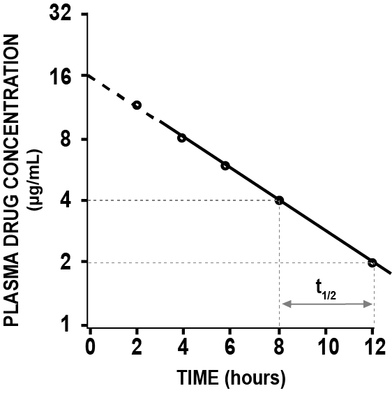
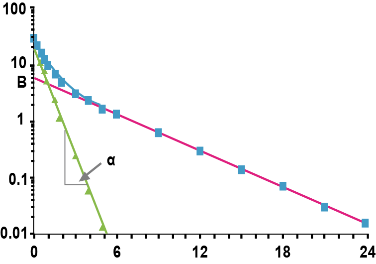

# 특수 ADVAN을 이용한 제어구문의 코딩 {#specific-advan}

\index{특수 ADVAN / specific ADVANs}\index{specific ADVANs / 특수 ADVAN}\index{specific ADVANs / 특수 ADVAN}

\Large\hfill
전상일
\normalsize

---

본 장에서는 PREDPP에 마련된 특정 서브루틴을 사용하여 PK 모델을 명시하는 방법에 대해 다루고자 하며, 이전 장에서 나왔던 제어구문 파일의 구조 중 $SUBROUTINES 와 $PK 부분에 대해 주로 설명하고자 한다. 전형적인 $SUBROUTINES는 숫자로 분류된 특수 ADVAN과 TRANS 서브루틴으로 구성되는데, 이 중 ADVAN은 모델의 구조를 알려주는 서브루틴이다. 예를 들면, ADVAN1은 정맥투여 1구획 모델을, ADVAN2는 정맥 외 투여 1구획 모델을 의미하며, ADVAN3은 정맥투여 2구획 모델을, ADVAN4는 정맥 외 투여 2구획 모델을 의미한다(표 \@ref(tab:specific-advan)). 그림 \@ref(fig:1comp-ex), \@ref(fig:2comp-ex)를 살펴보면 모두 정맥 투여 후 시간에 따른 로그-약물농도를 나타낸 그림이지만, 그림 \@ref(fig:1comp-ex)은 약물농도가 하나의 직선으로, 그림 \@ref(fig:2comp-ex)는 약물농도가 두개의 직선으로 나타나 있다. 그림 \@ref(fig:1comp-ex)과 같이 시간에 따른 로그-약물농도가 하나의 직선으로 설명되는 경우는 1구획 모델인 ADVAN1을, 그림 \@ref(fig:2comp-ex)와 같이 두개의 직선으로 설명되는 경우는 ADVAN3을 사용하면 된다.\index{특수 ADVAN / specific ADVANs}\index{specific ADVANs / 특수 ADVAN}\index{specific ADVANs / 특수 ADVAN}\index{\$PK}\index{\$SUBROUTINE}\index{ADVAN1}\index{ADVAN2}\index{ADVAN3}\index{ADVAN4}\index{PRED}\index{PREDPP}\index{TRANS}

Table: (\#tab:specific-advan) 구획 모델별 특정 ADVAN의 종류

|| **IV**     | **Extravascular** |
| :----: | :----: | :----: |
| 1-Compartment | ADVAN1 | ADVAN2 |\index{ADVAN1}\index{ADVAN2}
| 2-Compartment | ADVAN3 | ADVAN4 |\index{ADVAN3}\index{ADVAN4}
| 3-Compartment     | ADVAN11    | ADVAN12 |\index{ADVAN1}\index{ADVAN11}\index{ADVAN12}


(ref:1comp-ex) Example of IV 1-compartment model

```{r 1comp-ex, out.width="50%", fig.cap="(ref:1comp-ex)"}
#
 #4
```

```{r 2comp-ex, out.width="70%", fig.cap="(ref:2comp-ex)"}
#
 #4
```
(ref:2comp-ex) Example of IV 2-compartment model

TRANS는 각 모델에 상응하는 특정 파라미터를 알려주는 서브루틴인데, ADVAN1 TRANS1은 정맥투여 1구획 모델의 구조를 설명하기 위해, 파라미터 K를 사용하겠다는 의미이고, ADVAN1 TRANS2는 같은 모델 구조에 K대신 CL, V의 파라미터를 사용하여 설명하겠다는 의미이다. 1구획 모델(ADVAN 1, 2)에서는 TRANS2를, 2구획 모델(ADVAN 3, 4)에서는 TRANS4를 주로 사용하며, ADVAN 1\~4에서 사용하는 TRANS 서브루틴을 표 \@ref(tab:required-param-subroutine)에서 확인할 수 있다. 추가로, 각 ADVAN에서 필수적인 파라미터들과 TRANS와의 관계는 NONMEM User Guide - Part V의 Appendix 1, 2에 잘 설명되어 있고, 그중 ADVAN 1\~4 까지의 내용을 표 \@ref(tab:standard-pk-models)에서 확인할 수 있다. [@nonmem]\index{ADVAN1}\index{S1}\index{TRANS}\index{TRANS2}

\index{ADVAN1}
\index{ADVAN2}
\index{ADVAN3}
\index{ADVAN4}
\index{TRANS}

```{r required-param-subroutine}
tibble::tribble(
  ~`ADVAN subroutine`, ~`TRANS subroutine`, ~`Required parameters`,
  "ADVAN1", "TRANS1", "K",
  "ADVAN1", "TRANS2", "CL, V", # bold: \\textbf{TRANS2}
  "ADVAN2", "TRANS1", "K, KA",
  "ADVAN2", "TRANS2", "CL, V, KA", # bold: \\textbf{TRANS2}
  "ADVAN3", "TRANS1", "K, K12, K21",
  "ADVAN3", "TRANS3", "CL, V, Q, VSS",
  "ADVAN3", "TRANS4", "CL, V1, Q, V2", # bold: \\textbf{TRANS4}
  "ADVAN3", "TRANS5", "AOB, ALPHA, BETA",
  "ADVAN3", "TRANS6", "ALPHA, BETA, K21",
  "ADVAN4", "TRANS1", "K, K23, K32, KA",
  "ADVAN4", "TRANS3", "CL, V, Q, VSS, KA",
  "ADVAN4", "TRANS4", "CL, V2, Q, V3, KA", # bold: \\textbf{TRANS4}
  "ADVAN4", "TRANS5", "AOB, ALPHA, BETA, KA",
  "ADVAN4", "TRANS6", "ALPHA, BETA, K32, KA"
) %>% 
  kable(booktabs = TRUE, align = "l", escape = FALSE, caption = "ADVAN과 TRANS 서브루틴 조합에 따른 필수 파라미터") %>% 
  column_spec(1, bold=TRUE) %>% 
  collapse_rows(columns=1, latex_hline="major", valign = "top")
```

\index{TRANS}
```{r standard-pk-models}
readxl::read_excel("data-raw/fig-tab.xlsx", sheet="47", range="A2:D31") %>%
  rename(`ADVAN TRANS` = 1) %>% 
  kable(booktabs = TRUE, align = "l", escape = FALSE,
        caption = "Standard Pharmacokinetic Models and Parameters") %>% 
  column_spec(1, width = "1.8cm") %>% # ADVAN TRANS
  column_spec(2, width = "1.5cm") %>% # alternative parameters
  column_spec(3, width = "4.2cm") %>% # Detail
  column_spec(4, width = "5cm") %>% # Reparam lines
  collapse_rows(1, latex_hline="major", valign = "top")
```

ADVAN과 TRANS 서브루틴 조합에서 상기에 설명한 필수 파라미터 외에 다양한 부가적인 파라미터를 정의할 수 있는데, 여기에는 흡수지연시간, 생체이용률, 0차흡수의 속도, 기간 등이 있다. 모든 부가 파라미터에는 파라미터 이름 뒤에 숫자가 나오며, 이는 그 파라미터가 적용되는 구획을 표시한다. 해당 내용은 표 \@ref(tab:additional-param)에 간략히 설명하였으며 NONMEM User Guide - Part V의 Appendix 1 및 Part VI - Chapter VII에 자세히 설명되어 있다. [@nonmem]\index{TRANS}
\index{ALAG}
```{r additional-param}
txt <- "Name, Parameter
Sn, Scaling parameter for compartment number n
Fn, Bioavailability fraction for compartment n
Rn, Rate parameter for compartment n
Dn, Duration parameter for compartment n
ALAGn, Absorption lag parameter for compartment n"
read_csv(txt) %>% 
  kable(booktabs= TRUE,
        caption = "Additional PK parameters")
```

앞서 언급된 ADVAN & TRANS 서브루틴 및 필수/부가 파라미터를 실제 제어구문의 예를 들어 간략히 설명하고자 한다. $SUBROUTINES 문법은 아래 예시와 같이 쓸 수 있는데 이는 정맥 외 투여 1차 흡수, 2구획 모델이며 CL, V2, V3, Q, Ka의 파라미터를 사용하여 설명하겠다는 의미이다. $PK block에는 $SUBROUTINES에서 사용하고자 하는 약동학 파라미터들을 정의하는 곳으로 `CL = THETA(1) * EXP(ETA(1))` 와 같은 형식으로 표기할 수도 있고, 아래 예시와 같이 표기할 수도 있다. 아래 예시처럼 표기하게 되면 추후 공변량에 대한 수식을 만들게 될 때, 보다 수월하게 작성할 수 있는데, 공변량은 THETA에 수식을 붙이는 형태이기 때문이다. 이는 [11장 공변량 분석](#covariate-analysis)에서 다뤄진다.\index{\$PK}\index{\$SUBROUTINE}\index{TRANS}


```{example, code-example-advan4, echo = TRUE}
공변량 수식 작성에 수월한 제어구문
```
\vspace{-5ex}
```perl
$SUBROUTINES ADVAN4 TRANS4
$PK 
  TVCL = THETA(1)
  TVV2 = THETA(2)
  TVV3 = THETA(3)
  TVQ  = THETA(4)
  TVKA = THETA(5)
  CL   =  TVCL * EXP(ETA(1))
  V2   =  TVV2 * EXP(ETA(2))
  V3   =  TVV3 * EXP(ETA(3))
  Q    =  TVQ  * EXP(ETA(4))
  KA   =  TVKA * EXP(ETA(5))
      
  ALAG1=  THETA(6) * EXP(ETA(6))
  S2   =  V2 / 1000
```
ADVAN4 TRANS4에 대한 구획모형을 아래와 같이 도식화 할 수 있는데, 여기서 괄호 안의 숫자는 해당 구획을 의미한다.\index{ADVAN4}\index{TRANS}
ADVAN4 서브루틴에서 Depot(저장구획)는 1구획, Central(중심구획)은 2구획, Peripheral(말초구획)은\index{저장구획 / depot compartment}\index{depot compartment / 저장구획}\index{ADVAN4}
3구획이다.

(ref:2comp-structure) Structure of 2-compartment extravascular model

```{r 2comp-structure, fig.cap="(ref:2comp-structure)", out.width = '80%'}
 #4
```

$PK 블록에 쓰인 필수 파라미터를 살펴보면 CL은 청소율, V2, V3는 각각 중심구획의 분포용적, 말초구획의 분포용적, Q는\index{\$PK}
Intercompartmental clearance, KA는 흡수속도상수를 의미하며, 부가 파라미터인 ALAG1은 저장구획의\index{저장구획 / depot compartment}\index{depot compartment / 저장구획}\index{ALAG}
흡수지연시간, S2는 중심구획에 대한 척도 파라미터를 의미한다.\index{척도 파라미터 / scaling parameter}\index{scaling parameter / 척도 파라미터}\index{scaling parameter / 척도 파라미터}

만약에 IV와 PO 데이터가 같이 있다면, 약물의 절대생체이용률을 구할 수 있는데, F1 = THETA(7) \*\index{F1}
EXP(ETA(7)) 이와 같이 표기하면 된다. F 뒤에는 보통 저장구획의 번호를 붙이는데, 여기서는 저장구획이 1구획이니 F1을 사용하면 된다. IV 데이터는 없고 PO 데이터의 용량군이 여러 개라면 아래처럼 하나의 용량군을 1로 고정하고, 다른 용량군의 THETA를 다르게 주어 상대생체이용률을 구할 수 있다. (코드 \@ref(exm:code-if))\index{저장구획 / depot compartment}\index{depot compartment / 저장구획}\index{F1}

```{example, code-if, echo=TRUE}
상대생체이용률을 위한 제어구문
```
\vspace{-5ex}
```perl
IF (DOSE.EQ.50) F1 = 1
IF (DOSE.EQ.100) F1 = THETA(7)
IF (DOSE.EQ.200) F1 = THETA(8)
```
척도 파라미터(S)는, 쉽게 얘기하면 투여한 용량과 약물농도 사이의 단위를 통일시켜주는 파라미터로, 일반적으로 S 뒤에 약물농도가 관찰되는 구획(일반적으로는 중심구획)의 번호를 써주게 되며, ADVAN1, 3에서는 S1을 ADVAN2, 4에서는 S2를 사용하면 된다. 기본적으로 NONMEM에서 분포용적의 단위는 L, 투여 용량의 단위는 mg인데, 투여 용량의 단위가 mg이고 관찰된 농도의 단위가 mg/L인 경우 S2 = V2 라고 표기하면 된다. 하지만, 농도의 단위가 μg/L (= ng/mL)인 경우 투여 용량의 단위(mg)와 농도에서 용량의 단위(μg)가 불일치하게 된다. Concentration (μg/L) = Amount (mg) / Volume(L) 의 식에서 생각해 볼 때, 양의 단위를 μg으로 변환하면 단위가 일치하게 되는데, 이렇게 하기 위해서는 데이터셋의 AMT 에 1,000을 곱해주면 된다. 같은 맥락으로 분포용적(여기서는 V2)을 1,000으로 나누면 동일한 상황이 되는데, 이를 적용하려면, 제어구문에서 위의 예시와 같이 S2 = V2 / 1000을 써주면 된다. ADVAN별 부가 파라미터에 대한 구체적인 설명은 NONMEM User Guide - Part VI 및 표 \@ref(tab:basic-additional)를 참고하도록 하자. [@nonmem]\index{척도 파라미터 / scaling parameter}\index{scaling parameter / 척도 파라미터}\index{scaling parameter / 척도 파라미터}\index{ADVAN1}\index{ADVAN2}\index{AMT}\index{S1}

\footnotesize

(ref:basic-additional) Basic and additional pharmacokinetic parameters
```{r basic-additional}
readxl::read_excel("data-raw/fig-tab.xlsx", sheet="50", range="B2:E36") %>% 
  rename(CMT = 2, PARAM = 3) %>%
  kable(booktabs=TRUE, align = "l", escape=FALSE, 		
		caption = "(ref:basic-additional)") %>% 
  column_spec(1, width = "1.8cm") %>%
  column_spec(2, width = "2.2cm") %>%
  column_spec(3, width = "1.5cm") %>%
  column_spec(4, width = "7.5cm") %>%
  collapse_rows(c(1, 2), valign = "top", latex_hline="major")
```

\normalsize
