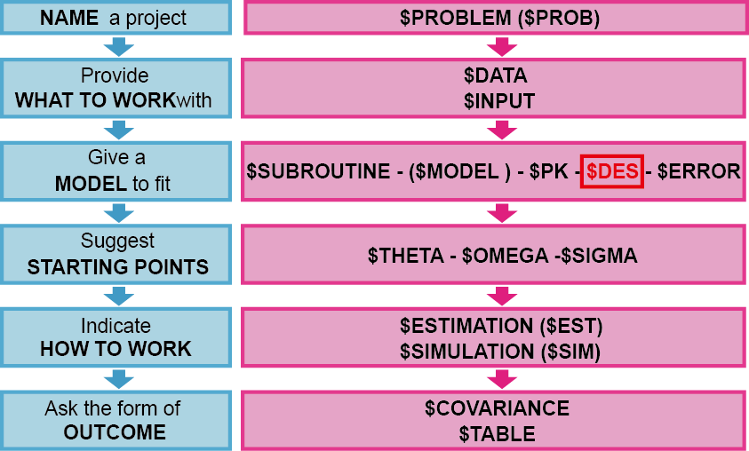

# 일반 ADVAN을 이용한 제어구문의 코딩 {#general-advan}

\Large\hfill
홍태곤
\normalsize

---

일반 ADVAN은 사용자가 직접 모델을 정의하고, 서브루틴을 작성할 수 있다. \$MODEL 구문을 사용하여 사용자가 원하는 만큼 999개까지 구획을 만들 수 있다. 일반 비선형 모델(ADVAN 6,8,9,13)에서는 \$PK구문 다음에 \$DES구문을 사용하여 모델에서 각 구획의 내부값(질량, 농도, 효과 등)의 즉각적인 변화율을 표현할 수 있다. 일반 선형 모델(ADVAN 5,7)은 구획 사이의 1차식(first-order kinetics)에 따른 이동을 가정하기 때문에 $DES구문이 필요하지 않다. 일반 ADVAN의 종류는 다음과 같으며, 이 장에서는 ADVAN 5\~8에 대하여 다루기로 한다.\index{\$DES}\index{\$MODEL}\index{\$PK}

```{r gen-advan, message = FALSE}
advan <- c("ADVAN5 (General Linear)",
"ADVAN6 (General Nonlinear)",
"ADVAN7 (General Linear with Real Eigenvalues)",
"ADVAN8 (General Nonlinear Kinetics with Stiff Equations)",
"ADVAN9 (General Nonlinear Kinetics with Equilibrium Compartments)",
"ADVAN13 (General Nonlinear Kinetics using LSODA)")

knitr::kable(dplyr::tibble(`General ADVAN` = advan), 
             caption = "일반 ADVAN의 종류",
             booktabs=TRUE)
```

## 일반 선형 ADVAN

(ref:advan-code) 일반 선형 ADVAN을 이용한 코드의 구조

```{r advan-code, fig.cap="(ref:advan-code)"}

```

특수 ADVAN과 비교하였을 때, 일반 선형 ADVAN 코드의 특징은 \$MODEL 구문이 추가되었다는 점이다. \$MODEL 구문을 사용하여 모델에서 사용할 구획의 수와 특성을 정의할 수 있다. 다음에 언급될 비선형 ADVAN과 다르게 선형 ADVAN에서는 구획 사이의 1차 이동만을 가정하기 때문에, \$PK 구문만으로 각 구획 간의 연결 관계와 속도상수를 정의할 수 있다. 구획들 간의 관계는 1차 이동 속도상수를 의미하는 알파벳 K와 구획내의 물질 이동의 시작과 끝의 구획번호를 사용하여 \$PK 구문에서 정의한다. M 구획에서 n 구획으로의 이동상수는 Kmn으로 표현한다. 예를 들어, 파라미터 K12는 구획1에서 구획2로 이동하는 속도를 설명하는 1차 이동 속도상수이다. 따라서 일반 ADVAN 모델에서 추정하는 주된 파라미터는 속도상수가 되며 이러한 추정은 행렬지수(matrix exponential)에 대한 수치적 근사(numerical approximation)를 이용하여, 선형 미분방정식을 푸는 방식으로 이루어진다.\index{특수 ADVAN / specific ADVANs}\index{specific ADVANs / 특수 ADVAN}\index{specific ADVANs / 특수 ADVAN}\index{\$MODEL}\index{\$PK}

(ref:advan-lin-property) 일반 선형 ADVAN 의 종류 및 특징 [@nonmem]

```{r advan-lin-property}
tibble::tribble(
  ~"Reason", ~"ADVAN 5", ~"ADVAN 7",
  'When used?', 'Eigenvalues of the rate constant matrix are complex', 'Eigenvalues of the rate constant matrix are known to be real',
'Example','PBPK model','Many PK systems',
'Running time', 'Slower', 'Faster'
) %>% 
  kable(booktabs=TRUE, caption = "(ref:advan-lin-property)") %>%
  column_spec(1, width = "2cm") %>%
  column_spec(2, width = "5cm") %>%
  column_spec(3, width = "5cm")
```

일반 선형 ADVAN에는 ADVAN 5와 7이 있으며, 보통 속도상수의 고유값(eigenvalue)이 복소수(complex\index{고유값 / eigenvalues}\index{eigenvalues / 고유값}
number)이며 복잡한 구조의 모델(ex. PBPK 모델)의 경우 ADVAN 5를 적용하고, 더 단순한 구조를 가지며 고유값이\index{고유값 / eigenvalues}\index{eigenvalues / 고유값}
실수(real number)인 일반적인 약동학 모델에서는 상대적으로 더 빠른 ADVAN 7을 적용할 수 있다.

(ref:advan-lin-example) 일반 선형 ADVAN을 이용한 코드 예시

```{r advan-example, fig.cap="(ref:advan-lin-example)", out.width="100%"}
knitr::include_graphics("./figures/05-fig-02-redraw.png")
```

일반 선형 ADVAN의 코드를 보면 \$SUBROUTINE 구문을 통해 어떤 ADVAN을 사용할 지 설정한 후, \$MODEL 구문에서 모델에서 사용할 구획의 수와 특성을 정의한다. 특수 ADVAN 과 달리 999개까지 사용자가 원하는 만큼 구획의 수를 설정할 수 있다. \$PK구문을 이용하여 각 구획 간 물질의 이동 관계를 설정하고 약동학 파라미터(ex CL, V)와의 관계도 정의할 수 있다.\index{특수 ADVAN / specific ADVANs}\index{specific ADVANs / 특수 ADVAN}\index{specific ADVANs / 특수 ADVAN}\index{\$MODEL}\index{\$PK}\index{\$SUBROUTINE}

## 일반 비선형 ADVAN

(ref:nonlin-code) 일반 비선형 ADVAN을 이용한 코드의 구조

```{r nonlin-code, fig.cap="(ref:nonlin-code)"}

```

일반 비선형 ADVAN에서는 구획 간 물질 이동에 있어 선형 관계(1차 이동)뿐만 아니라, 비선형 관계를 허용하기 때문에 이러한 특성을 설명하기 위하여, 반드시 \$DES 구문을 이용한 미분 방정식을 작성하여야 한다.\index{\$DES}


```{r advan-6-8}
tibble::tribble(~" ", ~"ADVAN 6", ~"ADVAN 8",
				"When used?", "Linear or non-linear transfer between compartments", "Big difference in the time constants (long half life: Ka vs Ke)",
				"Method", "Runge-Kutta method", "Gear method") %>%
  kable(booktabs=TRUE, caption="(ref:nonlin-advan)") %>%
  column_spec(2:3, width = "5cm") %>%
  column_spec(1, width = "1.5cm")
```

(ref:nonlin-advan) 일반 비선형 ADVAN 의 종류 및 특징 [@bonate]

일반 비선형 ADVAN에는 ADVAN 6, 8, 9, 13이 있으며, 이 장에서는 ADVAN 6와 8에 대하여 다룬다. 보통 안정적이고 경직되지 않은(nonstiff) 모델의 경우 ADVAN 6를 적용하고, 추정하는 속도상수 간 큰 차이를 보이는 불안정하고 경직된(stiff) 모델(ex. 결합은 빠르면서, 긴 반감기를 가진 단일클론항체)은 ADVAN 6를 이용할 경우, 파라미터 추정 시간이 오래 걸리거나 추정에 실패할 수 있어 대안으로 ADVAN 8을 적용할 수 있다. 경직된 모델이란 속도상수 추정을 위한 미분방정식 풀이에 있어, Runge-Kutta method와 같은 수치적인 방법(numerical method)를 적용하였을 때 수치적으로 불안정한(numerically unstable) 모델을 말하며, 이러한 경우 Gear method 를 이용한 ADNVA 8의 적용을 고려할 수 있다. (표 \@ref(tab:advan-6-8))

(ref:nonlin-advan-code-example) 일반 비선형 ADVAN을 이용한 코드 예시

```{r nonlin-advan-code-example, fig.cap="(ref:nonlin-advan-code-example)", out.width="100%"}

```

일반 비선형 ADVAN의 코드를 보면 앞에서 살펴본 일반 선형 ADVAN과 유사한 구조를 보이나, \$PK에 이어 미분방정식을 표현하는 \$DES 구문이 추가된다.\index{\$DES}\index{\$PK}

비선형 ADVAN을 사용할 경우, \$SUBROUTINE 구문에 적용할 ADVAN(ex. ADVAN 6 or 8)을 지정한 후, `TOL` 이라는 명령어를 추가해야 한다. `TOL` 은 tolerance 의 약자로, 각 구획의 내부값(질량, 농도, 효과) 계산에 필요한 숫자의 정확한 자릿수(NRD, number of required digits)를 의미하며, 일반적으로 \$ESTIMATION 구문에 설정하는 SIG 값보다 1 또는 2 큰 숫자로 설정한다.\index{tolerance / 허용치}\index{tolerance / 허용치}\index{\$ESTIMATION (\$EST)}\index{\$SUBROUTINE}\index{TOL}

\$MODEL 구문에서는 일반 선형 ADVAN 과 동일하게 모델에서 사용할 구획의 수와 특성을 정의한다. DEPOT, CENTRAL, PERI 는 사용자가 임의로 써주는 명칭인 반면, default name 이라고 불리는 DEFDOSE, DEFOBS 는 NONMEM 에 정의되어 있는 특정한 의미를 지닌 용어이다. DEFDOSE 와 DEFOBS 는 각각 용량과 관찰값을 배정한 기본구획으로 정의한다. 구획을 정의하는 데이터 항목(CMT)이 데이터셋에 포함되어 있지 않을 때 이러한 기본구획들을 정의할 필요가 있으며, 데이터셋의 CMT 를 사용할 경우에는 생략할 수 있다. DEFDOSE 를 입력하지 않을 경우, "DEPOT" 으로 지정된 첫째 구획에 용량이 투여된 것으로 NONMEM 이 인식하며, "DEPOT"을 지정하지 않는 다면, 여러 구획 중 첫째 구획에 용량이 투여된 것으로 인식한다. 마찬가지로 DEFOBS 를 입력하지 않을 경우 "CENTRAL" 로 지정된 첫째 구획에 관찰값이 배정된 것으로 NONMEM 이 인식을 하며, "CENTRAL" 을 지정하지 않는 다면, 여러 구획 중 첫째 구획에 관찰값이 배정된 것으로 인식한다 [@nonmem]. 데이터셋에 CMT 항목을 만들고, DEFDOSE 와 DEFOBS 를 데이터셋과 반대로 설정하더라도, NONMEM 은 데이터셋에 지정된 대로, 용량과 관찰값을 인식한다. 따라서 데이터셋에 정확히 용량과 관찰값의 구획을 지정해주는 것이 중요하다.\index{\$MODEL}\index{CMT}\index{DEFDOS}\index{DEFOBS}\index{FO}

마지막으로, 사용자가 의도한 각 구획 간의 물질 이동 상태에 맞게 \$DES에 미분 방정식을 작성하면 된다. 미분 방정식의 각 식은 DADT(i)로 나타내며, 여기서 i는 해당 구획의 번호이다. 예를 들어 1번 구획에서 약이 1차 속도로 제거되는 것은 `DADT(1)= -KA * A(1)`으로 나타낼 수 있다. 여기에서 A(1)은 구획 1에서의 시간에 따라 변한다고 가정한 내부값(약의 양)을 의미한다. \$DES 구문 안에서 시간 의존적인 파라미터를 추정할 경우, 시간 변수는 `T` 로 표현하여야 하며 이는 데이터셋에 주어진 이산형의 시간(TIME)과 다른 연속변수를 의미한다.\index{\$DES}\index{DADT(i)}\index{TIME}
\begin{equation}
\begin{split}
\frac{dA_1}{dt} & = -A(1) \cdot k_a \\
\frac{dA_2}{dt} & = A(1) \cdot k_a - A(2) \cdot (k_{23} + k_{20}) + A(3) \cdot k_{32} \\
\frac{dA_3}{dt} & = A(2) \cdot k_{23} - A(3) \cdot k_{32}
\end{split}
(\#eq:2comp-oral)
\end{equation}

(ref:des-example) \$DES 구문 적용을 위한 코드 예시\index{\$DES}
```{r des-example, fig.cap="(ref:des-example)"}
knitr::include_graphics("./figures/05-fig-05.png")
```

```{r 2comp-oral, fig.cap = "2구획 경구모델", out.width = '80%'}
knitr::include_graphics("figures/05-fig-06.png")
```

```{example, advan5-example, echo = TRUE}
2구획 경구모델을 ADVAN5로 구현한 코드 예시\index{ADVAN5}
```
\vspace{-5ex} 
```perl
$SUBROUTINE ADVAN5
$MODEL
  COMP(DEPOT, DEFDOSE)
  COMP(CENTRAL, DEFOBS)
  COMP(PERIPH)
$PK ; Define basic PK relationships
  CL = THETA(1)*EXP(ETA(1))
  V2 = THETA(2)*EXP(ETA(2))
  V3 = THETA(3)*EXP(ETA(3))
  Q  = THETA(4)*EXP(ETA(4))
  KA = THETA(5)*EXP(ETA(5))
  
  S2 = V2
  K12= KA
  K20= CL/V2
  K23= Q/V2
  K32= Q/V3
$ERROR
  Y  = F*(1+EPS(1)) 
```

동일한 2구획 경구모델(그림 \@ref(fig:2comp-oral))을 일반 선형(ADVAN5, 코드 \@ref(exm:advan5-example)) 및 비선형(ADVAN6, 코드 \@ref(exm:advan6-example)) ADVAN 코드를 이용하여 추정할 수 있다. 일반 선형 ADVAN은 비선형 ADVAN에 비하여 더 간단하게 코드를 작성할 수 있으며, 비선형 ADVAN은 좀 더 다양한 형태의 약물 동태에 적용할 수 있는 장점이 있으나, \$SUBROUTINE 구문에 TOL 명령어를 작성하고 \$DES에 각 구획의 물질 이동을 설명하는 미분방정식을 작성하여야 한다.\index{\$DES}\index{\$SUBROUTINE}\index{ADVAN5}\index{ADVAN6}\index{TOL}

```{example, advan6-example, echo = TRUE}
2구획 경구모델을 ADVAN6로 구현한 코드 예시\index{ADVAN6}
```
\vspace{-5ex}
```perl
$SUBROUTINE ADVAN6 TOL=4
$MODEL
  COMP(DEPOT, DEFDOSE)
  COMP(CENTRAL, DEFOBS)
  COMP(PERIPH)
$PK ; Define basic PK relationships
  CL = THETA(1)*EXP(ETA(1))
  V2 = THETA(2)*EXP(ETA(2))
  V3 = THETA(3)*EXP(ETA(3))
  Q  = THETA(4)*EXP(ETA(4))
  KA = THETA(5)*EXP(ETA(5))
  
  S2 = V2
  K20= CL/V2
  K23= Q/V2
  K32= Q/V3
$DES ; Define differential equations
  DADT(1) = -A(1)*KA
  DADT(2) = A(1)*KA - A(2)*(K23+K20) + A(3)*K32
  DADT(3) = A(2)*K23 - A(3)*K32
$ERROR
  Y  = F*(1+EPS(1)) 
```

<!--
참고문헌

1.  Beal SL, Shenier LB, Boeckmann AJ, Bauer RJ, editors. 1989 NONMEM
    7.4.0 Users Guides – Part VI. (1989-2018). ICON Development
    Solutions, Hanover. P111.

2.  Bonate PL. Pharmacokinetic-Pharmacodynamic Modeling and Simulation.
    2~nd~ ed. New York: Springer Science + Business Media, LLC;
    2011. P605.

3.  Beal SL, Shenier LB, Boeckmann AJ, Bauer RJ, editors. 1989 NONMEM
    7.4.0 Users Guides – Part IV. (1989-2018). ICON Development
    Solutions, Hanover. P106.
-->
