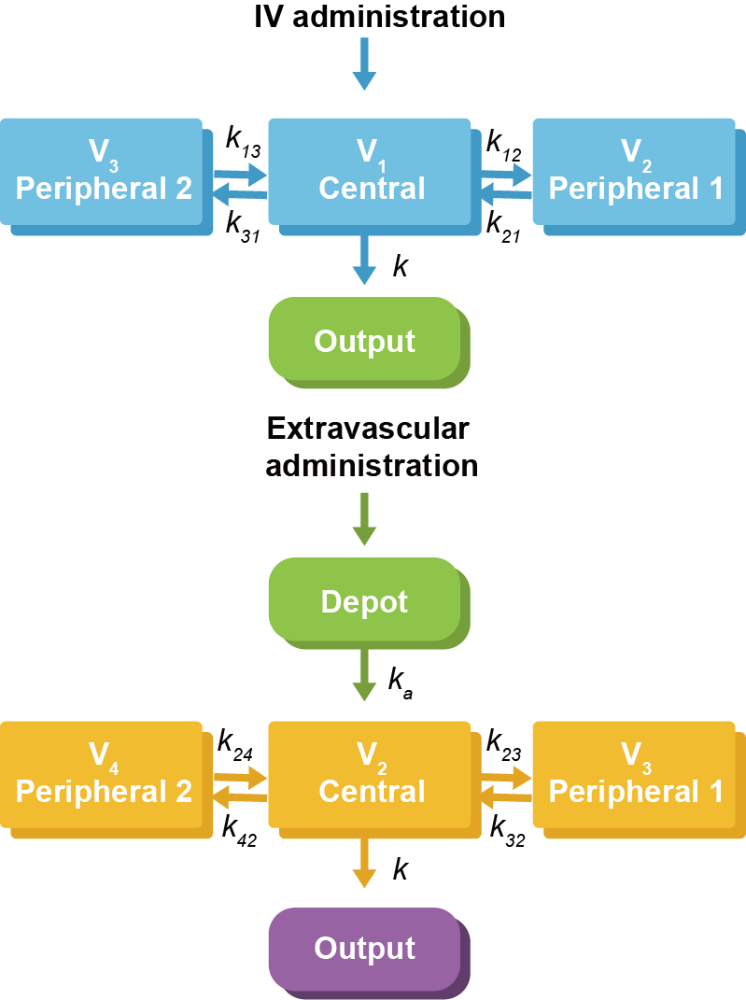

---
output:
  pdf_document: default
  html_document: default
---

# 기타 ADVAN {#newer-advan}

\Large\hfill
임동석
\normalsize

## ADVAN9 - General Nonlinear Model with Equilibrium Compartments
\index{ADVAN9}

ADVAN9는 ADVAN6와 같은 상황에서 쓸 수 있는 또 다른 ADVAN으로 ADVAN6보다 좀 더 robust 한 방법으로 주장되고 있으나 이는 상황 별로 달라서 어떤 것이 낫다고 할 수는 없다. Holford가 제안한 하나의 방법은 $EST 에서 MAXEVAL=0로 한 후 ADVAN6와 9을 각기 돌려보고 둘 중 소요시간이 짧은 것을 선택하여 쓰는 것이다. [@nickholford]\index{\$ESTIMATION (\$EST)}\index{ADVAN6}\index{ADVAN9}\index{MAXEVAL}\index{MAXEVAL=0}

## ADVAN10 - One Compartment Model with Michaelis-Menten Elimination
\index{ADVAN1}\index{ADVAN10}

1분획 모델로서 정맥주입하는 약물의 Michaelis-Menten 제거 모델을 사용할 경우 ADVAN10을 쓰면 되는데, 실제 모델링에서 쓰이는 사례는 매우 드물다. Michaelis-Menten 과 같은 제거 모델이 필요할 경우 ADVAN6에서 수식으로 구현하는 것이 다른 제거모델과의 비교나 분포분획의 숫자,흡수 모델 등에 있어서 훨씬 유연한 방법이기 때문이다.\index{ADVAN1}\index{ADVAN6}\index{ADVAN10}

## ADVAN11과 12 - Three Compartment Linear Model (IV and First Order Absorption) 
\index{ADVAN1}\index{ADVAN11}

ADVAN1~4의 경우와 같이 ADVAN11과 12는 3분획으로 분포하며 정맥주사와 1차 경구흡수되는 모델들이다 (그림 \@ref(fig:advan1112)). ADVAN1~4만큼 자주 쓰이지 않으나 투여 간격이 매우 길다거나 마지막 용량 투여 후 오랜 시간 동안 지속적으로 농도를 측정한다든지 하여 3개의 기울기가 존재하는 것이 의심되는 상황 등에서 시도해 볼 수 있다.\index{기울기 / gradient}\index{gradient / 기울기}\index{ADVAN1}\index{ADVAN11}

ADVAN11의 예를 들면 앞의 장들에서 소개된 것과 마찬가지로 TRANS 옵션을 선택해야 하는데 TRANS1을 쓰면 Vd를 제외한 약동학 파라미터들을 micro constant(K, K12, K21, K13, K31)들을 써서 표현하며, TRANS4를 쓰면 CL, Q2, Q3를 쓰되 이들과 micro constant들과의 관계식을 함께 써 주어야 한다. TRANS6를 쓸 경우 시간에 따른 농도변화를 지수함수 형태로 나타낼 수 있으며, 역시 지수함수의 파라미터들과 micro constant들과의 관계식을 써 주어야 한다. 이들 중 TRANS4를 사용하여 CL, Q로써 모델링하는 것이 가장 흔히 쓰이는 방법이고, TRANS1이 간혹 쓰이며, TRANS6를 사용하는 경우는 드물다.\index{ADVAN1}\index{ADVAN11}\index{S1}\index{TRANS}

\index{ADVAN1}\index{ADVAN11}\index{ADVAN12}
```{r advan1112, fig.cap="ADVAN11(위)과 ADVAN12(아래)의 모델 구조와 micro constants의 이름들"}

```

## ADVAN13 - General Nonlinear Model using LSODA
\index{ADVAN1}\index{ADVAN13}

NONMEM 7.12 버전에 추가된 SUBROUTINE으로서 LSODA라는 기법을 사용하여 stiff, nonstiff 미분방정식을 풀어준다. 보통의 ESTIMATION 방식에서는 별 이점이 없으나 좀 더 많은 계산을 필요로 하는 방식들(MCMC, BAYESIAN, IMP MAP)을 쓸 때 속도가 빨라진다고 알려져 있다.\index{BAYES}
