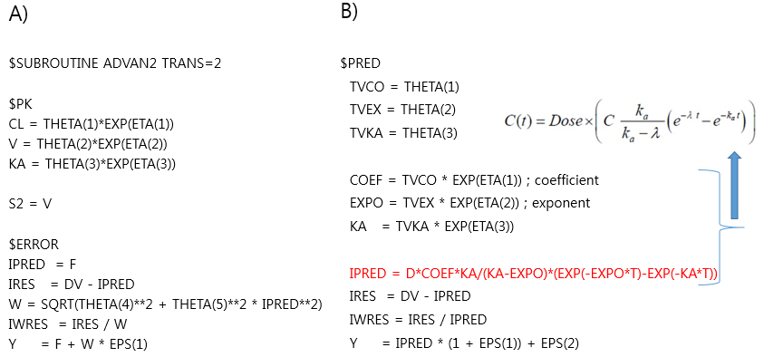
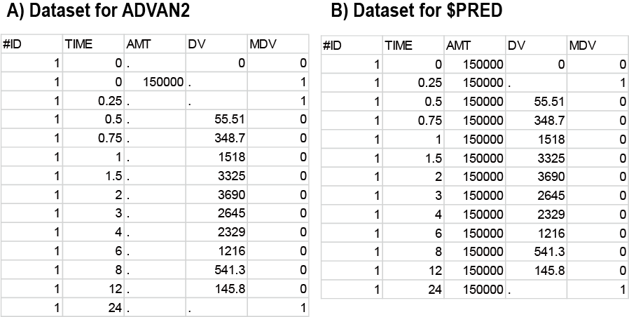

# \$PRED: ADVAN을 쓰지 않는 코딩 {#PRED}
\index{\$PRED}\index{PRED}

\Large\hfill
임동석
\normalsize

## \$PRED와 PREDPP library사용할 때의 차이
\index{\$PRED}\index{PRED}\index{PREDPP}

PREDPP built in 모델들인 ADVAN들 중에서 하나를 골라서 쓰는 방식을 앞서 장들에서 보아왔지만 이번에는 미리 만들어 놓은 모델이나 파라미터를 쓰는 것이 아닌 연구자가 원하는 대로 모델의 구조를 만들어 볼 수 있는 \$PRED를 소개한다. 이것은 PK관련된 식이든, 어떤 함수든 모든 식을 어떤 그 코드 안에 풀어 쓰는 것이므로 약속된 용어(reserved word)도 전혀 없다. 물론 데이터셋의 칼럼 이름들을 정의해주는 \$INPUT 뒤에 적어주는 ID, TIME, DV, MDV는 공통으로 쓰지만 특정 ADVAN을 쓸 때 투여량을 나타내는 AMT, 분획을 의미하는 CMT 등의 용어들은 \$PRED를 쓸 때는 미리 약속된 이런 의미를 가지는 용어가 아니라 그냥 칼럼의 제목에 지나지 않는다. 물론 \$DES와 함께 쓰는 ADVAN6, 8, 9, 13의 경우에도 특정 모델에 얽매이지 않고 연구자가 상상하는 모델의 구조를 주고 테스트할 수 있지만 이들은 미분방정식의 형태로 넣어주는 것이므로 \$PRED와는 다르다.\index{dependent variable(DV) / 종속변수(DV)}\index{\$DES}\index{\$INPUT}\index{\$PRED}\index{ADVAN6}\index{AMT}\index{CMT}\index{ID}\index{MDV}\index{PRED}\index{PREDPP}\index{TIME}

제어구문 파일의 맨 앞에 \$PROBLEM으로 프로젝트 이름을 쓰고 \$DATA, \$INPUT에서 데이터셋을 불러 들여오고, 그 다음에 \$SUBROUTINE, \$MODEL, \$PK, \$DES, \$ERROR들을 적절히 골라 적었으나 \$PRED를 쓸 때는 이들이 필요 없게 된다. 그림 \@ref(fig:first-order-pred)의 예는 1분획 모델을 ADVAN2 대신 \$PRED로 적은 것이다. 이후 나머지 초기값 주는 것, estimation 방법 등은 \$PRED를 쓰건, 다른 ADVAN을 쓰건 동일하다. 데이터셋에서도 약속된 용어가 통하지 않으므로 그림 \@ref(fig:pred-dataset)와 같이 차이가 난다.\index{\$DATA}\index{\$DES}\index{\$ERROR}\index{\$INPUT}\index{\$MODEL}\index{\$PK}\index{\$PRED}\index{\$PROBLEM}\index{\$SUBROUTINE}\index{ADVAN2}\index{PRED}

(ref:first-order-pred) 1구획 모델의 ADVAN2, $PRED 제어구문 파일 비교\index{\$PRED}\index{ADVAN2}\index{PRED}

```{r first-order-pred, fig.cap="(ref:first-order-pred)"}

```

(ref:pred-dataset) ADVAN과 \$PRED의 데이터셋 차이\index{\$PRED}\index{PRED}

```{r pred-dataset, fig.cap="(ref:pred-dataset)"}

```

AMT와 같은 용어는 PREDPP library를 사용할 경우(\$SUBROUTINE 쓸 때) 한번의 투여간격 사이에 주는 용량이라는 의미로 약속되어 있어서 \$INPUT에서 데이터셋의 칼럼 이름으로 명시해 주어야 하고, 그림 \@ref(fig:pred-dataset)의 A)와 같이 0시간에 한번 주면 몸 속으로 흡수되어 24시간까지 계속 영향을 주는 값으로 약속되어 있다. 그러나 \$PRED를 사용할 때는 B)와 같이 마치 어떤 공변량처럼 그 칼럼에 계속 같은 숫자로 표시해 주어야 하는 것이다. 이는 그림 \@ref(fig:first-order-pred)의 제어구문에서 `IPRED = D*COEF*KA/(KA-EXPO)*(EXP(-EXPO*T)-EXP(-KA*T))`의 용량을 나타내는 변수 `D`에 해당된다. 데이터셋 맨 윗줄의 칼럼 이름들은 제어구문에서 읽어 들일 때 무시되고 \$INPUT 뒤에 적어준 칼럼 이름들을 따르게 된다. 앞서 기술한 것처럼 \$INPUT 뒤에 AMT건 DOSE건 D건 무슨 단어를 써도 그냥 칼럼의 제목이라는 의미만을 가진다. 단지 \$PRED 블록 내에서 쓸 때와 동일하여야 하므로, 그림 \@ref(fig:first-order-pred)의 예에서는 \$INPUT 뒤에 나오는 네번째 칼럼 이름은 “D” 라고 써주면 될 것이다. \index{투여간격 / interdose interval(II)}\index{interdose interval(II) / 투여간격}\index{interdose interval(II) / 투여간격}\index{\$INPUT}\index{\$PRED}\index{\$SUBROUTINE}\index{AMT}\index{IPRED}\index{PRED}\index{PREDPP}

미분방정식으로 각 분획간의 물질이동의 식만 주면 알아서 각 분획 별 물질의 양을 구해주는 \$DES와는 달리 \$PRED를 쓸 경우 우리가 얻고자 하는 값(예컨데 특정 분획에서의 약물 농도)을 라플라스 변환을 이용하든지 하여 수식으로 풀어서 넣어 주어야 한다.\index{\$DES}\index{\$PRED}\index{PRED}

## \$PRED를 써야 하는 경우
\index{\$PRED}\index{PRED}

편리한 ADVAN들이 이미 여러 가지가 나와 있는데 똑같은 모델을 굳이 복잡한 수식을 풀어서 열거하는 \$PRED로 처리해야 할 필요는 없다. 그러나 지금까지 나와 있는 PREDPP의 ADVAN들 만으로 표현할 수 없는 모델을 써야 할 경우는 자주 있다. PK/PD 모델들 역시 ADVAN만으로 처리할 수 있는 것들도 있으나 그 성격이 다양하여 연구자가 직접 모델을 만들어 테스트해야 하는 경우도 많다. (코드 \@ref(exm:formula))\index{\$PRED}\index{PRED}\index{PREDPP}

```{example, label="formula", echo = TRUE}
약력학 모델과 같이 다양한 수식들을 써야 하는 경우 ADVAN 보다는 \$PRED 블록 안에서 수식을 직접 적어주는 것이 편리하다.\index{\$PRED}\index{PRED}
```
\vspace{-5ex} 
```perl
$PROB Sigmoidal PD Model
$DATA ../sigmoidal_effect.csv IGNORE=@
$INPUT ID CP RESP=DV
$PRED
  E0=THETA(1) ; Baseline
  EMAX=THETA(2) ; Max Effect
  C50=THETA(3)*EXP(ETA(1)) ; C50
  ; only parameter with interindividual variability
  GAM=THETA(4) ; Gamma
  ; do not add an ETA to this - very hard to fit
  IPRD=E0+(EMAX-E0)*CP**GAM/(CP**GAM+C50**GAM)
  Y=IPRD+EPS(1)
$THETA
...

```

