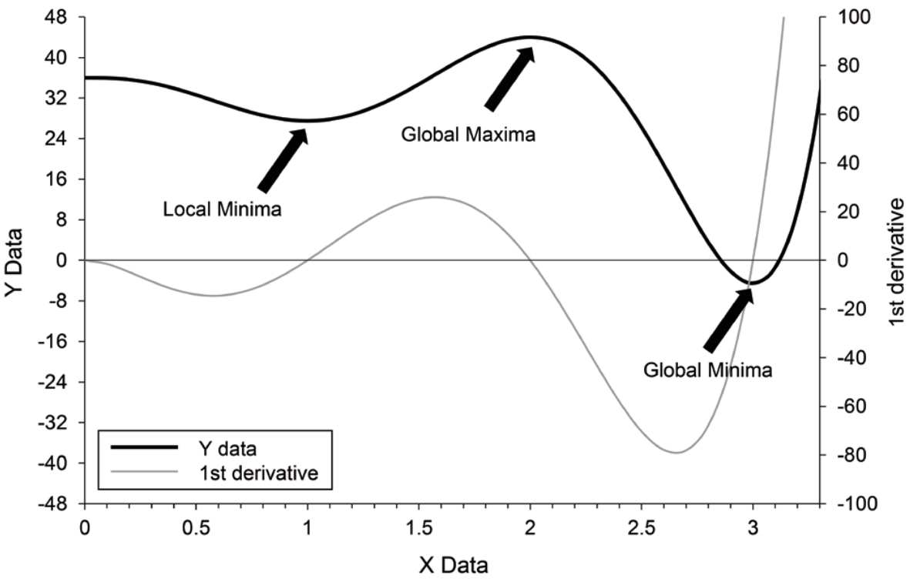

# 초기추정값 {#IE}

\Large\hfill
한승훈
\normalsize

---

IE(initial estimate, IE)은 NONMEM 제어구문의 필수 구성 요소이다. 단 한 번의 모델링 경험만으로도 IE을 결정하는 것이 단순한 작업이 아니라는 것과 IE에 따라 FPE(final parameter estimate, FPE)이나 NONMEM 실행 시간이 달라질 수 있다는 것을 알게 된다. 특히, 계량약리학 분야의 초보자들은 일반적으로 NONMEM의 작동 방식과 제어 구문 구성 요소에 대한 이해의 폭이 좁기 때문에, IE의 개념, 역할 및 가치에 관한 지식이 부족할 수 있다. 그러나 모델의 구조나 IE의 역할에 대한 충분한 이해 없이 IE을 선택하는 경우, 전혀 타당하지 않은 FPE을 얻을 수 있으므로 이 문제를 간과해서는 안 된다. 따라서, 모델 구축 작업과 관련하여 일반적으로 받아들여질 수 있는 적절성을 확보하기 위해서는 IE에 관한 정확한 정보와 지식을 갖는 것이 중요하다 하겠다.

IE은 단순한 값들의 집합(파라미터의 개수에 대응하는)이 아니라 모델의 구조와 그러한 구조를 구성하는 요소인 파라미터의 값의 추정을 위해 반드시 요구되는 출발점이다. 그러기에 IE을 적절히 선택하기 위해서는 NONMEM의 추정 알고리즘에 대한 지식과 함께 모델을 해석할 수 있는 수준의 약동-약력학 지식이 필수적으로 요구된다. 실제로 초보자가 이러한 모든 지식을 온전히 이해하고 IE을 적용하는 것은 거의 불가능하지만, 본 문서에서 다루는 내용 정도에 준해 IE의 기본적인 사항을 이해한다면, IE을 무작위로 혹은 부적절하게 선택함으로 인해 발생하는 FPE의 오류를 어느 정도 피할 수 있을 것으로 생각되며, 이를 통해 불필요한 시간 낭비를 줄일 수 있을 것이다.

## 초기 추정값의 의미와 역할 {#IE-role}

NM-TRAN 제어구문을 작성할 때에는 여러 파라미터에 대한 IE을 반드시 선택하여 입력하여야 한다. 여기에서 파라미터라 함은 일반적인 약동-약력학 파라미터와는 다른 모델의 파라미터를 의미하는데, 제어구문의 기초적 내용에서 다뤄지는 THETA(*θ*), OMEGA(*ω*), SIGMA(*σ*)가 그것이다. 모델의 구조에 따라, 하나의 약동-약력학 파라미터는 각각 1개의 *θ*, *ω*에 대응될 수도 있고, 2개 이상의 모델 파라미터를 이용하여 표현될 수도 있다. 또한, 잔차 모델의 특성에 따라 1개 혹은 2개 이상의 *σ*가 필요할 수도 있다. 중요한 것은 IE이 ‘약동-약력학 파라미터 별’로 결정되는 것이 아니라 ‘모델 파라미터 별’로 결정되어야 한다는 것이다. 따라서, 제어구문 작성 시에는 모델에 포함된 *θ*, *ω*, *σ*의 개수 총합에 해당하는 수의 IE이 필요하게 된다.\index{잔차 / residual error}\index{residual error / 잔차}\index{NM-TRAN 제어구문 / NM-TRAN control stream}\index{NM-TRAN control stream / NM-TRAN 제어구문}\index{NM-TRAN control stream / NM-TRAN 제어구문}\index{NM-TRAN}

IE이 필요한 이유는 NONMEM이 파라미터 추정을 위해 Newton-Raphson 방법과 유사한 접근 방식(quasi-Newton-type minimization algorithm)을 사용한다는 것이다. 이 방법의 구체적인 내용을 여기에 다루지 않으나, 이것이 특정한 출발점에서부터 시작하여 NONMEM의 목적함수 값을 최소화(관측값의 발생가능성을 최대로 한다는 것과 동일한 의미임 - NONMEM의 추정 방법 관련 내용 참고)하는 파라미터 값들의 조합을 찾아가는 방법이라는 것만은 이해하여야 한다. 다시 말해, NONMEM의 추정이라는 것은 목적함수값을 최소화하는 파라미터 값들의 조합을 찾는 것이며, 이 때의 파라미터 값을 FPE을 최소화된 목적함수값과 함께 보고해 주는 것이다. 따라서, NONMEM은 각각의 파라미터에 대해 추정을 시작할 수 있는 시작점을 필요로 하게 되고, 이것이 사용자가 제어구문에 각 파라미터 별로 IE을 입력해 주어야 하는 유일하면서도 불가피한 이유인 것이다.\index{목적함수 / objective function}\index{objective function / 목적함수}

다음 절에 대한 이해를 위해 여기에서 추정 알고리즘에 대해 약간 더 설명한다. 다음은 NONMEM이 목적함수값을 최소화하는 파라미터 값을 찾아가는 논리를 나타낸 것이다. 효율적인 설명을 위해 파라미터가 단 하나인 상황을 가정한다.\index{목적함수 / objective function}\index{objective function / 목적함수}

1. 목적함수를 그래프로 그렸을 때, 그 함수값이 최소화되는 점(극값)에서 목적함수의 미분값은 0이다. \index{목적함수 / objective function}\index{objective function / 목적함수}
2. 따라서, 목적함수의 도함수를 구한 후, 이 값이 0이 되는 값을 찾으면 된다. \index{목적함수 / objective function}\index{objective function / 목적함수}
3. 이를 위해 우선 IE에서의 도함수의 기울기(이계도함수값)를 가지며, 도함수값을 지나는 직선을 구한다. \index{기울기 / gradient}\index{gradient / 기울기}
4. 3.에서 구한 직선과 x축의 교점을 찾고, 교점의 x값에 해당하는 값으로 3.의 IE을 업데이트한다. 
5. 더 이상 유의한 수준의 목적함수값 감소가 없는 때까지 3., 4.의 작업을 반복한다. (최종 지점에서는 이계도함수값이 양의 값을 가져야만 최소값을 구할 수 있다.)\index{목적함수 / objective function}\index{objective function / 목적함수}

3., 4.의 과정에서 업데이트 되는 파라미터값을 수식으로 표현하면 식 \@ref(eq:updateparam)과 같다. 
\begin{equation}
x_{i+1} = x_i - (\frac{d^2Y}{dx_i^2})^{-1}(\frac{dY}{dx_1})
(\#eq:updateparam)
\end{equation}
또한, 이러한 일련의 과정을 그림 \@ref(fig:newton-minimization)을 통해 보다 쉽게 이해할 수 있다.

```{r newton-minimization, fig.cap="Newton-Raphson 방법을 이용한 함수의 최소값 추정 알고리즘의 개념도"}
knitr::include_graphics("figures/08-fig-01.png")
```
 
이러한 과정의 핵심은 파라미터 값의 업데이트이며, 이러한 업데이트 과정을 1회 거치는 것을 1회의 iteration이라고 지칭한다. 물론 NONMEM의 목적함수는 파라미터가 여러 개이며, 함수의 형태 자체도 복잡하므로, 실제 추정작업을 이처럼 단순한 함수 관계로 나타내기는 어렵다. 그러나 기본적인 원리는 이와 유사하기 때문에 이 정도 이해만으로도 충분히 초기값이 파라미터 추정에서 어떠한 역할을 하는지는 파악할 수 있을 것이다.\index{목적함수 / objective function}\index{iteration / 되풀이}\index{objective function / 목적함수}

## 왜 좋은 초기추정값을 선택해야 하는가?

\@ref(IE-role)에서 다룬 바만으로도 IE을 실제 최종 추정값으로부터 먼 값으로 줄수록 추정에 시간이 더 많이 걸릴 것이라는 정도는 이해할 수 있다. 보다 더 여러 번의 iteration이 필요할 것이기 때문이다. 그러나 이는 잘못된 IE이 발생시킬 수 있는 사소한 문제에 지나지 않는다. 더욱 중요한 문제는 IE을 잘못 선택했을 때, 잘못된 최종 추정값을 얻을 수 있다는 것이다. \@ref(IE-role)의 내용을 제대로 이해한 독자라면 Newton-Raphson 방법이나 그 유사 방법이 찾는 것은 “극값”이라는 점을 알 수 있을 것이다. 엄밀히 말하면 제시한 IE으로부터 가장 가까운 곳에 있는 극값을 의미한다. 문제는 대부분의 약동-약력학 데이터 분석의 상황에서 목적함수의 형태가 단순한 형태가 아니며 따라서 그러한 함수가 여러 개의 극값을 가질 수 있다는 것이다. 아래의 단순화된 사례를 확인해 보자. 이 사례는 Peter L. Bonate가 지은 Pharmacokinetic-pharmacodynamic modeling and simulation 중 Nonlinear models and regression 절에 소개되어 있다.\index{목적함수 / objective function}\index{iteration / 되풀이}\index{objective function / 목적함수}\index{simulation / 시뮬레이션}
\begin{equation}
Y = 5x^6 - 36x^5 + \frac{165}{2}x^4 - 60x^3 + 36
(\#eq:multiplepoles)
\end{equation}

```{r limitation-newton-rhapson, fig.cap="복잡한 함수에서 Newton-Raphson 방법의 한계"}

```

위의 그림 \@ref(fig:limitation-newton-rhapson)에서 목적함수의 극값은 3개이며, 2개는 극소값, 1개는 극대값이 된다. 이 때, 당연히도 도함수가 0과 교차하는 점은 3개가 되고, 2개는 이계도함수값이 양의 값을, 1개는 이계도함수값이 음의 값을 가지게 되는 것이다. 즉, 2절에서 제시한 요건을 만족하는 지점이 2개가 된다. 그렇다면 이 상황에서 초기 조건은 최종 도달지점에서 어떤 영향을 미칠 것인가? 아래의 표 \@ref(tab:final-destination)를 통해 확인할 수 있다.\index{목적함수 / objective function}\index{objective function / 목적함수}

```{r final-destination}
readxl::read_excel("data-raw/fig-tab.xlsx", sheet="71", range="B2:F19") %>% 
  rename(`$i$`= 2) %>% 
  rename(`$x_i$`= 2) %>% 
  rename(`$\\frac{dY}{dx_i}$`= 3) %>% 
  rename(`$\\frac{dY}{d^2x_i}$`= 4) %>% 
  rename(`$x_{i+1}$`= 5) %>% 
  kable(escape = FALSE, caption = "(ref:destination)", booktabs=TRUE)
```

(ref:destination) 초기값에 따른 최종 도달지점의 변화  [@han2016tips]

이 사례에서 초기값을 0.70으로 선택하면 Newton–Raphson 방법에 의해 추정되는 극값은 x가 1.00일 때이다. 그러나 이 값은 전체 함수의 실제 최소값이 아닌 극값(local minima)이므로, 극값의 위치를 찾았다 하더라고 실제 최소값을 찾는 데에는 실패한 것이다. 최소값에 해당하는 극값의 위치를 정확히 추정하기 위해서는 그러한 위치에 보다 가까운 초기값을 선택해야 한다. 이에 따라, 초기값을 1.60으로 잡았을 때, 그 최종 추정 지점이 3.00으로서 실제 최소값에 해당하는 극값의 위치(global minima)가 된다. 많은 PK-PD 모델링 시에도 마찬가지로, 각 파라미터가 가질 수 있는 타당한 값에 가까운 값을 초기값으로 선택하여야 적절한 FPE를 얻을 수 있을 것이다. 모델이 간단하거나, 모델을 지지하는 데이터의 양이 많은 경우에는, 비교적 덜 정확한 IE 값을 지정하더라도 안정적으로 최적의 FPE를 찾을 수 있는 경우가 있지만, 이러한 경우라도 모델링을 수행하는 전문가는 각 파라미터의 의미와 설명하려고 하는 데이터의 관계를 정확하게 파악하여 가급적 예상되는 FPE에 근접한 값을 사용하는 것이 추천된다.

## 고정효과, 임의효과 파라미터의 의미와 초기추정값의 지정 {#fixed-random-meaning}
\index{임의효과 / random-effect}\index{random-effect / 임의효과}

집단 내 약동-약력학 파라미터의 분포를 설명할 때에는, 각 파라미터 별로 두 개의 특성을 제시해야 한다. 하나는 집단의 대표값이며, 다른 하나는 그러한 대표값과 각 개인 파라미터의 차이(변이)가 얼마나 큰가를 나타내는 값(분산, 표준편차 등)이다. 집단의 대표값은 THETA (*θ*)를 사용하여 정의되며, 이는 해당 인구집단에 속한 개인이라면 이 대표값과 유사한 파라미터 값을 가져야 함을 의미한다. 따라서, 이 값은 고정효과(각 개인 혹은 측정값에 따라 달라지지 않는 값)로 처리된다. *θ*에 대한 IE는 \$THETA 블록에 제시하며, *θ*의 개수보다 적은 수의 값을 지정하면 NONMEM은 에러 메시지를 출력하고 실행되지 않는다. 각 파라미터의 개인 간 변이(between-subject variability, BSV)의 크기를 설명하는 값은 ω^2^을 이용하여 표현된다. BSV와 관련된 내용은 제어구문을 처음 배우는 사람이 가장 혼란스러워 하는 부분이기도 한데, 이는 THETA와 달리 ω^2^이라는 용어가 모델의 구조를 표현하는 부분에서는 전혀 등장하지 않기 때문이다. 모델의 구조에서는 하나의 파라미터에 대해 집단의 대표값과 각 개인 값 간의 편차를 ETA (*η*)를 이용하여 표현한다. 예를 들면, *P*~ij~ = *θ*~i~ + *η*~ij~ (*P*~ij~는 j번째 개인의 파라미터 값)와 같은 형태이다. 즉, 대상자 별로 다른 *η* 값을 부여함으로써, 개인 별로 서로 다른 파라미터 값을 만들어 내는 것이다. 중요한 것은 이러한 편차의 원인이 모델에 제시되지 않기 때문에 이 *η*는 임의효과로 처리된다는 것이다. NONMEM에서 임의효과를 나타내는 값들은 공통적으로 특정한 분포를 갖는다. 임의효과는 말 그대로 임의적 효과이며, 따라서, 한 집단에서 이러한 효과가 어느 한 방향(양 또는 음)으로 치우쳐 나타나지 않는다.(특정한 방향으로 치우치는 변인이 있다면 이는 임의효과로 처리할 수 없음) 따라서, 모든 *η*의 평균은 0이다. 이 원리를 이용해 *P*~ij~ = *θ*~i~ + *η*~ij~와 같은 구조에서 집단의 대표값이 *θ*값이 될 수 있는 것이다. 또한, *θ*값은 단순히 하나의 값이기 때문에, 결국 *η*~ij~의 변이가 *P*~ij~의 변이를 대변하게 된다. 이러한 상황에서 사용자가 지정할 수 있는 초기값은 이 변이의 크기를 나타내는 값이며, 이 값이 바로 *ω*~i~^2^으로 *η~ij~*의 분산을 뜻한다. 즉, *η*~ij~ \~ N(0, *ω*~i~~2~)이며, 모델 구조를 표현할 때는 *η*~ij~를 사용하여 관계를 정의하지만, 이에 대해 실제로 지정해야 하는 IE는 *η*~ij~에 해당하는 *ω*~i~^2^인 것이다. 이 값은 $OMEGA 블록에 제시하며, 사용된 *η*의 개수보다 적은 수의 값을 지정하면 NONMEM은 에러 메시지를 출력하고 실행되지 않는다.\index{임의효과 / random-effect}\index{random-effect / 임의효과}\index{\$OMEGA}\index{\$THETA}

이상의 내용에서 각 개인에서 표준적인 시간-농도 또는 시간-효과 관계(모델 예측값)를 만들어 내기 위한 두 개의 파라미터를 살펴보았다. 구조 모델은 한 집단 내에서 모든 대상자에게 공통으로 적용되는 사항이므로, 이 구조 모델을 구성하는 파라미터의 값들을 개인 별로 다르게 지정함으로써, 각 개인마다 다른 모델 예측값을 얻을 수 있는 것이다. 그러나 아직 해결되지 않은 문제는 각 시간에 얻어진 모델의 예측값과 관측값 간의 편차를 어떻게 정의할 것인가이다. 위의 내용을 잘 이해한 독자라면, 이를 임의효과로 처리해야 한다는 것 역시 알 수 있을 것이다. 이 편차 역시 측정 오류, 분석 기기의 정밀도 한계 또는 일시적인 신체의 변화 등 예측 불가능한 원인으로 발생하는 것이기 때문이다. 일반적으로 ‘잔차(residual error)’라는 용어가 이를 뜻하며, 개인 간 변이와 마찬가지로 모델 자체에서는 EPSILON (EPS, *ε*)을 이용하여 모델의 예측값과 관측값 간의 관계를 정의하고, IE로서는 그 분산인 σ^2^의 값을 제시한다. 구조 모델과는 달리, 이러한 잔차 모델은 \$ERROR 블록 내에 Y = F + *ε*~1~ (Y는 관측값, F는 모델 예측값) 등의 형태로 제시하고, IE는 \$SIGMA block에 제시한다. 앞의 식에서 보이는 바와 같이, 이 잔차 모델은 개인 별로 다르게 적용되는 것이 아니며, 집단의 모든 관측값에 대해 공통적으로 적용되는 사항이다. 즉, 모든 관측값은 각각의 *ε* 값을 가지게 되면, σ^2^값은 모든 관측값에서 확인된 잔차의 분산이 된다. 경우에 따라서는 Y = F · (1 + *ε*~1~) + *ε*~2~와 같이 두 개 이상의 *ε* 을 사용할 수도 있다.\index{임의효과 / random-effect}\index{random-effect / 임의효과}\index{잔차 / residual error}\index{residual error / 잔차}\index{\$ERROR}\index{\$SIGMA}

## THETA의 초기추정값 지정

일반적으로 IE 정확성이 문제가 되는 것은 주로 고정효과 파라미터(*θ*)이다. 집단 약동-약력학 분석에서 1차적인 관심사는 집단의 대표적인 약동-약력학 파라미터 값을 추정하는 것이기 때문이다. 또한, 임의효과 파라미터에 대해 IE를 제시하는 것은 추정의 시작점을 제시한다기보다는 해당 파라미터의 추정을 허용한다는 의미가 더 큰 것이며(뒤에 추가로 설명함), 실제로는 고정효과 파라미터의 IE가 이러한 시작점 역할을 하기에 IE가 적절치 않을 때 위 \@ref(fixed-random-meaning)에서 제시한 문제를 유발하는 것도 고정효과 파라미터라고 보는 것이 옳다.\index{임의효과 / random-effect}\index{random-effect / 임의효과}

고정효과의 IE는 FPE에 대한 대략적인 사용자의 추정값이라고 할 수 있다. 이러한 추정의 정확성을 높여 좋은 IE를 제시하기 위해 사용자는 각 파라미터가 가지는 생리학적인 의미를 파악할 수 있어야 하며, 이에 비추어 특정한 파라미터 값이 타당한 값인가를 판단할 수 있어야 한다. 이를 고려할 때, 많은 의약품에서 *CL*, *V~d~*, 그리고 1차 속도론적 흡수속도상수(*ka*)는 1–100 L/h, 10–1000 L, and 0.1–10 h^−1^ 정도의 범위에 있는 것이 타당하다. 또한, 혈관 내 투여에 대한 정보 없이 혈관 외 투여 후의 약동학 데이터를 다룰 때는 생체이용률(*F*, 0-1 범위에 있음)로 나누어진 *CL*, *V~d~* 등의 값이 구해진다는 것 역시 염두에 두어야 한다. 이러한 이해를 기반으로 문헌 등에 제시된 유사 사례에서의 고정효과 파라미터 값을 참고할 수 있으며, 그 값이 타당한 경우 IE 값으로 사용할 수 있다. 문헌과 분석용 데이터 간의 인구집단 특성, 질병 관련 요인, 제형의 차이 등을 고려하여 그러한 변인들의 약동-약력학적 영향을 파악할 수 있다면, 보다 적절한 IE 값을 선택할 수 있을 것이다.

보다 정교한 IE 값의 선택을 위해서는 탐색적 데이터 분석(exploratory data analysis) 과정을 철저히 수행하는 것을 추천한다. FPE는 제시된 구조 모형과 사용된 파라미터 등을 고려할 때, 주어진 데이터셋에 가장 적절한 파라미터 값이다. 다시 말해, 확보한 데이터가 FPE를 결정하는 것이며, 데이터셋을 보다 면밀히 파악함으로써 사용자는 더 좋은 IE 값을 제시할 수 있다. 간단히 y축을 로그 척도로 하여 시간에 따른 집단의 평균 농도를 그려 보는 것만으로도 매우 중요한 정보들을 얻을 수 있는데, 그림 \@ref(fig:eda-ie)을 통해 이를 설명하도록 하겠다.\index{탐색적 데이터 분석(EDA) / exploratory data analysis(EDA)}\index{exploratory data analysis(EDA) / 탐색적 데이터 분석(EDA)}\index{exploratory data analysis(EDA) / 탐색적 데이터 분석(EDA)}


```{r eda-ie, fig.cap = "탐색적 데이터 분석을 통한 IE 값 결정"}
 # <!--no-num-->
```
\index{탐색적 데이터 분석(EDA) / exploratory data analysis(EDA)}\index{exploratory data analysis(EDA) / 탐색적 데이터 분석(EDA)}
\index{exploratory data analysis(EDA) / 탐색적 데이터 분석(EDA)}\index{exploratory data analysis(EDA) / 탐색적 데이터 분석(EDA)}

이 그림은 일반적으로 관찰되는 혈관 내 투여 후 시간-농도 관계로서, 2구획 모델로 설명하기에 적절한 데이터이다. 따라서, 두 개의 직선의 합으로써 농도 변화를 설명할 수 있으며, 각 직선의 시작점과 기울기 등 상수 값들을 얻을 수 있다. 이후 이러한 상수 값을 다음의 변환 과정을 통해 빈번하게 사용하는 약동학적 파라미터 값으로 변환하면, FPE에 상당히 근접한 IE 값을 얻게 된다.\index{기울기 / gradient}\index{gradient / 기울기}
\begin{equation}
\begin{split}
k_{21} & = \frac{A \cdot \beta + B \cdot \alpha}{A+B} \\
k_{10} & = \frac{\alpha \cdot \beta}{k_{21}} \\
k_{12} & = \alpha + \beta - k_{21} - k_{10} \\
V_c & = \frac{Dose}{A+B} \\
V_p & = V_c \cdot \frac{k_{12}}{k_{21}} \\
Q & = V_c \cdot k_{12} = V_p \cdot k_{21} \\
CL & = V_c \cdot k_{10}
\end{split}
(\#eq:twocompmodel)
\end{equation}

많은 약동-약력학 모델에 대해 유사한 방법으로 IE 값을 얻는 전략이 Gabrielsson과 Weiner의 Pharmacokinetic and Pharmacodynamic Data Analysis, 5th ed. 중 ‘Chapter 2. Pharmacokinetic Concepts’, ‘Chapter 3. Pharmacodynamic Concepts’에 잘 정리되어 있으므로 이를 읽어보기를 추천한다. [@gabrielsson]

또한, 집단의 대표값과 각 개인 파라미터 값의 관계를 어떻게 설정했는가에 따라 *θ*의 값은 약간씩 달라질 수 있는데, 예를 들어 개인 간 변이를 가법적으로 설정한 경우(*P*~ij~ = *θ*~i~ + *η*~ij~)에 *θ* 값은 해당 파라미터의 집단 평균값에 가까워질 것이며, 이를 지수적으로 설정했다면(*P*~ij~ = *θ*~i~ · EXP(*η*~ij~)), *θ* 값은 중앙값에 가까워질 것이다. 이러한 맥락에서 모델링을 수행하는 사람이라면 본인이 작성한 제어구문의 구조가 파라미터 추정값에 어떠한 영향을 미치는가를 이해할 수 있어야 한다고 하겠다. 특히, 공변량 관계가 적용된 모델에서는 공변량 효과 역시 고정 효과로써 반영이 되므로 공변량이 적용되는 파라미터에는 1개 이상의 *θ*가 추가되며, 이는 기존에 THETA 하나를 이용하여 집단의 대표값을 설명하는 경우와는 다른 고려가 필요하다. 예를 들어, 집단의 분포용적 대표값이 100 L일 때, 이를 *θ* 하나로 표현하면 그 값이 그대로 100 L/hr이겠으나, V = *θ*~1~\*WT + *θ*~2~ (WT는 체중)라는 구조로 표현한다면, *θ*~1~의 값은 100을 WT의 평균으로 나눈 값과 유사한 값이 될 것이므로, 이를 반영하여 IE를 설정해 주어야 할 것이다.

## OMEGA의 초기추정값 지정

파라미터의 개인 간 변이의 크기는 NONMEM을 이용하여 추정을 수행하기 전에는 정확히 어느 정도인지를 가늠해 보기가 쉽지 않다. 또한, ω^2^와 같은 임의효과의 IE를 조금 부정확하게 지정했다고 해서 *θ*에서와 같이 시작점이 크게 어긋나는 문제가 발생할 가능성은 적기 때문에, FPE와 근접한 IE 값을 설정하기 위해서 two-stage method와 같은 다른 집단분석방법을 별도로 수행하는 것 역시 효율적이지는 않다. 따라서, 실제 모델링 과정에서는 ω^2^의 IE는 어느 정도 타당한 값(지수적 관계의 개인 간 변이 구조에서는 0.01-0.1 정도)으로서 일괄 지정하는 경우가 많다. 그리고 IE 값 자체의 중요성이 상대적으로 떨어지기 때문에, 오히려 IE를 지정했는가 아니면 이를 0으로 고정하였는가의 여부가 더 중요하게 생각된다. 모델링 초기에는 *θ*의 추정에 집중하는 경향이 있기 때문에 IE를 지정하지 않고, 대부분의 ω^2^를 0으로 고정한 상태로 모델링이 진행되며, 이후 중요성이 높은 ETA에 대해 IE를 지정하여 ω^2^를 추정하거나, 모든 ω^2^의 추정을 동시에 허용한 후 ω^2^가 잘 추정되지 않는 ETA에 대해서는 이를 다시 0으로 고정하는 방법을 사용하기도 한다.\index{임의효과 / random-effect}\index{random-effect / 임의효과}

특정한 run에서 신뢰성 있게 추정된 ω^2^ 값이 있다면, 이 값을 다음 run의 IE로 사용하는 것도 좋은 접근일 수 있다. 앞서 언급한 바(0.01-0.1)와 같이 정보가 부족한 IE를 주기보다는, 이미 추정된 값을 IE로 제시하는 것이 NONMEM 실행에 훨씬 도움이 되기 때문이다. 다만, 추정을 허용하는 ω^2^의 개수가 증가할수록 관찰값의 개인 간 변이를 설명할 수 있는 방법이 많아지는 것이기 때문에 일반적으로 이전에 추정되었던 ω^2^의 값이 감소하는 경향을 보인다는 점은 이 과정에서 고려해야 할 요소이다. 또한, 특정한 경우에는 상대적으로 큰 값의 IE를 제시하거나, 그러한 정도 FPE가 출력되었을 때에도 그것이 타당하다고 보아야 하는 때가 있는데, 흡수속도상수나 약력학 파라미터와 같이 일반적인 disposition 파라미터에 비해 그 생리적인 변이 정도가 본래 큰 파라미터에 대한 ω^2^이거나, 대상자 수가 적어 개인 간 변이의 정도가 과장되는 상황이 이에 속한다. 이와 더불어, 신장으로 제거되는 약물의 청소율과 분포용적 등 생리학적으로 비례 관계를 가질 수 있는 파라미터들에 대해서는 사전에 OMEGA BLOCK 등을 이용해 상관성을 반영해야 할 가능성을 염두에 두고 공분산에 대한 IE를 허용하는 것도 고려하며 모델링을 수행하는 것이 추천된다.\index{공분산 / covariance}\index{covariance / 공분산}

## SIGMA의 초기추정값 지정

각 파라미터에 대한 ω^2^과는 달리 1개 이상의 σ^2^에 대한 IE는 반드시 지정해야 한다. 개인 간 변이가 없는 모델은 있을 수 있지만 잔차가 없는 모델은 있을 수 없기 때문이다. ω^2^에 대해서도 마찬가지이겠지만, σ^2^의 IE를 지정할 때 반드시 고려해야 하는 것은 특정 σ^2^에 상응하는 *ε*이 어떻게 구조화되어 있는지이다. 만약, 잔차 모델이 Y = F + *ε*~1~의 구조를 가진다면 잔차는 관측값에 가법적인 관계가 있으므로, 어느 정도 관측값의 크기를 고려하여 그 IE를 정해야 할 것이다. 만약, 관측값이 100-10,000, 정도의 값을 가진다면, σ^2^의 값은 최소한 1,000 정도에서 시작하는 것이 옳을 것이다. 그러나, 관측값이 1-100 정도의 값을 가질 때, IE를 1,000으로 지정했다면, 잔차의 크기를 너무 크게 가정한 것이 되며, 이 경우 NONMEM은 잔차의 크기를 최대한 크게 만들면서, 각 파라미터의 값들을 정확하게 추정하지 못하는 방식으로 실행을 멈출 가능성이 크다. 또한, Y = F · (1 + *ε*~1~)의 형태로 잔차 모델을 정했다면, 이 경우 적절한 σ^2^의 IE는 1 미만의 값이라고 볼 수 있다. 이 모델에서는 잔차가 예측값의 크기에 비례하여 정해지기 때문에, 관측값의 크기는 고려할 필요가 없다. Y = F · (1 + *ε*~1~) + *ε*~2~와 같이 잔차의 유형 두 가지를 동시에 쓰는 경우에도, 개별 *ε*들은 동일한 특성을 유지한다. 따라서, *ε*~1~은 비례적 잔차에 준해 IE를 제시해야 하며, *ε*~2~는 가법적 잔차에 준해 IE를 제시하는 것이 바람직하다. 너무 큰 값의 IE를 허용하는 것은 앞서 언급한 이유로 추천되지는 않지만, 많은 전문가의 의견에 따르면, σ^2^에 대해서는 상대적으로 작은 값의 IE로 추정을 시작하는 것보다, 비교적 큰 값의 IE로 추정을 시작할 때, NONMEM이 보다 쉽게 추정을 마무리하는 경향이 있다. 따라서, 타당성을 확보한 범위 내에서 가급적 큰 값의 IE를 허용하여 추정을 시작하는 것이 보다 효율적인 방법으로 생각된다.\index{잔차 / residual error}\index{residual error / 잔차}


<!--
참고문헌

[@han2016tips]
1\. Han S, Jeon S, Yim DS. Tips for the choice of initial estimates in NONMEM. Transl Clin Pharmacol. 2016 Sep;24(3):119-123. https://doi.org/10.12793/tcp.2016.24.3.119
-->

