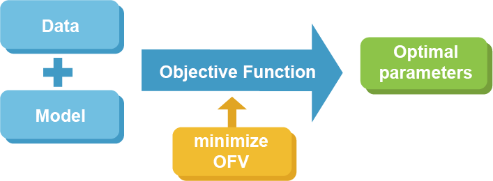
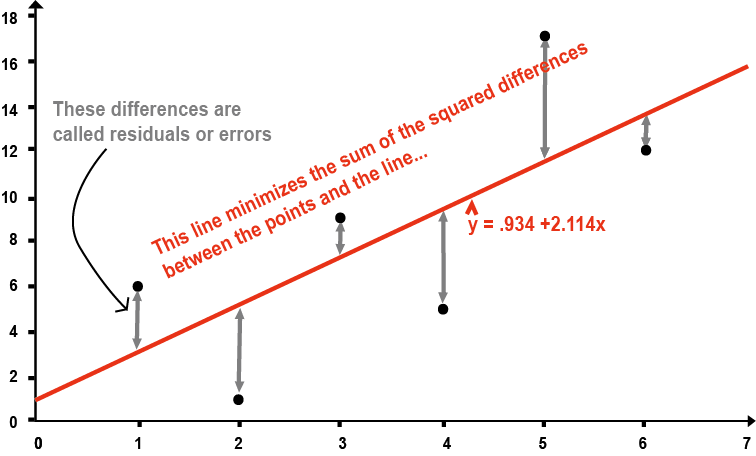
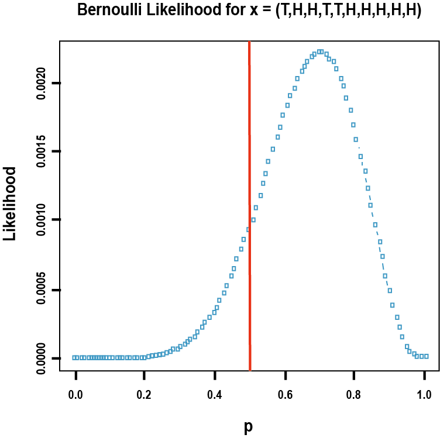

# 파라미터 추정 방법 및 세팅 {#estimation-methods}

\Large\hfill
김정렬
\normalsize

## 추정 방법 및 관련 옵션

\index{\$ESTIMATION (\$EST)}\index{MAXEVAL}\index{NOABORT}\index{SIGDIGITS (SIGDIG)}
```perl
$ESTIMATION NOABORT MAXEVAL=9999 METHOD=1 INTER PRINT=10 SIGDIGITS=3
```

$ESTIMATION 레코드에는 종종 위와 유사한 구문을 쓰게 되고, 이는 NONMEM으로 하여금 어떤 방식으로 파라미터를 추정하고 그 결과를 출력할 것인지에 대한 옵션을 제시하는 것이다. 이중에는 NONMEM이 실행되기 위해 반드시 정의되어야 하는 옵션이 있는 반면, 일부는 생략하더라도 사전에 정해진 값이 적용되어 아무런 문제없이 NONMEM을 실행할 수 있다.\index{\$ESTIMATION (\$EST)}

### NOABORT
\index{NOABORT}

NONMEM이 파라미터를 추정하는 동안 함수 계산을 하다 보면 계산이 불가능한 상황이 발생하기도 하며 이 경우 NONMEM은 더 이상 추정 과정을 실행하지 않고 그 상태로 중단된다. 지나치게 크거나 작은 값과 같이 적절하지 않은 초기 추정값이 지정되었거나 주어진 정보의 양에 비해 추정하고자 하는 파라미터가 지나치게 많을 때 종종 발생한다. 이때 NOABORT 옵션을 주면 NONMEM 자체의 기능을 통해 적절하게 값을 복구(recovery)함으로써 추정 과정을 계속하게 됨으로써 이런 상황을 일부 회피할 수 있다. 그러나 이 옵션만으로 모든 문제를 완벽하게 해결할 수 있는 것은 아니며, 개발한 모델 구조가 자료를 제대로 설명하지 못한다면 이 옵션을 사용했음에도 중단되는 경우가 많다.\index{NOABORT}

### MAXEVAL
\index{MAXEVAL}

NONMEM이 목적함수 값(objective function value)을 계산하기 위해 지나치게 많은 추정을 반복하다 보면, 실행 속도가 느려질 뿐만 아니라 추정된 최종 파라미터가 지나치게 크거나 작은 값으로 나오는 등 부적절한 경우가 있다. 이때 목적함수 계산이 적절한 수준에 이르면 그만해도 좋다는 옵션을 MAXEVAL 값으로 줄 수 있다. 예를 들어 `MAXEVAL=10000`으로 정의하면, 10,000번 까지만 계산하고 더 이상 진행하지 않고 마지막 계산된 파라미터를 최종 값으로 확정하라는 의미이다. 통상의 NONMEM 결과에서 MAXEVAL 값은 자료량이 충분해 파라미터가 잘 추정되면 10번 이내인 경우도 있고, 추정 파라미터가 많고 모델이 복잡한 경우라도 100을 넘지 않기 경우가 많다. 따라서 10,000번 이상 계산해야 한다는 것은 부적절할 수 있으니 불필요한 계산을 지속하지 않도록 하는 것이다. 물론 자료가 매우 많고 파라미터 추정이 쉽지 않은 복잡한 모델이라면 계산을 지속할 수 있으니 지나치게 낮은 값으로 설정할 필요는 없다. 컴퓨터 성능이 떨어져 NONMEM 실행에 오랜 시간이 걸리던 과거에는 프로그램 실행 시간을 줄이고 효율적인 작업을 위해 해당 옵션이 필요했을 것으로 생각되지만, 현재 컴퓨터 성능이라면 시간이 오래 걸리지 않기 때문에 해당 옵션은 설정하지 않아도 될 것이다.\index{목적함수 / objective function}\index{objective function / 목적함수}\index{MAXEVAL}

### METHOD

NONMEM이 파라미터를 추정하는 방법은 METHOD 옵션으로 설정한다. 이중 First Order (FO) 방식은 `METHOD = FO` 또는 `METHOD = 0` 같이 설정하며, 이 값이 기본(default) 설정이므로 FO 방식을 적용하고자 한다면 생략해도 무방하다. 이 방식은 NONMEM이 파라미터를 추정할 때 근사하는 Taylor series 식에 이용되는 개별 η 값의 합을 0으로 가정하여 계산하는 방식을 말하며, 복잡한 계산식이 단순하게 되어 파라미터 추정을 빠르게 할 수 있는 장점이 있다. 그런데 계산이 빨라지는 대신 추정 파라미터에 비뚤림(bias)이 발생하게 되므로, 각 파라미터의 대략의 값을 추정하고자 한다면 FO 방식을 이용할 수 있다.\index{1차추정법 / first-order method(FO)}\index{first-order method(FO) / 1차추정법}\index{first-order method(FO) / 1차추정법}\index{FO}


FOCE 방식은 단순 FO가 아닌 Conditional Estimation을 의미하며, 개별 η 값의 합을 0으로 가정하는 FO 방식과 달리 실제 추정한 η 값의 합을 이용하므로 계산식이 복잡해 실행 시간이 오래 걸리는 반면 보다 정확한 값을 얻을 수 있는 것으로 알려져 있다. 이 방식은 `method = cond` 또는 `method = 1`로 표현할 수 있다. FO 방식에 비해 비뚤림이 적게 발생하기 때문에 개별 값을 좀더 정확하게 추정하기 위해서는 FOCE 방식을 쓴다.(표 \@ref(tab:fofoce))\index{1차 조건부 추정방법(FOCE) / first-order conditional estimation method(FOCE)}\index{1차추정법 / first-order method(FO)}\index{first-order conditional estimation method(FOCE) / 1차 조건부 추정방법(FOCE)}\index{first-order method(FO) / 1차추정법}\index{first-order conditional estimation method(FOCE) / 1차 조건부 추정방법(FOCE)}\index{first-order method(FO) / 1차추정법}\index{FOCE}\index{FO}


```{r fofoce, echo=FALSE}
library(tibble)
fofoce <- tribble(~`비교`, ~FO, ~FOCE,
        "연산속도", "빠르다", "느리다",
        "자료의 양", "Sparse", "Dense",
        "Ω의 크기", "작을 때", "클 때",
        "비선형 정도", "작다", "크다",
        "실례", "새로운 자료를 분석, 최신 모형을 적용", "집단약력학 모형, 범주형 또는 이산형 자료")
knitr::kable(fofoce, caption="FO와 FOCE의 비교", booktabs = TRUE) %>%
  column_spec(2:3, width = "4cm")
```

\index{1차 조건부 추정방법(FOCE) / first-order conditional estimation method(FOCE)}\index{first-order conditional estimation method(FOCE) / 1차 조건부 추정방법(FOCE)}\index{first-order conditional estimation method(FOCE) / 1차 조건부 추정방법(FOCE)}\index{FOCE}\index{FO}

### INTERACTION
\index{INTERACTION}

파라미터 추정 시 η와 ε 사이의 상호작용을 가정할 때 해당 옵션을 설정한다. 개체간 차이를 의미하는 η와 잔차인 ε 사이의 예상되는 상호작용을 무시하면 파라미터 추정 시 비뚤림이 발생하게 된다. 특히 Y = F * (1 + ε) 또는 Y = F * (1 + ε~1~) + ε~2~ 같은 잔차 모델을 사용하는 경우 상호작용을 고려하는 것이 통계학적으로 적절하며, Y = F + ε와 같이 표현되는 잔차 모델에서는 이런 상호작용 설정이 파라미터 추정 결과와 무관한 것으로 알려져 있다.\index{잔차 / residual error}\index{residual error / 잔차}

### PRINT

NONMEM이 실행되면 파라미터를 추정하기 위해 되풀이(iteration)를 반복하게 되는데 그 중간 과정을 보여달라는 옵션이다. 이 옵션을 설정하지 않으면 처음에 시작한다는 문구가 뜬 후 바로 이어 최종 결과가 제시된다. 즉 중간에 어떤 과정으로 진행되었는지 알 수 없으며, 추정하는데 시간이 오래 걸리는 경우 제대로 실행되고 있는지 확인하기 어렵다. 그래서 중간중간 진행 과정을 확인하기 위해 해당 옵션을 이용할 수 있다. 예를 들어 10으로 설정하면 되풀이를 10번 할 때마다 중간 과정을 보여주기 때문에 이를 통해 각 파라미터가 어떤 값으로 수렴하는지 확인할 수 있다. 그런데 최근 컴퓨터는 계산을 빠르게 처리하기 때문에 중간 과정이 순식간에 지나가 실제 값을 확인하기 어려워 설정하는 의미가 없는 경우도 있다.\index{되풀이 / iteration}\index{iteration / 되풀이}

## NONMEM 추정

NONMEM은 목적함수(objective function)를 최적화하는 방식으로 파라미터를 추정하게 되고, 이때 최적화된 목적함수 값(Objective Function Value, OFV)이 산출된다. 개발한 모델로부터 산출된 OFV는 가능도비 검정(Likelihood Ratio Test, LRT) 방법을 이용함으로써 보다 적절한 모델을 선정할 수도 있다. 여기 제시된 내용은 수학자가 아닌 이상 정확하게 이해하기는 쉽지 않지만, 개념적으로 간단히 도식화하면 그림 \@ref(fig:obj)과 같다.\index{가능도 / likelihood}\index{가능도비 검정 / likelihood ratio test}\index{목적함수 / objective function}\index{likelihood / 가능도}\index{likelihood ratio test / 가능도비 검정}\index{objective function / 목적함수}

```{r obj, fig.cap = "NONMEM 추정 도식화"}

```

일반적으로 우리는 주어진 자료를 설명하기 위해 다양한 파라미터가 포함된 모델을 개발하게 되고 이를 NONMEM으로 실행하게 될 것이다. 이때 NONMEM은 목적함수를 계산하게 되고 이 값이 최소화되는 파라미터 조합을 output 파일을 통해 제시한다. 어떤 형태로 목적함수를 설정하느냐에 따라 OLS, WLS, ELS 방법 여러 가지 방식들이 이용된다.\index{목적함수 / objective function}\index{objective function / 목적함수}

### OLS 방식

OLS (ordinary least square) 방식은 단순 선형회귀(linear regression)를 하는 걸 말하며,
흔하게 사용된다. 이는 SAS, SPSS 등 통계 프로그램에서 사용하는 선형회귀 방식과 동일하다. 예를 들어 용량에\index{SS}
따른 약동학 파라미터 AUC의 상관관계를 파악하기 위해 그래프를 그리고 가상의 선을 설정하여 "용량에 따라 AUC는 증가한다"는 결론을 내리는 것이 전형적인 OLS 방식이다.(그림 \@ref(fig:OLS))

```{r OLS, fig.cap = "ordinary least square"}
 #fig 2
```


회귀를 통해 자료를 설명할 때 관찰값과 예측값 간의 차이를 잔차(residual) 또는 오차(error)라고 표현하는데, OLS 방식에서는 아래 수식 \@ref(eq:OLS)과 같이 이 잔차를 제곱해서 나온 값의 합, 즉 잔차제곱합을 최소화하는 파라미터 조합을 찾게 된다.\index{잔차 / residual error}\index{residual error / 잔차}
\begin{equation}
OBJ_{OLS} \propto \sum_{}^{}{(Y_{obs} - Y_{pred})}^{2} 
(\#eq:OLS)
\end{equation}

그림 \@ref(fig:OLS)에서와 같이 직선 형태의 1차 함수로 자료를 설명하는 경우, 모델은 기울기 및 y 절편의 두 개 파라미터를 갖게 되고 이 두 개 파라미터의 조합으로 다양한 직선이 그려지며 그로부터 각각 잔차제곱합이 산출될 것이다. 이중 기울기가 2.114이고 y 절편은 0.934인 파라미터 조합일 때 잔차제곱합이 가장 작게 되고, 이 값을 모델의 파라미터로 추정하는 방식이 OLS 방식이다.\index{기울기 / gradient}\index{gradient / 기울기}\index{잔차 / residual error}\index{residual error / 잔차}

### WLS 방식

WLS (weighted least square) 방식은 관찰값별로 정해진 가중요소(weighting factor)를 주어\index{가중요소 / weighting factor(W)}\index{weighting factor(W) / 가중요소}
선형회귀를 한다는 점이 OLS와 다른 점이다.
\begin{equation}
\text{OBJ}_{\text{WLS}} \propto \sum_{}^{}\left\{ W \times {(Y_{\text{obs}} - Y_{\text{pred}})}^{2} \right\}
(\#eq:wls)
\end{equation}

OLS 방식에서는 관찰값이 모두 동일한 가치를 지니고 있으므로 특히 어떤 관찰값에서의 잔차를 최소화 해야 하는가에 대한 기준이 없다. 반면 WLS 방식에서는 보다 정확하게 회귀해야 하는 값에 더 큰 가중요소를 부여함으로써 선형회귀를 하게 된다. 이때 가중요소는 관찰값 분산의 역수로 설정하는 경우가 많지만, 다른 방식도 가능하다. 다시 말해 특정 시점의 값이 유사하게 관찰되어 관찰값 분산이 가장 작다면 그 시점에 가장 큰 가중요소를 부여함으로써 잔차제곱합을 최소화할 때 해당 관찰값의 잔차를 줄이는 것이 보다 영향력을 갖도록 하는 방식이다.\index{가중요소 / weighting factor(W)}\index{weighting factor(W) / 가중요소}\index{잔차 / residual error}\index{residual error / 잔차}

그런데 예측값이 아닌 관찰값 변이를 가중요소로 이용하면 관찰 자체에 따른 변이도 포함되어 가중요소 설정이 부정확할 수 있다. 모든 시점의 관찰값 변이가 유사하면서 작을 경우 파라미터 추정을 신뢰할 수 있지만, 관찰값 변이가 균등하지 않거나 전반적으로 크다면 일부 가중요소는 부적절하게 설정되며 이를 활용하여 산출한 파라미터의 신뢰도에 문제가 제기될 수 있다.\index{가중요소 / weighting factor(W)}\index{weighting factor(W) / 가중요소}

### ELS 방식

관찰값 변이를 이용한 WLS 방식에서의 가중요소 설정 한계를 보완하기 위해 예측값 변이를 고려하는 것이 ELS (extended least square) 방식이다. 이 방식은 NONMEM에서 실제 활용하고 있는 것으로, 실행 시간은 오래 걸리지만 보다 정확한 값을 추정할 수 있는 것으로 알려져 있다.\index{가중요소 / weighting factor(W)}\index{weighting factor(W) / 가중요소}
\begin{equation}
  \text{OBJ}_{\text{ELS}} \propto \sum_{}^{}\left\lbrack W \times {(Y_{\text{obs}} - Y_{\text{pred}})}^{2} + \ln\left\{ \text{Var}\left( Y_{\text{pred}} \right) \right\} \right\rbrack
(\#eq:els)
\end{equation}

## Likelihood

가능도(likelihood) 개념은 확률(probability)과 함께 이해하는 것이 좋다. 확률이라는 것은 파라미터 값이 주어졌을 때 아직 관찰되지 않은 결과를 예상할 때 사용한다. 즉, 앞면이 나올 가능성이 ½인 동전을 10번 던졌을 때 앞면이 몇 번 나올 것인지와 같은 물음에서 확률의 개념을 이해할 수 있다. 반면 가능도라는 것은 관찰된 결과를 알고 있는 상태에서 그런 결과가 예상되는 가능한 파라미터를 추정하는 것과 관련이 깊다. 앞서 예시를 응용하면, 동전을 10번 던져 앞면이 5번 나왔다는 사실에 근거할 때 동전의 앞면이 나올 확률은 ½일 가능성이 가장 높다고 말할 수 있다. 다시 말해 확률이 파라미터가 주어졌을 때 관찰값에 대한 함수라면, 가능도는 관찰값이 주어졌을 때 파라미터에 대한 함수로 볼 수 있다. 이런 이유로 가능도는 여러 추정 가능한 파라미터에 대한 분포 형태로 표현되며, 앞서 예시에서 실제 확률은 ½이 아닐 수도 있지만 ½일 가능성이 가장 높은, 즉 최대가능도(maximum likelihood) 값을 갖는 파라미터는 ½이라고 할 수 있다.\index{가능도 / likelihood}\index{likelihood / 가능도}

우리가 모델을 통해 확인하고자 하는 파라미터는 NONMEM에서 θ 형태로 표현되며, 약동학에서 청소율, 분포용적 등이 이에 해당하고 앞서 예시의 경우 앞면이 나올 확률이다. 아래 그림 \@ref(fig:coin)은 동전을 던져 앞면이 일곱번 나왔을 때 동전 앞면이 나올 확률, 즉 추정하고자 하는 파라미터에 대한 가능도를 나타낸 것이다. 예상한 바와 같이 앞면이 나올 확률이 0.7인 경우 가능도가 가장 크며, 이는 앞면이 나올 확률이 0.7인 동전일 때 관찰 결과를 가장 잘 설명함을 의미한다.\index{가능도 / likelihood}\index{likelihood / 가능도}

```{r coin, fig.cap = "동전 앞면이 7회 나올 확률의 가능도"}

```

평균이 μ이고 표준편차가 σ인 정규분포를 따르는 확률변수 x를 가정할 때, 파라미터 θ의 가능도를 구하는 함수는 아래와 같다.\index{가능도 / likelihood}\index{likelihood / 가능도}
\begin{equation}
\begin{split}
  L\left( \theta \middle| \mathcal{x} \right) & = P\left( \mathcal{x}_{1} \right|\widehat{\theta}) \times P\left( \mathcal{x}_{2} \right|\widehat{\theta}) \times \cdots \times P\left( \mathcal{x}_{n} \right|\widehat{\theta}) \\
  & = \left( 2\pi \right)^{- \frac{1}{2}n} \times \prod_{\mathcal{i}\text{=1}}^{n}\left( (\sigma_{i}^{2})^{- \frac{1}{2}} \times e^{- {\ \frac{1}{{2\sigma}_{i}^{2}}\left( x_{i} - \widehat{\theta} \right)}^{2}} \right)
\end{split}
(\#eq:likelihood)
\end{equation}

위 식의 양변을 로그변환한 식 및 그 식에 -2를 곱한 식은 각각 아래와 같다.
\begin{equation}
\begin{split}
  \ln{(L)} & = - \frac{1}{2}n\ln\left( 2\pi \right) - \frac{1}{2}\sum_{\mathcal{i} = 1}^{n}\left( \ln{(\sigma_{i}^{2})} + \frac{\left( x_{i} - \widehat{\theta} \right)^{2}}{\sigma_{i}^{2}} \right) \\
  -2\ln{(L)} & = n\ln\left( 2\pi \right) + \sum_{\mathcal{i} = 1}^{n}\left( \ln{(\sigma_{i}^{2})} + \frac{\left( x_{i} - \widehat{\theta} \right)^{2}}{\sigma_{i}^{2}} \right) \propto \text{OFV}
\end{split}
(\#eq:2ll)
\end{equation}

이처럼 가능도 식을 로그변환하여 -2를 곱하면 목적함수 계산식을 얻을 수 있고, 가능도를 최대로 한다는 건 목적함수 값을 최소로 한다는 것과 같은 의미로 해석됨을 알 수 있다.\index{가능도 / likelihood}\index{목적함수 / objective function}\index{likelihood / 가능도}\index{objective function / 목적함수}

## Taylor 전개식
\begin{equation}
f(x) = \sum_{n = 0}^{\infty}\frac{f^{\left( n \right)}\left( \alpha \right)}{n!}{(x - \alpha)}^{n}
(\#eq:taylor)
\end{equation}

위 식은 미분가능한 함수를 다항식 형태로 변환한 것으로, 이런 변환을 통해 참값에 근사한 해를 구할 수 있다. 엄밀한 해를 구하기 위해서는 무한대 차수까지 모든 도함수의 합을 활용해야 하지만, NONMEM에서 FO 및 FOCE 방법으로 파라미터를 산출하는 경우 첫 번째 도함수만 활용하고 이후 도함수는 모두 무시하여 근사한 해를 구하고 Laplacian 방법에서는 두 번째 도함수까지 활용하여 해를 구한다.\index{1차 조건부 추정방법(FOCE) / first-order conditional estimation method(FOCE)}\index{1차추정법 / first-order method(FO)}\index{first-order conditional estimation method(FOCE) / 1차 조건부 추정방법(FOCE)}\index{first-order method(FO) / 1차추정법}\index{first-order conditional estimation method(FOCE) / 1차 조건부 추정방법(FOCE)}\index{first-order method(FO) / 1차추정법}\index{FOCE}\index{FO}

## Likelihood Ratio Test

단순한 모델에 파라미터를 추가해 보다 복잡하게 만드는 등 하나의 모델이 다른 모델의 특수 형태인 서로 관련된 모델간 적합도를 비교하기 위해 가능도비를 검정한다. 각 모델에서 산출된 목적함수 값의 차이는 모델에서 사용된 파라미터 개수 차이를 자유도로 갖는 *Χ*~2~ 분포를 따른다는 특성을 이용한다. 즉 가능도를 로그변환한 것이 목적함수 형태로 표현되므로, 모델간 가능도비를 로그변환한다는 것은 목적함수 값의 차이를 의미한다. 이 목적함수 값의 차이와 해당 자유도에서의 *Χ*~2~ 분포 값을 비교함으로써 통계적으로 우수한 모델을 판정할 수 있다. 이때 비교하고자 하는 목적함수 값은 동일한 자료를 이용하여 동일한 잔차 형태를 가정한 모델로부터 산출된 것이어야 한다.\index{가능도 / likelihood}\index{목적함수 / objective function}\index{likelihood / 가능도}\index{objective function / 목적함수}\index{잔차 / residual error}\index{적합도 / goodness of fit}\index{residual error / 잔차}\index{goodness of fit / 적합도}
