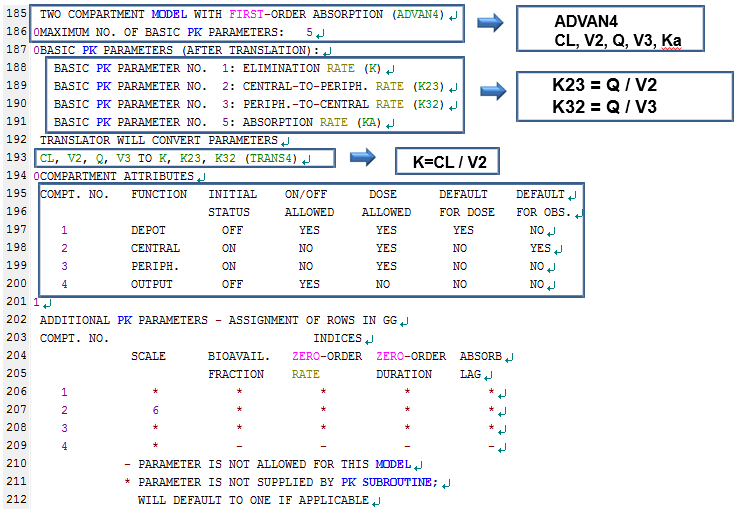

# NONMEM 실행결과 해석 및 Xpose4 사용법 {#use-of-xpose4}

\Large\hfill
전상일
\normalsize

---

NONMEM을 실행시키면, 다양한 보고파일들이 도출되는데, 본 장에서는 도출된 보고파일들 중 실행결과(output) 파일에 대해 설명하고, table 파일들을 이용하여 진단 플롯을 그리는 방법에 대해 다루고자 한다. 실행결과 파일은 제어구문 파일과 파일 이름은 같지만, 확장자가 .out인 파일이다. 실행결과 파일을 보면 데이터셋과 제어구문의 내용이 요약되어 나오고 실행의 결과와 추정한 파라미터 값 등을 확인할 수 있는데, 구성을 크게 3개로 나누어 살펴보면, 전체 결과 요약 부분, 추정 단계 부분, 공변량 부분으로 구분할 수가 있다. 결과 요약 부분에는 제어구문의 내용, NONMEM을 실행한 날짜와 시간, 제목, 읽어 들인 데이터 요약 등이 나와 있고, 추정 단계 부분에는 최소화의 성공여부와 목적함수값(OFV, Objective Function Value), 최종 파라미터 추정치 등이 나와 있다. 공변량 부분은 제어구문에 $COVARIANCE 를 추가한 경우에만 나오게 되며 추정치의 표준오차, 공분산 행렬, 상관 행렬 등이 나와 있다. 제어구문의 파일명을 만들 때 영문 8글자 이하로 만드는 것을 추천하는데, 이는 제어구문의 파일명이 영문 8글자를 넘어가게 되면 실행결과 파일명의 뒷부분이 물결(\~) 모양으로 표시되어 어떤 파일을 실행시켰는지 한눈에 알아보기가 어렵기 때문이다.\index{공분산 / covariance}\index{목적함수 / objective function}\index{실행결과 파일 / output files}\index{covariance / 공분산}\index{objective function / 목적함수}\index{output files / 실행결과 파일}\index{\$COVARIANCE (\$COV, \$COVAR)}

\index{xpose4}

실행결과 파일의 내용을 구체적으로 살펴보면 아래와 같다.\index{실행결과 파일 / output files}\index{output files / 실행결과 파일}

```{r image-01, fig.cap= '실행결과 파일의 82-102행'}

```

```{r image-02, fig.cap= '실행결과 파일의 103행-137행', out.width='95%'}
knitr::include_graphics('assets/media-10/image2.png')
```

```{r image-03, fig.cap= '실행결과 파일의 138행-164행', out.width='100%'}

```

초반부 내용은 해당 부분에 쓰여진 설명을 참고하도록 하고, 154행부터 보면 APPEND, PRINT, HEADER 라고 쓰여진 부분이 있는데, 이는 $TABLE 블록에서 표 파일을 만들 때 준 옵션에 대한 설명이다. APPEND는 표 파일에 DV, PRED, RES, WRES 부분을 추가하겠다는 옵션으로 NOAPPEND라고 쓰면 표 파일에 이부분이 추가되지 않는다.  PRINT는 표 파일의 내용을 실행결과(OUTPUT) 파일 내에 출력하겠다는 의미로, NOPRINT를 사용하면 출력되지 않는다. HEADER는 열이름(ID, TIME, AMT 등)을 주는 경우에 사용하여, NOHEADER라고 쓰면 열이름이 표시되지 않고, ONEHEADER라고 쓰면 표 파일의 첫번째 행에 열이름이 표시된다. 각 표들을 엑셀 등으로 실제로 열어서 옵션이 어떻게 적용되고 있는지 살펴보면 이해가 쉽다.\index{dependent variable(DV) / 종속변수(DV)}\index{\$TABLE}\index{AMT}\index{ID}\index{NOAPPEND}\index{NOHEADER}\index{NOPRINT}\index{ONEHEADER}\index{PRED}\index{RES}\index{TIME}\index{WRES}

```{r image-04, fig.cap= '실행결과 파일의 185행-212행', out.width='100%'}

```

185행부터는 모델의 구조(ADVAN4)와 그 구조를 설명하기 위해 사용된 파라미터(TRANS4)에 대해 나와있으며, 195\~200행에는 현재 모델 구조에서의 각 구획 별 설명이 나와있다. ADVAN4에서 ‘DOSE’에 대한 구획은 1구획, ‘OBSERVATION’은 2구획이 기본값으로 되어있으며, 1\~3구획까지 모두 ‘DOSE’가 허용된다고 되어 있다(DOSE ALLOWED: YES). 이 때문에 정맥투여와 경구투여 데이터가 같이 있는 2구획 모델의 경우 ADVAN4를 사용하여 하나의 모델로 설명할 수 있는데, 이 때는 투여 경로를 명시해주어야 하므로 CMT를 데이터셋에 추가해야 한다. 표 \@ref(tab:basic-data-format)와 같이, 경구투여인 경우 CMT를 1로, 정맥투여인 경우 CMT를 2로 주면 된다.\index{ADVAN4}\index{CMT}\index{TRANS}

\index{CMT}
```{r basic-data-format}
read_csv('data-raw/media-10-tab-1.csv', col_types="cccccc") %>% 
  kable(booktabs=TRUE, caption = "투여경로에 따라 CMT가 기록된 데이터셋")
```

```{r image-05, fig.cap= '실행결과 파일의 227행-238행', out.width ='80%'}
knitr::include_graphics('assets/media-10/image5.png')
```

```{r image-06, fig.cap= '실행결과 파일의 271행-290행', out.width='100%'}

```

227행부터는 \$ESTIMATION 구문에 대해 설명해주는 부분으로, 사용자가 준 옵션에 대한 설명이 나와있다. 아래와 같이 옵션을 주면, 위의 결과가 나오게 된다.\index{\$ESTIMATION (\$EST)}

```perl
$ESTIMATION MAXEVAL=9999 SIG=3 PRINT=10 METHOD=1 INTER
```
\index{\$ESTIMATION (\$EST)}\index{MAXEVAL}

MAXEVAL은 추정동안 함수평가의 최대수를 의미하는 것으로, 추정과정이 무한대로 지속되는 것을 방지하기 위해 주는 옵션이다. 0으로 주면 파라미터의 추정을 진행하지 않는다. SIG는 SIGDIGITS (SIGDIG)의 약자로, NONMEM에서 최소화를 진행할 때 파라미터의 유효자리 숫자를 의미하며, 기본값은 3으로 되어있다. 원하는 유효자리의 결과를 얻지 못하여 최소화에 실패하는 경우, SIG=2 등으로 변경하면 성공하는 경우가 많다. PRINT 옵션은 추정과정의 내용을 되풀이 간격마다 찍도록 해주는 옵션으로 0번째와 마지막은 기본적으로 인쇄된다. `METHOD=0` 은 1차 추정법 (first-order method, FO)이고, `METHOD=1`은 1차 조건부 추정법(first-order conditional estimation, FOCE)이며, INTER는 INTERACTION의 약자로, ETA-EPS 간의 상호작용을 감안하도록 해주는 옵션이다.\index{되풀이 / iteration}\index{iteration / 되풀이}\index{조건부 추정법 / conditional estimation method}\index{conditional estimation method / 조건부 추정법}\index{1차 조건부 추정방법(FOCE) / first-order conditional estimation method(FOCE)}\index{first-order conditional estimation method(FOCE) / 1차 조건부 추정방법(FOCE)}\index{first-order method(FO) / 1차추정법}\index{first-order conditional estimation method(FOCE) / 1차 조건부 추정방법(FOCE)}\index{first-order method(FO) / 1차추정법}\index{FOCE}\index{FO}\index{INTERACTION}\index{MAXEVAL}\index{SIGDIGITS (SIGDIG)}

```{r image-07, fig.cap= '실행결과 파일의 292행-311행', out.width='100%'}

```

293행을 살펴보면, `MINIMIZATION SUCCESSFUL`이 나와있는데, 이는 추정과정이 성공적으로 끝났다는 것으로 목적함수의 값이 성공적으로 최소화 된 것을 의미한다. 297행부터는 ETABAR에 대한 설명으로 ETABAR는 ETA 값들의 평균을 의미한다. NONMEM에서 ETA는 평균이 0이고 분산이 ω^2^ 인 표준정규분포를 따른다고 가정하는데, 이 가정에 대한 통계적 유의성을 확인하는 부분이다. “ETA의 평균은 0이다” 라는 귀무가설이 주어져있고, 0과 가까운 매우 작은값의 ETABAR와, 이에대한 P-value가 제시되어 있다. 위의 예시에서는 P-value가 모두 0.05이상으로 귀무가설을 기각하지 않으므로(유의수준 0.05) 가정이 틀리지 않음을 알수 있다. 만약 P-value가 0.05보다 작은값이 나오면 가정이 틀렸다는 얘기로, 해당 ETA(의 분산)값은 모델에 반영될수 없으므로 0으로 고정해야 한다.\index{목적함수 / objective function}\index{objective function / 목적함수}\index{ETABAR}\index{SS}

306행에는 ETA shrinkage(%) 가 나오는데, 보통 이 수치가 30% 이상이면 파라미터가 너무 많은상황(over-parametrization)이 되었다는 의미로, 모델을 단순화 시키는 작업이 필요하다. 즉 모델에서 추정해야할 파라미터의 수를 줄여야 한다는 것으로, 해당 ETA 값을 0으로 고정하는 것이 그중 하나의 방법이다.\index{shrinkage / 축소}\index{shrinkage / 축소}

```{r image-08, fig.cap= '실행결과 파일의 333행-361행', out.width='100%'}

```

```{r image-09, fig.cap= '실행결과 파일의 365행-393행', out.width='100%'}
knitr::include_graphics('assets/media-10/image9.png')
```

345행부터는 목적함수(OFV)의 값과 THETA, ETA의 최종 파라미터 추정치를 확인할 수 있으며, TH1 (THETA 1)의 결과 1.02E+01 은 10.2 라고 생각하면 된다. ETA 부분에 주어지는 값들은 ω^2^ 값으로, 행렬 형태로 제시된다. 예시에서 ETA1은 CL의 ETA의 ω^2^, ETA2는 V2의 ETA의 ω^2^ 값이며, 그 사이의 값은 두 파라미터의 공분산 값이다. 현재 모델에서는 공분산을 추정하지 않았기 때문에 0으로 나온 것이며, 두 파라미터 사이에 상관관계가 있다고 판단되면, $OMEGA 부분에 0.04 0.02 0.04 이런 식으로 초기값을 주어 추정하게 하면 된다.\index{공분산 / covariance}\index{목적함수 / objective function}\index{covariance / 공분산}\index{objective function / 목적함수}\index{\$OMEGA}

다음으로, $TABLE을 통해 생성된 표 파일들을 이용하여 진단 플롯을 그리는 방법을 알아보도록 하자. $TABLE은 코드 \@ref(exm:table-example)와 같이 많이 쓰는데, 이를 통해 생성되는 표 파일들과 R의 xpose4 package를 이용하여 진단 플롯을 그릴 수 있다. [@R-xpose4]\index{\$TABLE}

\index{conditional weighted residuals / 조건부 가중 잔차}

```{example, table-example, echo = TRUE}
$TABLE의 예\index{\$TABLE}
```
\vspace{-5ex} 
\small
```perl
$TABLE ID TIME AMT DV MDV DV IPRED CWRES IWRES ONEHEADER NOPRINT FILE=sdtab3
$TABLE ID ETA(1) ETA(2)                        ONEHEADER NOPRINT FILE=patab3
$TABLE ID SEX                                  ONEHEADER NOPRINT FILE=catab3
$TABLE ID AGE WT HT                            ONEHEADER NOPRINT FILE=cotab3
```
\normalsize
Sdtab은 Standard Table, patab은 Parameter Table, catab은 Categorical Covariates Table을 의미하며, cotab은 Continuous Covariates Table을 의미한다. 이 네 개의 테이블 이름은 xpose4 package에서 미리 약속된 이름으로 그대로 사용하여야 하며, 그 뒤에 숫자(Run Number라고 한다)만 바꾸어 사용하게 된다. \$TABLE의 옵션들은 앞에서 설명하였으니 생략하기로 하고, 추가적인 옵션들은 NONMEM 설치 폴더의 help 폴더 안에 있는 $table.ctl 파일을 참고하도록 하자.\index{\$TABLE}

Xpose4 package 가 설치되어 있다면, R 실행 후 아래와 같이 입력하여 Basic goodness-of-fit plots(그림 \@ref(fig:basic-gof))과 individual plots(그림 \@ref(fig:indi-plots))을 그릴 수 있다.

```r
library(xpose4)
xpose4()
# Run number (3, in this case)
# Selection: 4
# Selection: 2 or 5
```

(ref:basic-gof) Basic goodness-of-fit Plots

```{r basic-gof, fig.cap="(ref:basic-gof)"}
knitr::include_graphics("./assets/media-10/image11.png")
```

Basic goodness-of-fit plots에서 좌측 위 그림은 observations (DV) vs population predictions (PRED) 그림으로 집단 대표값을 통해 예측된 값(X축)과 관측값(observation, Y축)을 나타낸 그림으로, 개별 값들과 그 추세선(빨간선)이 기울기 1인 직선(일치선, line of identity)과 가까이 붙어있는 것이 가장 좋다. 우측 위 그림은 Observations (DV) vs Individual predictions (IPRED) 그림으로, 파라미터들의 개인간변이(ETA)를 반영하여 예측한 값(개인 예측값, X축)과 관측값(Y축)을 그린 그림으로, 이 역시 개별 값들과 추세선(빨간선)이 일치선과 가까이 붙어있는 것이 좋다. 개인간변이가 모델에 반영이 되어 있다면, PRED로 그린 그림보다 IPRED로 그렸을 때 개별 값들이 일치선에 더욱 밀착되어 있다.\index{개인 예측 / individual(specific) prediction(s)}\index{기울기 / gradient}\index{gradient / 기울기}\index{individual(specific) prediction(s) / 개인 예측}\index{IPRED}\index{PRED}

아래 두개의 그림은 잔차(residual)에 대한 진단 플롯으로, 좌측은 |IWRES| vs Individual predictions (IPRED), 우측은 Conditional weighted residuals (CWRES) vs Time 을 나타낸 그림이다. IWRES는 개인 가중잔차(Individual Weighted residuals)이고 |IWRES|는 개인 가중잔차에 절대값을 씌운 값이다. 잔차 모델이 적절하다면, CWRES 플롯의 모든 점들이 0을 기준으로 대칭 분포하게 되며, CWRES 값들의 흩어진 정도가 시간이나 개인 예측값에 따라 경향성이 없고, 그 범위가 -3과+3 사이에 분포할 것으로 기대된다.\index{개인 예측 / individual(specific) prediction(s)}\index{individual(specific) prediction(s) / 개인 예측}\index{잔차 / residual error}\index{residual error / 잔차}\index{conditional weighted residuals / 조건부 가중 잔차}\index{CWRES}\index{IPRED}\index{IWRES}\index{PRED}\index{RES}\index{WRES}

Xpose4에서는 Basic goodness-of-fit Plots 외에도 각 개체별로 개인 예측값의 적합도를 확인할 수 있으며(그림 \@ref(fig:indi-plots)), 파라미터 간의 상관관계 및 공변량에 대한 탐색도 가능하다.\index{개인 예측 / individual(specific) prediction(s)}\index{individual(specific) prediction(s) / 개인 예측}\index{적합도 / goodness of fit}\index{goodness of fit / 적합도}

```{r indi-plots, fig.cap="(ref:indi-plots)"}
knitr::include_graphics("./assets/media-10/image12.png")
```

(ref:indi-plots) Individual plots

마지막으로, NONMEM을 실행시켰는데 성공적으로 최소화되지 않았다면 아래와 같은 시도를 해 볼 수 있다.

1.  초기값을 다르게 줘 볼 것
2.  모델에서 THETA, ETA의 수를 줄여볼 것 
3.  ETA 값을 0으로 고정해볼 것 
4.  유효숫자 자릿수를 바꿔볼 것 (예, SIG=2) 
5.  이상치(outlying data point)를 제거해볼 것 \index{이상치 / outlier}\index{outlier / 이상치}
6.  단순 가법 오차 모델을 사용해볼 것 
7.  보다 좁은 상한, 하한 값(upper and lower bound)을 줘 볼 것 
8.  FOCE 방법(method=1)으로 시도해보기 전에 FO 방법(method=0)을 시도해 볼 것\index{1차 조건부 추정방법(FOCE) / first-order conditional estimation method(FOCE)}\index{1차추정법 / first-order method(FO)}\index{first-order conditional estimation method(FOCE) / 1차 조건부 추정방법(FOCE)}\index{first-order method(FO) / 1차추정법}\index{first-order conditional estimation method(FOCE) / 1차 조건부 추정방법(FOCE)}\index{first-order method(FO) / 1차추정법}\index{FOCE}\index{FO}
