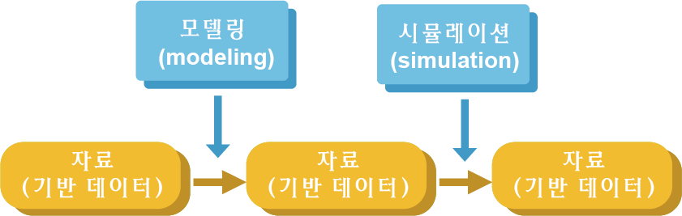

# (PART) 모델 진단 및 약동학-약력학 연계 모델 {-}

# 모델 진단/평가 개론 {#diag-eval}

\Large\hfill
한승훈
\normalsize

---

계량약리학에서 사용하는 다양한 방법론 중 가장 대표적인 것은 혼합효과 모델링-시뮬레이션이며, 이 일련의 과정에서 가장 핵심이 되는 것은 ‘신뢰할 수 있는’, 그리고 신뢰할 수 있으므로 ‘유용하다고 인정되는’ 모델이라고 할 수 있다. 계량약리학자는 이런 모델을 구축하고, 이를 기반으로 경험하지 못한 다양한 상황에 대한 가상 실험(또는 임상시험)을 실시할 수 있다. 다만, ‘신뢰할 수 있는 모델은 이러이러한 것이다.’라는 식으로 정의하는 것은 거의 불가능에 가깝다. 어느 정도의 신뢰가 필요한지, 얼마나 실제 상황을 잘 모사하여야 신뢰할 수 있는 것인지에 대한 객관적이며 절대적인 지표가 없기 때문이다. 따라서, ‘신뢰할 수 있다’고 함은 상황에 따라 가변적인 것이며, 모델링의 대상이나 목적에 따라 사용한 모델이 ‘신뢰할 수 있음’을 적절히 입증하는 절차가 필요하다. 그리고 이런 입증을 위해 활용되는 방법론이 바로 모델의 진단 또는 평가라 하는 절차이다.\index{시뮬레이션 / simulation}\index{simulation / 시뮬레이션}

모델 진단/평가의 구체적 내용을 살펴보기 전에, 계량약리학의 본질적인 필요성과 연결 지어 앞서 언급한 ‘신뢰성’이라는 개념에 대해 조금 더 구체적으로 생각해 볼 필요가 있다. 계량약리학 분석은 신약 개발 또는 임상 약물치료 상황에서 제시되는 특정한 질문들에 대한 타당한 해답을 얻기 위해 수행하는 것이다. 예를 들어, “목표 적응증을 가진 환자에서 임상적으로 적용 가능한 최적의 용량-용법은 어떤 것인가?”라는 질문에 대한 답을 얻기 위해서는, 기존에 확보한 약동-약력학 자료(비임상/임상)로부터 최선의 모델을 구현하고, 이를 이용한 다양한 시뮬레이션을 수행함으로써 최대의 유효성과 안전성을 충족하는 용량-용법을 찾게 된다.\index{시뮬레이션 / simulation}\index{simulation / 시뮬레이션}

```{r ms-workflow, fig.cap="모델링-시뮬레이션 workflow 및 구성 요소"}

```

이런 일련의 과정(그림 \@ref(fig:ms-workflow))을 잘 생각해 보면 궁극적으로 도출되는 결과의 신뢰성에 다음의 영향 요인들이 있음을 알 수 있다.

1. 자료 신뢰성: 데이터의 품질(얼마나 정확한가?)과 양(얼마나 충분한가?)
2. 모델 신뢰성: 주어진 자료에 비추어 판단한 모델의 정확성, 정밀성, 재현가능성
3. 예측 신뢰성: 시뮬레이션 시나라오와 절차의 타당성\index{시뮬레이션 / simulation}\index{simulation / 시뮬레이션}

따라서, 독자는 ‘모델링의 절차’에 초점을 두는 이 장에서 다루고자 하는 신뢰성의 개념이 위에 제시한 3개의 요인 중 2번에 해당하는 것임을 미리 이해할 필요가 있다. 자료 신뢰성은 그러한 자료를 얻고자 하는 ‘실험 또는 시험의 설계와 수행’과 관련이 있는 것이며, 예측 신뢰성은 어느 수준의 신뢰성이 입증된 모델을 확보한 상황에서 수행하는 ‘시뮬레이션의 절차’와 관련이 있는 것이기 때문이다.\index{시뮬레이션 / simulation}\index{simulation / 시뮬레이션}

이제 모델 진단/평가의 정확한 개념과 개별 절차에 대한 개략적 설명을 통해 이 교재 전반에서 다루는 내용에 대한 독자의 이해를 증진하고자 한다.

## 모델 진단과 평가의 일반 특성

모델의 진단/평가라는 용어를 사용함에 있어 의문을 가지는 독자들이 있을 수 있다. 진단이면 진단이고, 평가면 평가지 왜 이 두 용어가 계속 같이 붙어 다니는 것인가? 이에 대한 답변을 얻기 위해서는 진단과 평가가 무엇인가에 대한 정의가 필요한데, 전문가마다 이에 대한 견해는 일부 차이가 있는 경우가 많아 어느 것이 옳다고 특정하기는 쉽지 않다. 그러나 본 교재에서는 설명을 위해 진단과 평가를 다음과 같이 정의하고자 한다.

- 진단(diagnostics): 모델의 불완전성을 파악하여, 이를 개선함으로써 최선의 모델을 얻고자 수행하는 절차
- 평가(evaluation): 최종 모델의 신뢰성을 입증하여 모델링-시뮬레이션의 타당성을 확보하자고자 수행하는 절차\index{시뮬레이션 / simulation}\index{simulation / 시뮬레이션}

다시 말해, 진단은 최종 모델을 구현하기 위한 일련의 과정 중 수행하는 것이며, 평가는 최종 모델을 확보하고 난 후 수행하는 것이라고 구분하고자 한다.

이제부터는 진단/평가라는 용어와 연결하여 그 구성 요소를 설명한다. 현재 대부분의 계량약리학 워크샵이나 교재 등은 모델링-시뮬레이션의 수행 절차에 그 초점을 두고 있다. 따라서, 절차적인 특성들을 기준으로 내용이 구성될 수밖에 없는데, 모델을 진단하거나 평가하는 것은 앞서 언급한 것처럼 의도는 다르지만, 각각의 구성 요소와 수행 절차가 같기 때문에 함께 진단/평가라는 용어로 합쳐서 설명하는 것이다. 이는 마치 임상시험 등에서 사용하는 QC/QA의 개념과 유사하다. 두 작업에서는 유사하게 근거 문서 대조 작업이나 표준작업지침서(standard operating procedure, SOP) 검토 등이 이루어지지만, 전자의 경우는 부족한 부분을 보완하여 시험이 적절하게 수행되도록 하는 데에 반해 후자의 경우는 해당 임상시험이 적절하게 수행되었음을 보증하는 데에 그 목적이 있다. 따라서, 모델의 진단/평가와 관련된 절차는 서로 다른 것이 아님을 이해해야 하며, 이보다는 최종 모델 확보 이전의 모델링 단계에서는 필요에 따라 적절한 진단 기법을 사용하고, 최종 모델 확보 이후에는 이것이 정당하다는 것을 가능한 모든 기법을 통해 입증해야 한다는 것이 보다 옳은 설명일 것이다(표 \@ref(tab:diag-eval-property)^[Modified from the contents from https://www.tutor2u.net/business/blog/qa-which-is-best-quality-control-or-quality-assurance]).

\index{시뮬레이션 / simulation}\index{simulation / 시뮬레이션}


```{r diag-eval-property}
txt <- "Model diagnosis, Model evaluation 
Defects in the model are pointed out, Quality is established to the model 
Can be implemented as brief procedures, A medium to long-term process (e.g. simulations); cannot be implemented quickly 
Focus on outputs - work-in-progress and individual models (NOT the final model), Focus on process - how models are developed or established 
Achieved by partial inspection on modeling outcome, Achieved by full validation on the final model 
Targeted at modeling procedures, Targeted at model quality 
Emphasis on the standards, Emphasis on the purpose"
read_csv(txt) %>% 
  kable(booktabs=TRUE, caption = "(ref:diag-eval-property)") %>%
  column_spec(1:2, width="6cm")
```

(ref:diag-eval-property) 모델 진단과 평가의 특성

물론, 최종 모델에 대한 타당성 입증은 작업 전체의 흐름에 대한 확인 절차(예\> 파라미터 추가에 따른 최소 목적함수값(minimized values of objective function) 감소 추이 등) 등을 추가해야 할 수 있지만, 이 역시 기초적 방법론에서는 본 교재에서 설명하는 진단/평가 기법의 확장된 범위 안에 있다고 하겠다.\index{목적함수 / objective function}\index{objective function / 목적함수}

모델 진단/평가는 대상이 되는 모델의 NONMEM 실행결과가 적절히 얻어졌음을 전제로 한다. 즉, NONMEM 실행결과(output) 파일에서 NONMEM 실행이 적절히 이루어지지 않았다는 근거(예\> MINIMIZATION TERMINATED 메시지 또는 PARAMETER NEAR BOUNDARY 메시지 등)가 있다면, 그 이후의 모델 진단/평가는 의미가 없다. 따라서, 특정 모델에 대한 NONMEM 실행 후에는 반드시 실행결과 파일을 확인하여 데이터에 대해 모델의 적합이 적절히 이루어졌음을 확인하는 것이 중요하다. 이를 조금 더 확장해 보면, “모델의 적합이 적절히 이루어졌다.”라는 표현과 “최적의 모델이다.”라는 표현의 차이를 이해할 수 있다. 어떤 모델이건 기본적으로 주어진 구조와 데이터의 적합이 최선으로 이루어진 결과를 바탕으로 진단/평가가 수행되는 것이고, 다양한 진단/평가 결과 가장 좋은 결과를 보이는 모델이 최적의 모델인 것이다.\index{실행결과 파일 / output files}\index{output files / 실행결과 파일}

## 모델 진단/평가의 요소

일반적으로 모델을 진단하거나 평가할 때 3가지의 요소를 확인한다. 이는 다음과 같다.

- 적합도(goodness-of-fit, GoF)\index{적합도 / goodness of fit}\index{goodness of fit / 적합도}
- 파라미터 정확성(accuracy)/정밀성(precision)
- 재현성(reproducibility)

적합도는 제시한 모델 구조를 통해 데이터의 전체적 경향과 개별 데이터가 만족스럽게 설명되는가에 관한 요소이며, 파라미터 정확성/정밀성은 제시한 모델로 데이터를 적합하였을 때 추정되는 파라미터의 신뢰성과 관련된 요소이다. 재현성이란, 원본 데이터에 준하는 상황에 대한 시뮬레이션을 수행하였을 때, 전체적인 경향이 원본 데이터와 유사한가에 관한 요소인데, 모델링-시뮬레이션 초보자 입장에서는 적합도와 재현성 간의 차이를 직관적으로 이해하기 어려울 수 있다. 이는 이후 내용에서 보다 구체적으로 다루도록 한다. 각각의 요소는 시각적인 방법과 수치적인 방법으로 확인할 수 있으며, 표 \@ref(tab:eval-summary)로 구체적인 방법론을 요약하였다.\index{시뮬레이션 / simulation}\index{simulation / 시뮬레이션}\index{적합도 / goodness of fit}\index{goodness of fit / 적합도}

\index{shrinkage / 축소}
```{r eval-summary}
tibble::tribble(~" ", ~"Numerical", ~"Visual",
                
                "적합도 (goodness-of-fit, GoF)", 
                "Fit statistics (OFV, iOFV), Akaike information criterion (AIC) for non-nested model", 
                "Goodness-of-fit plot, Individual plot",
                
                "파라미터 정확성(accuracy) / 정밀성(precision)",
                "Parameter estimates, Parameter imprecision estimates (by NONMEM), EBE shrinkage, Bootstrap median and confidence interval",
                "Empirical Bayes Estimate (EBE) distribution",
                
                "재현성(reproducibility)",
                "Posterior Predictive Check (PPC), Numerical Predictive Check (NPC)",
                "Visual Predictive Check (VPC)") %>% 
  mutate_all(linebreak) %>%
  knitr::kable(escape = FALSE, 
			   booktabs = TRUE, 
			   caption = "모델 진단/평가의 요소 별 수행 방법론 요약") %>%
  column_spec(1, width = "3cm") %>%
  column_spec(2, width = "5.5cm") %>%
  column_spec(3, width = "4cm")
```

\index{shrinkage / 축소}\index{shrinkage / 축소}
\index{적합도 / goodness of fit}\index{goodness of fit / 적합도}

### 적합도의 확인 방법
\index{적합도 / goodness of fit}\index{goodness of fit / 적합도}

적합도를 확인하는 가장 대표적인 척도는 목적함수값(objective function value)이다. Basic-1 과정을 이수한 독자라면 목적함수값에 대해 어느 정도 이해하고 있을 것이며, 이 값이 작을수록 적합도가 좋다는 것 역시 인지하고 있을 것이다. 이는 모델 전체의 적합도를 나타내는 대리자 역할을 하는데 이를 이용한 적합도 확인에 대해 설명하기 전에 중요한 전제조건 세 가지를 먼저 언급하고자 한다.\index{목적함수 / objective function}\index{objective function / 목적함수}\index{적합도 / goodness of fit}\index{goodness of fit / 적합도}

첫 번째 전제조건은 유효한 실행결과이다. 모든 NONMEM 실행에서 NONMEM은 주어진 구조 내에서 파라미터 값을 조정해 가면서 최적의 적합도를 가지는 파라미터를 추정하게 되므로, 이 과정 속에서 목적함수값은 지속적으로 감소하게 된다. 결국 NONMEM은 실행결과 파일에 제시된 구조 하에서 파라미터 값 조정을 통해 확보할 수 있는 목적함수의 값들 중에서 가장 작은 값을 보고하는데, 이것이 바로 최소화된 목적함수값(minimized objective function value)이며, 바로 이 값이 적합도 평가에 사용되는 값이라는 것을 반드시 기억해야 한다. 따라서, 이런 최소화가 적절히 이루어지지 않은 실행결과(MINIMIZATION SUCCESSFUL 메시지가 출력되지 않은 경우)에 보고된 목적함수값을 모델 진단/평가에 활용해서는 안 된다.\index{목적함수 / objective function}\index{실행결과 파일 / output files}\index{objective function / 목적함수}\index{output files / 실행결과 파일}\index{적합도 / goodness of fit}\index{goodness of fit / 적합도}\index{SS}

두 번째 전제조건은 목적함수값이 포함 관계를 갖는 모델(nested model) 간의 상대평가의 척도라는 것이다. 간단히 말해, 목적함수값은 데이터 레코드의 개수나 잔차모델의 구조에 따라 영향을 받는다. 따라서, ‘목적함수값이 OOO’라는 문구만을 통해서는 그 모델의 적합도가 좋다거나 나쁘다는 결론을 내릴 수 없다. 목적함수값을 이용해 적합도를 진단할 때에는 비교 대상이 되는 모델이 반드시 존재해야 하며, ‘목적함수값으로 판단할 때 A모델이 B모델보다 적합도가 좋다.’라는 식의 해석이 이루어져야 한다. 또한, 비교 대상이 되는 모델 간에는 포함(nested)관계가 존재해야 하는데, 한 모델의 구성 요소를 삭제하지 않은 상태에서 새로운 모델의 요소가 부가되어야 한다. 예를 들어, 2구획 모델은 1구획 모델을 포함하는 모델이다. 그러나, 같은 2구획 모델이라도 약물 제거에 관한 구조(linear vs non-linear)가 아예 다르거나, 보다 복잡한 흡수 모델 간에 포함 관계가 없는 경우 등에는 목적함수값만으로 두 모델을 비교해서는 안 되며, 이 경우에는 Akaike Information Criterion (AIC)이라는 값을 이용한다. 이는 아래와 같이 계산된다.\index{목적함수 / objective function}\index{objective function / 목적함수}\index{잔차 / residual error}\index{적합도 / goodness of fit}\index{residual error / 잔차}\index{goodness of fit / 적합도}
\begin{equation}
AIC = -2LL + 2k \ \ \text{(k = number of parameters)}
(\#eq:aic)
\end{equation}

\index{-2LL}

여기서 -2LL은 일반적으로 NONMEM에서 사용하는 OFV 값에 해당하므로, 서로 포함관계가 없는 모델에서 파라미터 수가 더 많은 경우 그만큼 더 불리한 값(더 큰 값)을 만들어 주는 척도라 이해할 수 있다. 중요한 점은 잔차모델(error model) 역시도 이런 포함관계에 고려하여야 한다는 것이다. 일반적으로 가법잔차(additive error) 모델과 비례잔차(proportional error) 모델은 서로 포함관계에 있지 않다. 가법잔차와 비례잔차 간에 변환을 하기 위해서는 기존의 가법 요소 또는 비례 요소를 지우고 새로운 잔차구조를 정의해야 하기 때문이다. 따라서, 같은 구조모델을 가지고 있다하더라도 가법잔차와 비례잔차를 가진 두 모델을 OFV 값으로 비교하는 것은 옳지 않다.\index{additive error / 가법오차}\index{proportional error / 비례오차}\index{잔차 / residual error}\index{residual error / 잔차}\index{-2LL}

세 번째 전제조건은 데이터셋의 관찰 레코드(observation record) 값이 같아야 한다는 것이다. OFV는 개별 관찰값을 적합하면서 나타난 예측값과 관찰값 간의 차이를 반영하는 값이다. 따라서, 관찰값의 개수가 많아지면 자연히 OFV값 역시 증가하는 경향을 가진다. 그러므로 동일한 데이터셋을 대상으로 서로 다른 모델의 적합도를 비교하는 경우에만 OFV를 사용해야 한다.\index{적합도 / goodness of fit}\index{goodness of fit / 적합도}

이런 전제 조건들을 만족한 상황에서, 특정한 모델 요소를 더함으로써 OFV 값을 기준으로 통계학적으로 유의하게 모델이 개선되었다(p=0.05)고 결론짓기 위해서는 다음과 같은 기준보다 더 큰 OFV 값의 감소가 관찰되어야 한다.
\index{-2LL}
```{r}
txt <- "param,2ll
1, 3.84
2, 5.99
3, 7.81
4, 9.49"
read_csv(txt) %>% 
  mutate_all(as.character) %>% 
  rename(`$\\Delta$Parameters`= 1, `$\\Delta$-2LL` = 2) %>% 
  kable(escape=FALSE, 
        caption = "증가된 파라미터 개수 별로 통계학적으로 유의(p=0.05)한 OFV값 감소의 cutpoint",
        booktabs=TRUE)
```


이는 OFV 값이 기본적으로 likelihood(가능도, 우도)의 함수라는 이유로 인해 likelihood 값 간의 통계학적인 비교를 가능케 하는 likelihood ratio test (LRT)라는 통계학적 방법에 근거를 둔다. 이전 모델에 비해 1개의 파라미터를 필요로 하는 모델 요소가 부가되었을 때, OFV가 3.84 이상 감소하였다면 이는 유의미한 모델의 개선이다. 물론, 더 낮은 p-value를 통해 통계학적인 유의성을 평가할 수도 있으며, 이 경우 p-value가 낮아질수록 더 큰 OFV값의 감소가 관찰되어야 유의한 개선이라 본다. 그러나 가장 일반적인 것은 p=0.05로 하는 경우이며, 따라서 여기에서는 이 기준에 맞추어 OFV값의 비교를 설명하였다.\index{가능도 / likelihood}\index{likelihood / 가능도}\index{likelihood ratio test / 가능도비 검정}

NONMEM의 최근 버젼에서는 각 개인(individual) 별로 최소화된 OFV값을 자동으로 보고해 주는데 이 값을 iOFV값이라 하며, 전체 모델의 OFV값은 각 개인의 iOFV값의 합이다. 전체 모델의 OFV에서와 같이 관찰값을 많이 가진 개인은 그렇지 않은 개인에 비해 큰 iOFV값을 보인다. 만약, 관찰값의 개수가 모든 개인에서 같다면, iOFV값이 큰 개인일수록 사용자가 현재 제시한 모델 구조와 잘 맞지 않는 관찰값들을 가지고 있는 것으로 해석할 수 있다.(모델의 적합도가 클수록 OFV값은 떨어짐을 상기하자.) 이렇게 OFV값 증가에 영향을 크게 주는 개인들을 ‘influential individual’이라 한다. 따라서, iOFV 값은 모델 간의 적합도를 비교하는 데 사용되는 값이 아니라 전체 적합 상태 내에서 각 개인의 특성을 파악할 수 있도록 해 주는 값이라고 보는 편이 보다 타당한 해석이다.\index{적합도 / goodness of fit}\index{goodness of fit / 적합도}

시각적 방법을 이용한 적합도 확인에 대해서는 이후 “모델 적합 상태에 대한 진단” 장에서 구체적으로 설명한다.\index{적합도 / goodness of fit}\index{goodness of fit / 적합도}

### 파라미터의 정확성과 정밀성

NONMEM 실행 결과로 보고되는 파라미터들(THETA, OMEGA, SIGMA)은 기본적으로 현상을 설명하기에 적절한 값을 가지고 있어야 한다. 예를 들어, 비례잔차를 설정하였을 때 잔차의 분산을 나타내는 SIGMA 값이 10 이상으로 커진다거나, 흡수속도상수에 해당하는 THETA 값이 30 이상인 경우 이런 적절성을 의심해 볼 수 있다. 즉, 추정이 적절히 이루어져 기존 지식으로 받아들일 수 있는 값이어야 한다는 것이다. 계량약리학 초보자라면 특정 모델의 특성(taxonomy) 등과 관련한 기존 지식이 부족하여 파라미터값의 적절성을 평가하지 못하는 경우를 겪을 수 있다. 따라서, 이를 평가하기 위해서는 자신이 구현하고자 하는 모델의 특성과 파라미터가 의미하는 바에 대한 기초적 지식을 가지고 모델링을 수행하여야 한다. 이와 더불어, 초기값 등 사소한 모델 변경 시 최종 보고 파라미터 값이 과하게 요동치지 않아야 한다. 보통 데이터셋에 해당 파라미터를 추정하기에 정보가 충분치 못한 경우 이런 현상이 나타난다. 다시 말해 정보에 비해 너무 많은 파라미터를 추정한 것(overparametrization)일 수 있으며, 이렇게 불안정한 파라미터는 추정을 포기할 것을 고려해 봐야 한다. 또한, THETA 값에 대해서는 NONMEM 제어구문에서 제시한 각 파라미터 별 추정 허용 한계(boundary) 값에 근접해 있지는 않은 지 확인해야 한다. NONMEM이 output file에서 ‘parameter near boundary’라는 메시지를 띄워주므로 이런 메시지가 확인되었다면, 해당 파라미터의 추정 범위를 재설정하거나, 모델의 구조를 변경해야 하는 상황으로 해석하면 된다.\index{잔차 / residual error}\index{residual error / 잔차}

OFV값 최소화 시 고려되는 파라미터들(THETA, OMEGA, SIGMA)은 그 값과 더불어 서로 간의 상관관계를 확인해야 한다. 제어구문의 마지막 부분에 \$COV($COVARIANCE)라는 블록을 정의하면, NONMEM은 파라미터들 간의 correlation matrix를 함께 output file에 출력한다. 생리학적인 타당성이 있지 않은 한, THETA나 OMEGA 들은 기본적으로 상호 독립이며, 각각 다른 약동/약력학적 의미를 가진다는 전제 조건 하에 모델링을 진행한다. 그러나, 때로는 이런 파라미터들 간에 유의미한 상관성이 확인되는데, 가장 대표적인 경우는 각 파라미터들을 정확히 구분하여 추정할 수 있는 정도로 충분한 정보가 데이터셋에 제공되지 않은 경우이다. 구체적인 설명은 입문 수준을 넘어서는 것이므로 이후 단계에서 다루도록 한다.\index{correlation matrix / 상관행렬}\index{\$COVARIANCE (\$COV, \$COVAR)}

반복적인 데이터셋 재구성을 통해 집단을 구성하는 개인들이 변화해도 파라미터가 강건(robust)하게 유지되는지를 평가하는 붓스트랩(bootstrap) 방법, OFV값의 최소화 단계 이후 각 개인에 대해 가장 적절한 개인 별 파라미터 추정치를 산출하는 Empirical Bayes Estimate (EBE) 관련 내용 역시 파라미터의 정확성/정밀성에 대한 평가 방법으로 이후 각 해당 장에서 다룰 것이다.\index{붓스트랩 / bootstrapping}\index{bootstrapping / 붓스트랩}

중요한 것은 적합도와 달리 파라미터의 정확성과 정밀성은 모든 실행에서 수행하여야 하는 진단 방법이 아니라는 점이다. 앞에 기술한 바와 마찬가지로 파라미터의 정확성과 정밀성은 데이터에 포함된 정보의 양과 모델이 복잡한 정도 간의 상대적인 관계에서 문제가 되는 경우가 많으므로, 어느 정도 모델이 복잡해진 상태에서 일정 수준의 정확성과 정밀성이 유지되는가를 평가하는 것이 적절하다. 모델에 여러 요소를 부가하다 보면 파라미터의 품질에 문제가 생기는 순간이 생기기 마련이고, 그러한 상황이 생기는 시점에서 모델의 요소들을 유지할 것인지, 보다 간단한 모델을 최종 모델로 선정할 것인 것 등을 고려하면 된다. 구조모델이 데이터셋이 지지하는 바와 어긋나는 경우에도 파라미터 품질에 문제가 생기지만, 이에 앞서 적합도가 좋지 않은 것이 확인될 것이므로, 기본모델(base model) 선정 시 파라미터 품질을 볼 필요는 없다. 오히려 서로 다른 두 개의 구조모델이 최종모델의 후보로 제안된 상황에서 파라미터 품질이 모델 선택의 기준이 될 수 있다. 즉, 파라미터의 정확성과 정밀성은 핵심 실행(key run)의 결과에 대해 평가하는 것이다.\index{적합도 / goodness of fit}\index{goodness of fit / 적합도}

### 재현성

최종모델 단계에서 적용하는 모델의 진단/평가 방법이다. 이는 기본적으로 최종모델을 이용한 시뮬레이션 결과와 모델 구축의 근간이 된 데이터셋 간의 일치성을 평가한다. Numerical Predictive Check (NPC), Visual Predictive Check (VPC) 등의 방법이 이에 해당하며, 파라미터 품질에 대한 바와 마찬가지로 각 해당 장에서 구체적으로 설명할 것이다.\index{시뮬레이션 / simulation}\index{simulation / 시뮬레이션}

## 맺음말

최종모델은 적합도, 파라미터 품질, 재현성 등 모든 기준을 만족해야 하며, 각각에 진단/평가 요소 별로 해당 모델이 일정한 기준을 충족하였음을 확인할 수 있는 자료를 제시하는 것이 바람직하다. 그러나 모델링을 수행하는 중간 단계에서는 이런 진단/평가 방법을 상황에 맞게 활용할 수 있어야 한다. 적합도를 기반으로 더 좋은 모델을 찾아 가면서, 파라미터의 개수가 비교적 많아진 모델에서는 파라미터 품질이 적절히 유지되고 있는가를 모니터링해야 하며, 최종모델 단계에서는 모델링 수행 절차 중 발견하지 못했던 문제들을 찾아 보완해야 한다. 이후 소개되는 여러 방법론들을 숙지하여 ‘신뢰할 수 있는’ 모델을 구축하는 효율적이고, 바람직한 절차를 수행할 수 있어야 하겠다.\index{적합도 / goodness of fit}\index{goodness of fit / 적합도}
