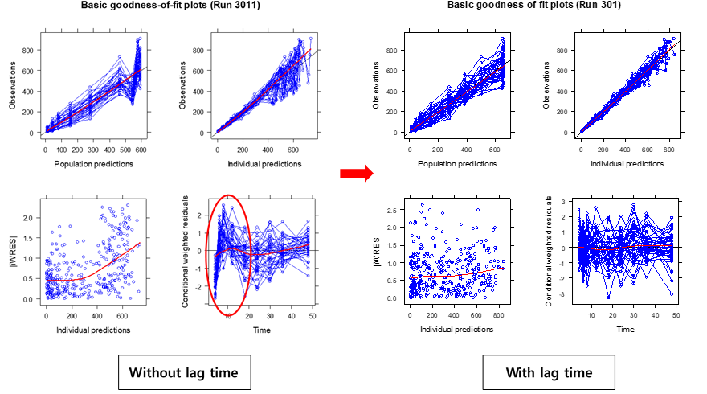

# 모델 적합 상태에 대한 진단 {#fit}

\Large\hfill
전상일
\normalsize

---

본 장에서는 모델의 적합 상태를 진단하는 방법 중, 잔차(residual)를 이용하여 진단하는 방법에 대하여 다루고자 한다. 그림 \@ref(fig:carousel)의 모델링 과정을 보면, 모델을 가정하고 그 후에 시험을 디자인하고, 시험을 수행하고, 얻어진 데이터를 탐색하여 모델에 적용하고, 그 결과를 분석한 후에 다시 모델에 반영하는 과정을 거치는데, 이 중 모델의 결과(output)를 분석하는 방법 중 하나인 잔차에 근거하여 결과를 분석하는 방법에 대해 설명하고자 한다. 이러한 잔차분석 방법에는 런검정(run test)과 basic goodness-of-fit(GOF) 플롯의 잔차플롯 을 확인하여 진단하는 방법 등이 있다. \index{잔차 / residual error}\index{residual error / 잔차}\index{goodness of fit / 적합도}

(ref:carousel) Modeling carousel [@gabrielsson]

```{r carousel, fig.cap="(ref:carousel)"}

```

잔차는 관측 값에서 예측 값을 뺀 값을 의미하며(그림 \@ref(fig:def-residual), ε (epsilon)으로 표시한다(ε = C~observation~ – C~prediction~). 잔차가 양수면, 즉 관측값이 예측곡선보다 위에 있으면 과소예측(underestimation) 되었다고 표현하고, 잔차가 음수이면, 즉 관측값이 예측곡선보다 아래에 있으면 과대예측(overestimation) 되었다고 표현한다.\index{잔차 / residual error}\index{residual error / 잔차}

\index{과대예측, overestimation}

(ref:def-residual) Definition of residual [@gabrielsson]

```{r def-residual, fig.cap="(ref:def-residual)", out.width = '50%'}
knitr::include_graphics("./figures/13-fig-02.png")
```

잔차는 정규성(normality)과, 등분산성(homoscedasticity) 그리고 독립성(independency)이 있다고 가정을 한다. 정규성 가정에서는 잔차의 분포는 평균이 0이고 분산이 σ^2^인 정규분표를 따른다고 가정한다(ε\~N(0, σ^2^)). 이 때문에 잔차분석은, outlier를 찾아내는데 활용될 수 있고, 모델의 가정이 잘못되었는지 판단하거나 다른 구조 모델을 써야할 지를 결정하는데 도움을 줄 수 있다. \index{homoscedasticity}\index{등분산 / homoscedastic}\index{homoscedastic / 등분산}\index{outlier / 이상치}\index{잔차 / residual error}\index{residual error / 잔차}

잔차의 분포는 다음과 같이 크게 네 가지 함수 형식을 사용하여 모델링 할 수 있는데, 가법오차모델(Additive error model), 고정변동계수(Constant coefficient of variation, CCV)를 사용한 모델, 가법과 CCV를 더한 모델, 그리고 로그오차모델(Log-error model)이다. \index{가법오차 / additive error}\index{고정변동계수(CCV) / constant coefficient of variation(CCV)}\index{additive error / 가법오차}\index{constant coefficient of variation(CCV) / 고정변동계수(CCV)}\index{잔차 / residual error}\index{residual error / 잔차}

가법오차모델은 `Y = IPRED + EPS(1)` 과 같은 형태로 표현할 수 있으며 농도 범위가 상대적으로 좁은 (10배 미만) 데이터를 설명하는데 적합하다.\index{가법오차 / additive error}\index{additive error / 가법오차}\index{IPRED}\index{PRED}

고정변동계수모델은 비례오차모델(Proportional error model)이라고도 하며, `Y = IPRED * (IPRED + EPS(1))`과 같이 쓸 수 있다. 농도 범위가 10배 이상으로 넓게 존재하는 데이터의 오차를 설명하는데 주로 쓰인다.\index{고정변동계수(CCV) / constant coefficient of variation(CCV)}\index{비례오차 / proportional error}\index{constant coefficient of variation(CCV) / 고정변동계수(CCV)}\index{proportional error / 비례오차}\index{IPRED}\index{PRED}

가법과 CCV를 더한 모델은 예측 값이 작을 때에는 가법요소가 변동을 설명하고, 예측 값이 클수록 곱셈형태의 요소가 커지게 되는 모델이며 `Y = IPRED * (IPRED+EPS(1)) + EPS(2)`의 형태로 표현된다.\index{IPRED}\index{PRED}

로그오차모델은 예측농도가 증가함에 따라 잔차의 분산이 로그선형 형태로 증가함을 가정하는 모델로 `Y = IPRED * EXP(EPS(1))` 과 같은 형태로 로 표현할 수 있다.\index{잔차 / residual error}\index{residual error / 잔차}\index{IPRED}\index{PRED}

예측값과 표준편차(σ) 사이의 관계를 그림으로 살펴보면(그림 \@ref(fig:pred-sd)) 가법오차모델의 경우 예측값이 작은 경우와 큰 경우 모두 표준편차가 일정한 반면, 고정변동계수모델의 경우 예측값이 커짐에 따라 표준편차도 커지는데, 이를 CV(변동계수, Coefficient of variation)와 예측값의 관계로 볼 경우 일정하기 때문에 비례오차모델 혹은 고정변동계수(CCV; constant CV)모델이라고 한다. 위 두 모델을 같이 사용하는 경우를, 가법과 CCV를 더한 모델 혹은 혼합오차모델(combined error model)이라고 하는데, 예측값이 작은 경우에는 표준편차가 일정하고, 값이 커질수록 표준편차가 커지는 것을 가정한다.\index{가법오차 / additive error}\index{고정변동계수(CCV) / constant coefficient of variation(CCV)}\index{비례오차 / proportional error}\index{additive error / 가법오차}\index{constant coefficient of variation(CCV) / 고정변동계수(CCV)}\index{proportional error / 비례오차}

\index{혼합오차모델 / combined error model}

```{r pred-sd, fig.cap="Relationship between standard deviation of residual variability and predicted concentrations", out.width='100%'}
include_graphics("./figures/13-fig-03.png") # fig 3
```

실제 NONMEM 제어구문에서는 오차모델 사용 시 코드 \@ref(exm:combined-upper), \@ref(exm:combined-lower)와 같은 방식들을 많이 쓰는데, 위 아래 수식 모두 혼합오차모델의 형태이다. 코드  \@ref(exm:combined-upper)은 가장 기본적인 형태이고,  코드 \@ref(exm:combined-lower)의 수식 형태를 사용하는 경우에는 EPS(1)의 분산을 1로 고정하여 ($SIGMA 1 FIX) 사용하는데, 이 때는 THETA의 추정값이 각 변이들의 표준편차를 나타내게 된다. 즉, THETA(5)는 가법오차모델의 표준편차이고, THETA(6)는 비례오차모델의 표준편차이다. 가법오차모델만 사용하고 싶다면 THETA(6)을 0으로 고정하면 되고, 비례오차모델만 사용하고 싶다면 THETA(5)를 0과 가까운 매우 작은 값으로 고정(예, `0.0001 FIX`)하면 된다.\index{가법오차 / additive error}\index{비례오차 / proportional error}\index{additive error / 가법오차}\index{proportional error / 비례오차}\index{\$SIGMA}


```{example, combined-upper, echo=TRUE}
$ERROR structure in NONMEM control stream: 기본형태\index{\$ERROR}
```
\vspace{-5ex} 
```perl
$ERROR
  IPRED = F
  Y     = IPRED * (1+EPS(1)) + EPS(2)
```


```{example, combined-lower, echo=TRUE}
$ERROR structure in NONMEM control stream: 가법오차모델의 표준편차\index{\$ERROR}
이고, 비례오차모델의 표준편차를 반영
```
\vspace{-5ex} 
```perl
$ERROR
  IPRED = F
  W     = SQRT(THETA(5)**2 + THETA(6) **2 * IPRED**2)
  IRES  = DV - IPRED
  IWRES = IRES / W
  Y     = IPRED + W * EPS(1)
```

Run test에서 run이란 같은 부호를 가진 잔차들의 일련의 묶음을 의미한다. 다시 말하면 같은 부호의 잔차가 연속으로 나올 때 이를 하나의 묶음으로 세는 것을 의미한다. 이러한 run을 세어봄으로써 잔차가 얼마나 무작위로 배치되어 있는가를 확인할 수 있다. 아래 예시를 보면 조금 더 쉽게 이해할 수 있다. (그림 \@ref(fig:run-test))\index{잔차 / residual error}\index{residual error / 잔차}

```{r run-test, fig.cap = "(ref:run-test)"}

```

(ref:run-test) Example of run test [@gabrielsson]

Run count가 너무 크거나 (+/-가 너무 많이 교차되어도), 너무 작아도 (+/-의 교차가 너무 적게 일어나도) 잔차의\index{잔차 / residual error}\index{residual error / 잔차}
분포가 무작위가 아님을 시사하지만, 이 결과만으로 결론내기보다는 잔차에 대한 진단 플롯들과 함께 고려하여 판단해야 한다.\index{잔차 / residual error}\index{residual error / 잔차}

Xpose4 package를 이용하여 여러 진단 플롯들을 그릴 수 있는데, 그 중 하나인 basic goodness-of-fit plots에서(그림 \@ref(fig:basic-gof-plot)) 아래쪽 두 개의 그림이 잔차(residual)에 대한 진단 플롯이다. 좌측은 |IWRES| vs Individual predictions (IPRED), 우측은 Conditional weighted residuals (CWRES) vs Time을 나타낸 그림이다. IWRES는 개인 가중잔차(Individual Weighted residuals)이고 |IWRES|는 개인 가중잔차의 절대값이다. 잔차모델이 적절하다면, CWRES 플롯의 모든 점들이 0을 기준으로 대칭으로 분포하게 되며, CWRES 값들의 흩어진 정도가 시간이나 개인 예측 값에 따라 경향성이 없고, 그 범위가 -3과+3 사이에 분포할 것으로 기대된다([10장 NONMEM 실행결과 해석 및 Xpose4 사용법](#use-of-xpose4) 참고).\index{개인 예측 / individual(specific) prediction(s)}\index{individual(specific) prediction(s) / 개인 예측}\index{잔차 / residual error}\index{residual error / 잔차}\index{conditional weighted residuals / 조건부 가중 잔차}\index{CWRES}\index{IPRED}\index{IWRES}\index{PRED}\index{RES}\index{WRES}

```{r basic-gof-plot, fig.cap = "Basic goodness-of-fit plots", out.width='100%'}
include_graphics("./figures/13-fig-05.png") # fig 6
```

잔차플롯을 활용하면 \index{잔차 / residual error}\index{residual error / 잔차}

1. 잔차분포의 비정규성을 체크할 수 있고, \index{잔차 / residual error}\index{residual error / 잔차}
2. 데이터의 시간 순서를 알 수 있다면, 시간 효과(time effect)가 있는지 체크할 수 있고, 
3. 등분산 여부에 대해 대해 확인하고, Y 값을 변환할 필요가 있는지 여부를(LnY로 변환, 1/Y로 변환 등) 체크할 수 있고 \index{등분산 / homoscedastic}\index{homoscedastic / 등분산}
4. 구조 모델에 고차 함수가 필요할지에 대해서도 체크할 수 있다. 

그림 \@ref(fig:wrong-models)을 보면, 구조 모델이 잘못된 경우와 잔차의 분산 모델이 잘못된 경우의 예시가 나와있는데, 이 중 몇 가지 예시를 살펴보기로 하자.\index{잔차 / residual error}\index{residual error / 잔차}

(ref:wrong-models) Schematic illustration of wrong structural models (upper row) and wrong variance models (lower row) [@gabrielsson]

```{r wrong-models, fig.cap = "(ref:wrong-models)"}
include_graphics("./figures/13-fig-06.png") # fig 7
```


우선, 첫째로 구조모델이 잘못된 경우이다. 그림 \@ref(fig:wrong-structure)을 보면 시간에 따른 잔차의 모양이 곡선형태를 이루고 있는데, 이는 모델에 지연시간을 반영하지 않은 경우이다. Run test를 통해 +/-를 확인해보면 앞쪽 시간에서는 마이너스, 중간시간대에서는 플러스가 됐다가 이후 다시 마이너스가 되는 현상이 나타나고, 이를 그림으로 보면 말발굽 모양이 된다. (그림 \@ref(fig:wrong-structure))\index{잔차 / residual error}\index{residual error / 잔차}

```{r wrong-structure, fig.cap = "(ref:wrong-structure)", out.width = '80%'}
include_graphics("./figures/13-fig-07.png") # fig 8
```

(ref:wrong-structure) Example of wrong structure model (lag time) [@gabrielsson]

실제 goodness-of-fit 플롯의 CWRES 플롯에서도 이와 같은 형태를 발견할 수 있으며, 경구흡수의 지연시간을 추가했을 때 (그림 \@ref(fig:lag-gof)) 이런 현상이 해결되는 것을 확인할 수 있다.\index{conditional weighted residuals / 조건부 가중 잔차}\index{CWRES}\index{RES}\index{WRES}

```{r lag-gof, fig.cap="Lag time 추가시의 GOF 변화", out.width='100%'}
 # fig 9
```
\index{goodness of fit / 적합도}

구조 모델이 잘못된 두번째 예시를 살펴보면, U자 형태의 커브가 관찰되는데, 2구획 모델을 1구획 모델로 설명하려고 하는 경우에 이와 같은 잔차 플롯이 흔히 관찰된다. (그림 \@ref(fig:u-curve))\index{잔차 / residual error}\index{residual error / 잔차}

```{r u-curve, fig.cap = "Example of wrong structure model (2-compartment model)", out.width='100%'}
 # fig 10
```

세 번째 예시는, 잔차의 모델이 잘못된 경우인데, 혼합오차모델(또는 비례오차모델)을 사용해야 하는 경우에 가법오차모델만 사용한 경우의 예시이다. 앞 시간대에서는 잔차가 크다가 뒤로 갈수록 잔차가 작아지는 형태인데, 약물 농도로 바꾸어 생각해보면, 약물 농도가 높아짐에(앞 시간대 약물 농도가 높으므로)따라 잔차가 커지는 경우이다. 잔차 모델을 가법오차모델에서 혼합오차모델 모델로 변경한 경우의 goodness-of-fit plots을 그림 \@ref(fig:addi-comb-gof)에서 확인할 수 있다.\index{가법오차 / additive error}\index{비례오차 / proportional error}\index{additive error / 가법오차}\index{proportional error / 비례오차}\index{잔차 / residual error}\index{residual error / 잔차}

```{r addi-comb-gof, fig.cap = "Example of wrong variance model (incorrect error model with wrong weighting scheme)", out.width='100%'}
 # fig 11
```

추가로, 잔차 플롯들의 다양한 형태에 따른 개선 방안을 살펴보면(표 \@ref(tab:diag-response)) 크게 두 가지 경우로 요약할 수 있는데, 잔차값들이 흩어져 있는 정도가 어떤 경향성을 가진 경우와 잔차의 모양이 특정 경향성을 나타내는 경우이다. 첫째로, 잔차값들이 흩어져 있는 정도가 어떤 경향성을 가진 경우, 시간이나 농도에 따른 잔차 플롯이 깔때기 모양이 되며, 이 경우 잔차에 가중치를 줄 수 있는 모델을 써야 한다. 둘째로, 잔차값들이 흩어져 있는 정도는 일정하지만 그 모양이 상승 또는 하강하는 띠 모양이거나 휘어지는 띠 모양을 나타내는 경우에는 구조모델 자체를 다른 것으로 바꾸어 이 현상을 해결해야 한다. 자세한 내용은 표 \@ref(tab:diag-response)를 참고하도록 하자.\index{잔차 / residual error}\index{residual error / 잔차}

```{r diag-response}
read_csv('data-raw/media-13-tab-1.csv', col_types="cccc") %>% 
  rename(`Fitted $\\hat{Y}_i$` = 3,
         `$X_{ji}$ values` = 4) %>% 
  kable(booktabs=TRUE, escape=FALSE, caption = "(ref:diag-response)") %>% 
  column_spec(1:4, width = "3cm") %>%
  add_header_above(c(" " = 1, `Plot of ε$_{i}$ versus` = 3), escape = FALSE)
```

(ref:diag-response) 진단 결과에 따른 모델 개선 방안 [@draper1998applied]

