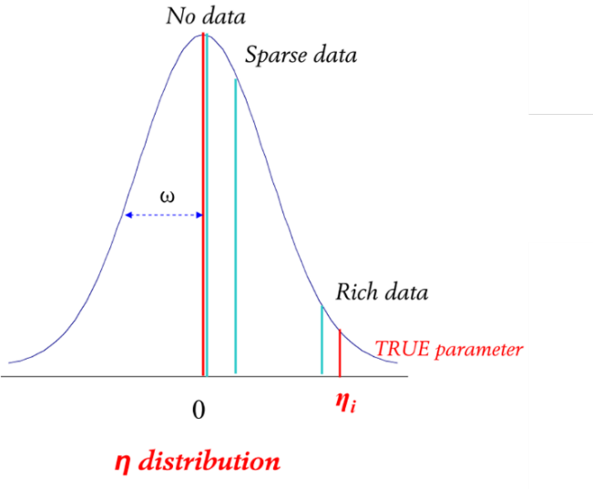
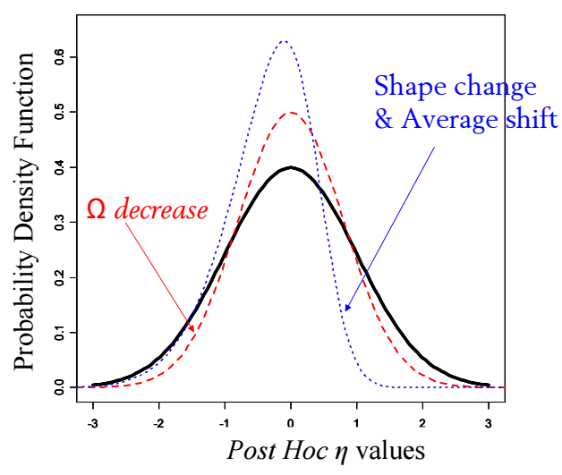
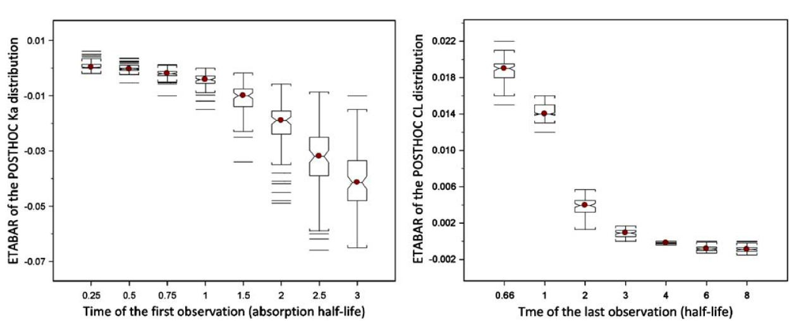
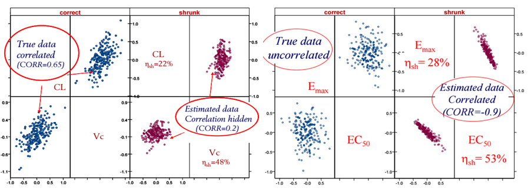
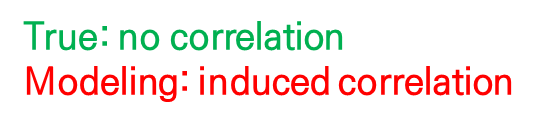
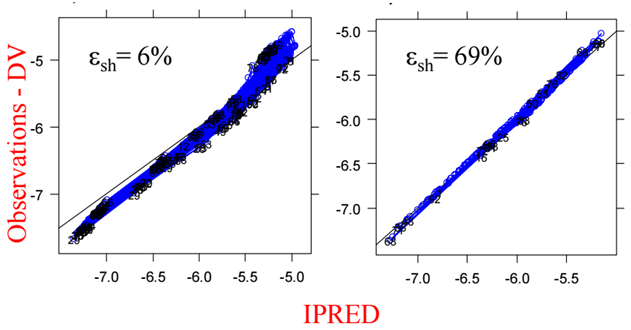
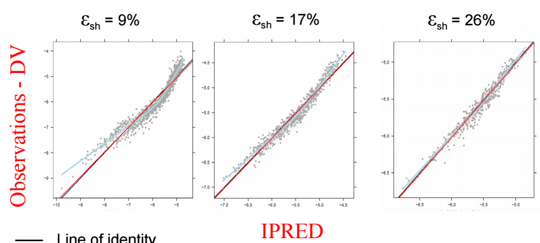
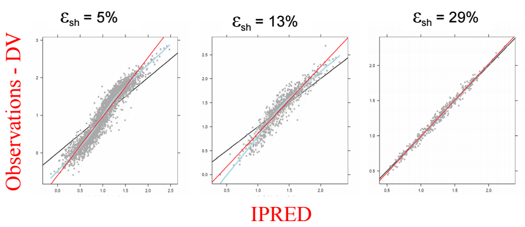
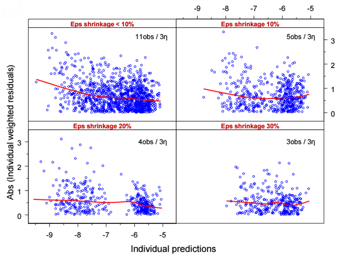

# 모델 파라미터의 적절성 {#parameters}

*전상일*

본 장에서는 경험적 베이즈 추정값(Empirical Bayes Estimates, EBEs)에 기초한 진단 방법을 소개하고, ETA shrinkage(축소), EPSILON shrinkage의 의미와 그에 따른 여러 결과들을 살펴보고자 한다. 베이즈 추정법은 개인으로부터 관찰된 데이터와 집단에 대한 사전 정보를 함께 이용하여 분석하는 기법이다. NONMEM에서는 집단의 데이터 속에 포함된 개인에 대한 베이즈 파라미터 추정치를 얻을 수 있는데, 이를 경험적 베이즈 추정값이라 한다. POSTHOC 추정값, 개인 파라미터 추정값(individual parameter estimates) 등은 모두 같은 의미로 사용된다. NONMEM에서는 조건부 추정법을 써서 개인 파라미터 추정값을 얻을 수 있으며, 1차추정법(FO)을 사용하는 경우 $ESTIMATION에서 POSTHOC 옵션을 추가하여 개인 파라미터 추정값을 얻을 수 있다. 이러한 개인 파라미터 추정값은 모델의 진단, 추정 및 결과값의 예측, 시뮬레이션 등에 사용될 수 있고, 그 중 모델의 진단 과정에서는 IPRED vs DV, IWRES vs IPRED, EBE vs EBE, EBE vs Covariate, GAM 등에 활용된다. 그림 \@ref(fig:ebe-cov)에는 EBE vs Covariate의 예시가 나와있는데, 여기서는 청소율에 대한 ETA의 분포와 공변량 사이의 경향성을 파악할 수 있다.

```{r ebe-cov, fig.cap="Example of EBE vs Covariates [@bonate]"}
knitr::include_graphics("./assets/media-15/image1.png")
```

개인 파라미터의 추정 시, 이에 대한 정보를 제공하는 데이터가 적거나 없을 때, 그 파라미터의 값은 종종 대표값으로 축소(shrinkage)된다. 반대로, 해당 파라미터를 설명하는 데 필요한 관찰값이 많이 존재한다면 모델의 적합을 향상시키는 방향, 즉 개인 파라미터를 집단의 대표값으로부터 더 멀어진 값으로 정할 가능성이 커지게 된다(그림 \@ref(fig:eta-shrinkage)). 데이터가 충분치 않은 경우에는 개인별 η를 구할 수 없기 때문에 개인 파라미터 추정값을 구할 수 없고, 이때 각 개인의 모델은 해당 파라미터의 대표값을 이용하게 된다.

```{r eta-shrinkage, fig.cap="(ref:eta-shrinkage)"}

```

(ref:eta-shrinkage) Concept of η shrinkage [@uppsala]

NONMEM에서 결과 파일의 ETAshrink(%)를 보면, 개인간 변이를 허용한 파라미터의 ETA shrinkage 값을 확인할 수 있다. ETA shrinkage는 다음과 같이 계산할 수 있는데, 각 개인 별 η의 표준편차를 ω로 나누어서 1에서 뺀 값이다.

$$
\eta_{sh} = 1 - \frac{SD(\hat\eta_{ph})}{w} 
(\#eq:eta-sh)
$$

η의 표준편차와 ω의 차이가 작을수록 ETA shrinkage는 작아지는데, 이 값이 0.2 – 0.3 보다 크다면 데이터가 충분치 않은 상황인지 확인해야 하고, 해당 EBE를 이용한 결과물이 있다면 신뢰할 수 있는 결과인지 확인해 보아야 한다.

ETA shrinkage가 커지면 다음과 같은 현상들이 나타날 수 있다.

첫째로, 분포 모양의 변화이다. ETA shrinkage가 큰 상황에서는 ω값이 작게 추정되거나, ETA의 분포가 비정규분포를 보일 수도 있다(그림 \@ref(fig:eta-shrinkage-plot)).

```{r eta-shrinkage-plot, fig.cap = "(ref:eta-shrinkage-plot)"}

```

(ref:eta-shrinkage-plot) Example 1 - Consequences of η shrinkage [@uppsala]

둘째로, ETA 평균값의 유의한 변화이다. ETA shrinkage로 인해 아래와 같이 ETABAR가 0과 유의하게 다르다는 결과가 나올 수 있다. 그림 \@ref(fig:ex2-cons)의 아래 그림을 보면, 첫번째 관측치와 마지막 관측치가 어느 시점인지에 따라, 즉 해당 파라미터를 설명할 수 있는 데이터의 양이 얼마나 있느냐에 따라 POSTHOC Ka와 CL의 분포 및 ETABAR 값이 어떻게 변화하는지를 확인할 수 있는데, 데이터가 충분하지 못한 경우 ETABAR가 0과 유의하게 다를 가능성이 높다는 것을 보여준다.

```{r ex2-cons, fig.cap = "(ref:ex2-cons)"}
 #fig4
```

(ref:ex2-cons) Example 2 - Consequences of η shrinkage [@uppsala]

셋째로, 파라미터간 상관관계가 소실되거나 유발(Hidden or induced parameter correlation)될 수 있다. 그림 \@ref(fig:ex3-cons)의 좌측처럼 파라미터(CL vs Vc)간의 상관관계가 소실되는 경우가 생길 수 있고, 우측 그림처럼 파라미터 (E~max~ vs EC~50~) 간의 상관관계가 유발되는 경우가 생길 수 있다. 그림 \@ref(fig:induced-corr)에서도 ETA shrinkage(%)가 커지면서 상관관계가 유발 또는 소실되는 것을 확인할 수 있다.

```{r ex3-cons, fig.cap="(ref:ex3-cons)"}
 # fig 5
```

(ref:ex3-cons) Example 3 - Consequences of η shrinkage [@uppsala]

```{r induced-corr, fig.cap = "(ref:induced-corr)"}

```

(ref:induced-corr) Induced or hidden correlation according to average shrinkage (%) [@uppsala]

마지막으로, 공변량에 대해서도 마찬가지 결과가 나타날 수 있으며, 파라미터 또는 EBE와 공변량 사이의 상관관계가 소실되거나 유발될 수 있다(그림 \@ref(fig:ex4-cons)).

```{r ex4-cons, fig.cap = "(ref:ex4-cons)"}

```

(ref:ex4-cons) Example 4 - Consequences of η shrinkage [@uppsala]

데이터가 부족한 경우 EPSILON shrinkage 또한 커질 수 있는데, 이는 다음의 수식으로 구할 수 있다.

$$
\epsilon_{sh} = 1 - SD(IWRES)
(\#eq:eps-iwres)
$$

EPSILON shrinkage는 1에서 IWRES의 표준편차를 뺀 값으로 이 때 사용되는 IWRES의 수식은 다음과 같다.

$$
IWRES_{ij} = \frac{DV_{ij}- IPRED_{ij}}{SD(\epsilon)} \ \text{(If IPRED} \rightarrow \text{DV, IWRES} \rightarrow 0)
(\#eq:iwres-ipred)
$$

희박한 자료의 경우 그림 \@ref(fig:concept-eps-shrinkage)처럼 IPRED가 DV를 향해 축소되는 현상이 나타나게 되는데, IPRED가 DV에 가까워질수록 IWRES는 0에 가까워지며, EPSILON shrinkage는 커지게 된다.

```{r concept-eps-shrinkage, fig.cap="(ref:concept-eps-shrinkage)"}
include_graphics("./assets/media-15/image24.png") #fig8
```

(ref:concept-eps-shrinkage) Concept of ε shrinkage [@uppsala]

EPSILON shrinkage의 결과로 다음과 같은 현상들이 나타날 수 있다.

첫째로, 구조모델의 오지정(misspecification)을 찾아내는데 어려움을 겪을 수 있다. 아래 그림 \@ref(fig:perfect-fit) 우측을 보면, 예측이 매우 잘된 것으로 보이지만, 실제는 EPSILON shrinkage로 인해 IPRED가 DV로 향해 축소되는 이른바 “Perfect fit phenomenon”이 나타난 것이다. 원래 모델은 0차 흡수 모델이고, 이를 1차 흡수모델로 설명한 경우인데, 흡수를 설명할 수 있는 데이터가 충분히 있는 경우 (그림 \@ref(fig:perfect-fit) 좌측) 모델 오지정을 찾아낼 수 있지만, 데이터가 부족한 경우 이를 찾아내기가 어렵다.

```{r perfect-fit, fig.cap="(ref:perfect-fit)"}
 # fig 9
```

(ref:perfect-fit) Perfect fit phenomenon [@uppsala]

2구획 모델을 1구획 모델로 설명한 경우(그림 \@ref(fig:1comp-2comp)), Sigmoid Emax 모델을 Linear Emax 모델로 설명한 경우(그림 \@ref(fig:linear-sigmoidal)) 등에서도 데이터가 부족한 경우 EPSILON shrinkage가 커지고, 모델의 오지정을 찾아내기가 어렵게 된다.

```{r 1comp-2comp, fig.cap = "(ref:1comp-2comp)"}
 # fig 10
```

(ref:1comp-2comp) 1-compartment model fitted to data simulated with a 2-compartment model [@uppsala] 

```{r linear-sigmoidal, fig.cap="(ref:linear-sigmoidal)"}
 # fig 11
```

(ref:linear-sigmoidal) Linear Emax model fitted to data simulated with a sigmoidal Emax model [@uppsala]

둘째로, IWRES를 활용하여 잔차모델의 오지정을 확인하는 것이 어려울 수 있다. 그림 \@ref(fig:low-IWRES)에 나타난 것처럼 관측치가 많은 경우 IWRES 플롯을 통해 잔차 분포의 경향성을 확인할 수 있는데, 관측치가 적은 경우 EPSILON shrinkage가 커지면서 잔차 분포의 경향성이 점점 사라지는 것을 확인할 수 있다.

```{r low-IWRES, fig.cap="(ref:low-IWRES)"}
 # fig 12
```

(ref:low-IWRES) Low power of IWRES to diagnose Residual error misspecification [@uppsala]

<!-- **참고문헌** -->

<!-- 1.  > Peter L. Bonate, Pharmacokinetic-Pharmacodynamic Modeling and -->
<!--     > Simulation 2<sup>nd</sup> edition, 2011 [@bonate] --> 

<!-- 2.  > Uppsala University, Empirical Bayes Estimate(EBE)-Based Diagnostics, 2007 [@uppsala] -->


