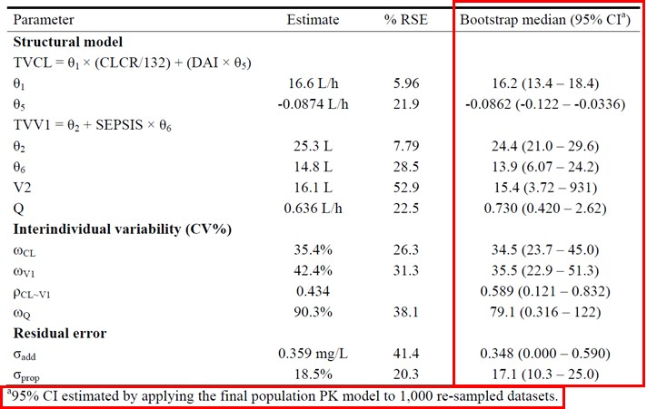
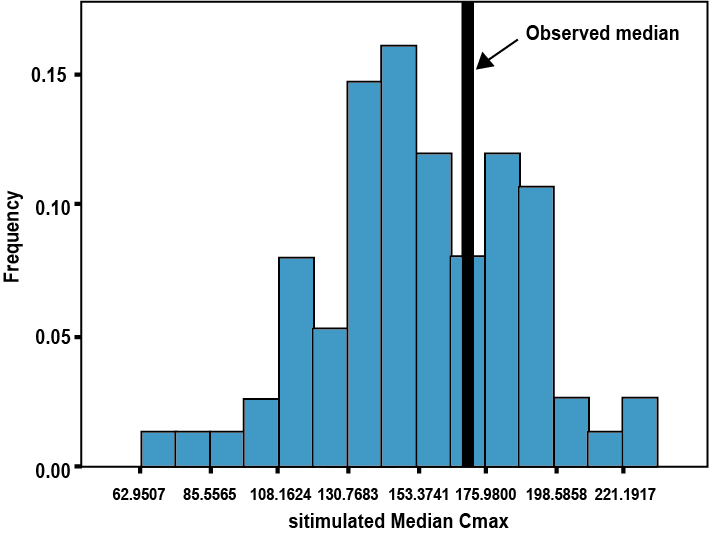

# 모델의 예측성능 평가 {#evaluation}

\Large\hfill
한성필
\normalsize

---

모델을 구축하고 나서 가장 먼저 해야할 일은 모델이 자료를 잘 설명하고 있는지 살펴보고, 모델이 의도대로 예측하고 있는지를 파악하는 것이다. 이를 위해서 객관적, 통계적으로 모델 예측 능력과 성능을 측정할 수 있어야 하고(모델평가, model evaluation), 모델을 만드는데 사용된 데이터셋에서와 같이 모델이 앞으로 사용될 환경에서도 잘 작동할 수 있다는 것을 보장해야(모델검증, model validation) 한다.

```{r purpose-eval}
readxl::read_excel("data-raw/fig-tab.xlsx", sheet="16-1", range="B2:D10") %>% 
  #kable(booktabs=TRUE, longtable=TRUE, caption = "목적과 표현방식에 따라 분류한 모델 평가 방법") %>% 
  kable(booktabs=TRUE, caption = "목적과 표현방식에 따라 분류한 모델 평가 방법") %>% 
  column_spec(1, width = "3.5cm") %>%
  column_spec(2, width = "5.0cm") %>%
  column_spec(3, width = "3.5cm") %>%
  collapse_rows(c(1,3), valign = "top")
```

모델을 수치적, 시각적, 통계적으로 평가하는 다양한 방법들이 제시되어 있으며 [@pmid17328581], 이것을 표 \@ref(tab:purpose-eval)에서 목적과 표현방식에 따라 정리하였다. 이 중 계량약리학 분야에서 재현성(reproducibility)에 초점을 맞춘 방법들을 통칭하여 흔히 모델검증(model validation)이라 한다. 모델검증의 목적은 타당성(validation) 검증 데이터셋에서 모델이 잘 작동되며 잘 적용되는지 여부를 검토하는 것이다. 이러한 모델검증 절차는 분석계획서에 통합적으로 기술되는 것이 추천된다. 이 장에서는 모델의 예측성능 평가를 위해 사용되는 다양한 기법의 목적과 방법에 대해 논할 것이다.

## 외부검증(External validation)/내부검증(Internal validation)
\index{내부검증 / internal validation}\index{internal validation / 내부검증}\index{외부검증 / external validation}\index{external validation / 외부검증}

모델 검증의 종류로 크게 외부검증과 내부검증으로 나눌 수 있다. 어떤 검증이 보다 더 설득력이 있다고 할 수 있을지에 대해서 이견이 있을 수 있지만 일반적으로 모델로 예측한 값들을 별도의 데이터셋과 비교하는 외부검증을 만족하는 경우 보다 높은 수준의 검증이 이루어졌다고 할 수 있다. 외부검증에서는 별도의 자료가 생성될 시의 통제되지 않은 요인이 검증 결과에 영향을 미칠 수 있다. 그러나 외부검증에 의해 만족스러운 예측성능이 검증될 경우 연구자는 개발된 모델이 새로운 자료에서도 적절히 예측할 수 있다는 자신감을 가질 수 있다. 그러나 외부검증이 어렵거나 불가능한 경우가 있기 때문에, 내부검증을 철저히 하는 것이 중요하다.\index{내부검증 / internal validation}\index{internal validation / 내부검증}\index{외부검증 / external validation}\index{external validation / 외부검증}

올바른 외부검증/내부검증은 사전계획에서부터 시작된다. 즉, 모델링을 시작하기 전에 계획을 세워 편향성을 제거하는 것이 필요하다. 모델을 비교하기 위해 사용되는 통계량에 대한 기준값을 미리부터 분석계획에 명시하는 것이 추천되며, 내부검증 혹은 외부검증에서 계산된 통계량이 애초에 설정된 기준을 만족시키지 않는 경우 모델의 개선이 필요하다.\index{내부검증 / internal validation}\index{internal validation / 내부검증}\index{외부검증 / external validation}\index{external validation / 외부검증}

데이터 분할 기법(data splitting method)은 모델 평가를 위해 새로운 자료를 수집하는 것이 어려울 경우에 검증 자료를 만들어내는 유용한 내부검증 방법으로 분석 데이터셋의 일부분을 임의로 추출하여 검사용 데이터셋을 만들고, 실제 개발 데이터셋에서 이를 제거한다. 이 방법의 단점은 모델의 예측 정확도가 자료를 나누는데 사용된 표본의 크기에 따라 좌우된다는 것이다. 또 다른 내부검증 기법은 재추출 방법(resampling)으로 교차 타당성 검증(cross-validation)과 붓스트랩(bootstrap)의 두 가지 방법이 포함된다. 교차 타당성 검증은 데어터 분할(data splitting)을 반복하여 사용하는 방법이고 모형 구축을 위해 사용되는 자료 세트의 크기가 다른 방법에 비해 크고 이로 인해 추정과정에서 무시되는 자료가 작다는 장점이 있고, 단일 샘플의 분할에 의존하지 않기 때문에 변이성이 감소하게 된다. [@poppk]\index{내부검증 / internal validation}\index{붓스트랩 / bootstrapping}\index{bootstrapping / 붓스트랩}\index{internal validation / 내부검증}

## 붓스트랩 (Bootstrap)
\index{붓스트랩 / bootstrapping}\index{bootstrapping / 붓스트랩}

검사용 데이터셋이 없거나 분석 시작시 작성되지 않은 경우에는 붓스트랩 접근법을 사용하는 것이 적절하다. 붓스트랩은 교차 타당성 검증과 같이 모형 구축에 모든 자료를 사용한다는 장점이 있다. 희귀질환이나 소아환자의 자료 등과 같이 표본 크기가 제한적일 수밖에 없는 경우, 집단모형을 평가하는데 매우 유용할 수 있다.\index{붓스트랩 / bootstrapping}\index{bootstrapping / 붓스트랩}

적당한 횟수(적어도 200회 이상)로 반복하여 얻어지는 붓스트랩 복제 값에 최종 모델을 반복적으로 적합(fitting)시켜서 얻어진 파라미터의 평균값들을 붓스트랩 없이 얻어진 최종 집단모델 파라미터 추정치와 비교하는 것이다. 이는 모델을 다양한 데이터셋에 적합(fitting)시키는 방법을 지칭하며, 각 데이터셋은 최종 모델의 데이터셋으로부터 반복 재추출된 대상자들에 대한 자료로 구성되어 있다. 붓스트랩에 의해 얻어진 결과를 보고하기 위해 중앙값과 95% 신뢰구간이 흔히 사용되며 이 값들을 어떻게 계산하는지 모식도(그림 \@ref(fig:boot95))로 표현하였다. 붓스트랩에 의해 얻어진 결과를 정리하여 보고하는 일반적인 방법을 그림 \@ref(fig:bootstrap-table)에 나타내었다. 흔하게 쓰이는 방법으로는, 1000개의 재추출된 데이터셋을 통해 얻어진 붓스트랩 중앙값과 최종예측값을 비교하는 것인데, 큰 차이가 없음을 알 수 있고, %RSE(relative standard error)로 계산된 신뢰구간과 붓스트랩 95% 신뢰구간을 비교하여 예측된 변동성 정도에 대한 검증도 할 수 있다.\index{붓스트랩 / bootstrapping}\index{bootstrapping / 붓스트랩}\index{집단모델 / population model}\index{population model / 집단모델}\index{standard errors of the estimates / 추정값의 표준오차}\index{standard errors of the estimates / 추정값의 표준오차}


```{r boot95, fig.cap = "(ref:bootstrap-process)"}
 #fig1
```

(ref:bootstrap-process) 붓스트랩을 사용하여 여러 파라미터의 중앙값과 95% 신뢰구간을 계산하는 방법에 대한 모식도\index{붓스트랩 / bootstrapping}\index{bootstrapping / 붓스트랩}

```{r bootstrap-table,  fig.cap = "(ref:bootstrap-summary-example)"}
 #fig2
```
(ref:bootstrap-summary-example) 붓스트랩에 의해 얻어진 결과를 정리하는 방법의 예. 중앙값(95% 신뢰구간)을 열로 정리하였고 1000개의 재추출된 데이터셋이 사용되었음을 알 수 있음\index{붓스트랩 / bootstrapping}\index{bootstrapping / 붓스트랩}

## Simulation-based diagnostics

시뮬레이션에 기반한 예측성능 평가 과정인 사후예측점검(PPC), VPC와 NPC은 모두 관찰값과 모델에 의해 시뮬레이션된 값들의 분포를 비교하는 것이다. [@yano2001evaluating; @post2008extensions] 시뮬레이션 데이터가 관찰 데이터의 분포특징을 적절히 반영하고 있음을 시각적, 수치적으로 확인할 수 있다면 모델의 예측성능 평가가 잘 이루어졌다고 말할 수 있다.\index{사후예측점검(PPC) / posterior predictive check(PPC)}\index{시뮬레이션 / simulation}\index{posterior predictive check(PPC) / 사후예측점검(PPC)}\index{simulation / 시뮬레이션}

### 사후 예측 점검 (posterior predictive check)
\index{posterior predictive check(PPC) / 사후예측점검(PPC)}

사후 예측 점검을 통해 현재와 미래 자료 세트의 중요한 임상적 특성이 모델에 의해 충실히 재현이 되는가를 결정하는데 유용할 수 있다. [@post2008extensions] 이 방법은 특정 요약 통계량을 원본 데이터셋에서 계산하고 이를 시뮬레이션으로부터 발생된 사후 예측 분포와 비교하는 것이다. (그림 \@ref(fig:ppc)) 사후값(posterior)은 불확실성(uncertainty)과 잔류변이(residual variability)를 반영하고 있으며 이것이 특정 분포를 따르지 않는 경우, 또는 관찰값과 큰 차이가 나는 경우 자신의 모델을 점검할 수 있다. 시뮬레이션의 반복 데이터셋을 생성하여 통계량의 분포와 상응하는 유의확률값을 얻어낼 수도 있다. 그러나 현재로서는 이러한 접근법이 널리 통용되고 있지는 않다.\index{시뮬레이션 / simulation}\index{simulation / 시뮬레이션}

```{r ppc, fig.cap="(ref:ppc)"}
 # 3
```
 
(ref:ppc) 사후 예측 점검의 예. 시뮬레이션된 C~max~의 분포에서 관찰값(검정색 실선)의 위치를 파악할 수 있음\index{시뮬레이션 / simulation}\index{simulation / 시뮬레이션}

### 시각적 예측 점검 (visual predictive check)

\index{시각적 예측 점검(VPC) / visual predictive check(VPC)}\index{visual predictive check(VPC) / 시각적 예측 점검(VPC)}
\index{visual predictive check(VPC) / 시각적 예측 점검(VPC)}

VPC로 생성된 그림은 관찰값과 시뮬레이션에 의한 예측구간을 겹쳐서 그림 형태로 제시한다.(그림 \@ref(fig:scatter-vpc)) 시각적으로 표현된 자료는 빠르고 직관적으로 모델의 예측성능을 평가할 수 있다는 큰 장점을 갖기에 현재 가장 널리 쓰이고 있는 방법이다.\index{시뮬레이션 / simulation}\index{simulation / 시뮬레이션}

모델의 VPC를 수행하기 위해 가장 먼저 할 일은 많은 데이터셋을 시뮬레이션하는 것으로, \$PK 또는 \$PRED는 손대지 않고 \$THETA, \$OMEGA, \$SIGMA 값들에 FPE(final parameter estimates)를 직접 고정하여 입력하거나 \$MSFI 구문을 이용해 모델 규격파일을 입력하여 최종 추정값을 사용하여 시뮬레이션이 수행된다. \$EST, \$COV는 삭제하고 \$SIMULATION을 입력해야 하는데 일반적으로 다음과 같은 구문을 사용한다. 이때 20190831은 임의의 시드값(seed)을 의미하며 1000은 반복 데이터셋의 개수를 의미한다. \index{모델 규격파일(MSF) / model specification file}\index{시드값 / seed value}\index{시뮬레이션 / simulation}\index{model specification file / 모델 규격파일(MSF)}\index{seed value / 시드값}\index{simulation / 시뮬레이션}\index{\$COVARIANCE (\$COV, \$COVAR)}\index{\$ESTIMATION (\$EST)}\index{\$MSFI}\index{\$OMEGA}\index{\$PK}\index{\$PRED}\index{\$SIGMA}\index{\$SIMULATION (\$SIM)}\index{\$THETA}\index{PRED}

```
$SIMULATION ONLYSIM 20190831 SUBPROBLEMS=1000
```

최소 1000개 이상의 반복 데이터셋이 선호되며 이를 통해 관측값과 시뮬레이션 예측값을 비교하게 된다. 반복 데이터셋을 생성하기 위한 입력 데이터셋은 모델을 구축할 때 사용한 데이터셋과 유사한 형태이나 DV값이 시뮬레이션 값으로 대체된다. 반복수가 커질수록 결과 파일의 용량이 비례적으로 커지게 되고 따라서 자료 처리 속도가 늦어지므로 처음에는 낮은 반복수로 확인 후, 어느정도 확인이 된 후 1000개, 2000개 반복수로 높이는 실용적인 접근법을 택할 수도 있다.\index{대체 / imputation}\index{시뮬레이션 / simulation}\index{imputation / 대체}\index{simulation / 시뮬레이션}

```{r scatter-vpc, fig.cap="(ref:scatter-vpc)"}
 # fig 4
```

(ref:scatter-vpc) 시각적 예측 점검 과정의 대표적인 scatter VPC 의 예 [@vpcnpc]. 점선은 시뮬레이션 값들의 5, 95 퍼센타일, 실선은 중앙값을 나타냄\index{시각적 예측 점검(VPC) / visual predictive check(VPC)}\index{시뮬레이션 / simulation}\index{simulation / 시뮬레이션}\index{visual predictive check(VPC) / 시각적 예측 점검(VPC)}

```{r ci-vpc, fig.cap = "(ref:ci-vpc)"}
 # fig 5
```

(ref:ci-vpc) 신뢰구간 VPC의 예 (Confidence interval VPC). 시뮬레이션된 예측값의 5번째 백분위수와 95번째 백분위수에 대한 95% 신뢰구간이 파란색 띠로 나타나 있고, 붉은색 점선은 관찰값의 5번쨰, 95번째 백분위수를 나타내며 붉은색 실선은 관찰값의 50번째 백분위수임\index{시뮬레이션 / simulation}\index{simulation / 시뮬레이션}

신뢰구간 VPC(confidence interval VPC)는 시뮬레이션된 예측값의 5번째 백분위수, 50번째백분위수(중앙값), 95번째 백분위수에 대한 95% 신뢰구간을 계산하여 나타낸다.(그림 \@ref(fig:ci-vpc)) 각 계급구간에서 예측값의 신뢰구간을 각각 음영(띠)으로 그리고 이 위에 예측값과 관찰값의 5번째, 50번째, 95번째 백분위수에 대한 선을 그려, 모델 오지정 여부를 보다 수월하게 파악할 수 있다. 그림 \@ref(fig:ci-vpc)의 VPC에서는 시뮬레이션 예측값의 5번째, 50번째, 95번째 백분위수의 95% 신뢰구간이 관측값의 각 백분위수를 대체로 포함하고 있어 모델 적합성을 지지하고 있음을 알 수 있다. 그러나 일부 시간 계급구간(bin)에서 5번째 백분위수가 하한 예측구간의 신뢰구간 밖으로 벗어나는 것을 알 수 있어, 이부분에 대한 모델 적합성을 재검토할 필요가 있을 수도 있다.\index{대체 / imputation}\index{모델 오지정 / model misspecification}\index{시뮬레이션 / simulation}\index{imputation / 대체}\index{model misspecification / 모델 오지정}\index{simulation / 시뮬레이션}

\index{계급구간화 / binning}\index{binning / 계급구간화}

VPC를 생성할때 계급구간화(Binning)가 적절히 행해지면 실제 수행 시간의 변동성이 그림에 과도하게 표현되는 것을 줄이고 계획된 시간(nominal time)이 같은 자료일때 동일한 예측 구간을 표현케 할 수 있으므로, 계급구간화를 올바르게 수행하는 것은 중요하다. PsN에서는 VPC 계급구간화에 대한 다양한 옵션을 제공하고 있으므로 이에 대한 자세한 정보는 PsN User Guide를 참고할 수 있다. [@vpcnpc]\index{계급구간화 / binning}\index{binning / 계급구간화}

\index{층화 / stratification}

VPC에서 PK 반응 정도가 다른 집단을 합쳐서 그린다면 반응 변수간의 차이가 하나로 합쳐져 표현되기 때문에 약물 농도의 패턴이 제대로 표현되지 않을 수 있다. 약물의 용량, 투여경로와 투약간격 등의 공변량 값이 혼합되어 있는 데이터셋에서는 층화(stratification)를 통해 VPC를 수행할 수 있다. PsN을 사용하여 VPC를 수행하는 경우 이러한 층화를 쉽게 할 수 있는데, 다음과 같은 구문을 도스창(터미널창)에서 입력한다.

```sh
vpc bean.CTL -lst=bean.CTL.lst -samples=1000 -stratify_on=DAY -idv=TAD
```

위 명령어에서 bean.CTL, bean.CTL.lst는 각각 모델 제어구문 파일과 결과파일이고 1000은 반복수, DAY는 층화가 이루어질 자료의 열(column)이름이며, TAD(time after dose)는 독립변수(independent variable, idv)를 지칭한다. DAY 자료에 따라 1일(첫 투약)과 14일(항정상태 투약)의 각기 다른 약물 농도 패턴이 올바르게 표시되었음을 알 수 있다. (그림 \@ref(fig:strat-vpc))\index{독립변수 / independent variable}\index{독립변수 / independent variable}\index{independent variable / 독립변수}\index{dependent variable(DV) / 종속변수(DV)}\index{time after dose / time after dose}\index{time after dose / time after dose}

```{r strat-vpc, fig.cap="(ref:strat-vpc)"}
include_graphics("figures/16-fig-06.png")
```

(ref:strat-vpc) 관찰일(DAY)에 따라 층화(stratification)가 이루어진 VPC.

VPC가 직관적이고 많은 상황에서 흔히 쓰이고 있으나 일부 유용성이 떨어지는 상황이 있을 수도 있기에 사용에 주의를 요한다. 결측치 (BQL, below quantification limit) 자료가 많은 경우 시뮬레이션이 잘 안될 수 있기 때문에 주의해야 하며, BQL 있는 부분과 아닌 부분을 층화로 나누어 그리기도 한다. 계획서 위반(protocol violation)이 많은 경우, 약물 복용 비준수(nonadherence)가 많은 경우에도 VPC 적용에 주의를 기울여야 한다. 또한 적응적 설계(adaptive design), 용량 조정 시험 등에서 사용하는 경우에도 VPC를 적용하는 것이 어려울 것이다. 용량 변화의 모든 상황을 층화로 나누어서 그리는 것이 필요하겠지만 경우의 수가 많아지는 경우 모든 상황을 VPC로 표현하는 것이 어려울 수 있다.\index{시뮬레이션 / simulation}\index{simulation / 시뮬레이션}

### 수치적 예측 점검 (numerical predictive check)
\index{수치적 예측 점검(NPC) / numerical predictive check(NPC)}\index{numerical predictive check(NPC) / 수치적 예측 점검(NPC)}

NPC는 VPC와 유사한 방식으로 모델 진단을 수행하며, 그 논리나 자료는 앞서 기술된 VPC와 차이가 없다. 즉, 모델이 적절한 방법으로 생성되었다면, 그로부터 시뮬레이션된 값들은 관찰된 자료와 큰 차이가 없을 것이다. [@vpcnpc] 설정된 예측 구간에 대해 관측값이 예측 구간 경계인 안쪽 혹은 바깥쪽에 얼마나 위치하는지 살필 수 있다. 5%의 관측값이 95% 예측 구간 밖에 위치할 경우(2.5%는 상한 위쪽에, 2.5%는 하한 밑 쪽에), 혹은 10%의 관측값이 90% 예측 구간 밖에 위치할 경우(5.0%는 상한 위쪽에, 5.0%는 하한 밑 쪽에) NPC에 의한 모델 진단이 비교적 잘 이루어졌다고 할 수 있을 것이다. (그림 \@ref(fig:npc))\index{시뮬레이션 / simulation}\index{simulation / 시뮬레이션}

```{r npc, fig.cap="(ref:npc)"}

```

(ref:npc) 수치로 모델의 예측성능을 평가하는 수치적 예측 점검 과정(NPC)\index{수치적 예측 점검(NPC) / numerical predictive check(NPC)}\index{numerical predictive check(NPC) / 수치적 예측 점검(NPC)}

<!--
## 참고문헌

1. Brendel K, Dartois C, Comets E, Lemenuel-Diot A, Laveille C, Tranchand B, Girard P, Laffont CM, Mentre F. Are population pharmacokinetic and/or pharmacodynamic models adequately evaluated? A survey of the literature from 2002 to 2004. Clin Pharmacokinet 2007; 46: 221-34. # 17328581 [@pmid17328581]

2. 식품의약품안전처. 의약품 개발 시 집단 약동학 활용을 위한 가이드라인. 식품의약품안전처 의약품심사부 종양약품과 2015. [@poppk]

3. Karlsson MO, Savic RM. Diagnosing model diagnostics. Clin Pharmacol Ther 2007; 82: 17-20. # 17571070 [@karlsson2007diagnosing]

4. Yano Y, Beal SL, Sheiner LB. Evaluating pharmacokinetic/pharmacodynamic models using the posterior predictive check. J Pharmacokinet Pharmacodyn 2001; 28: 171-92. # 11381569 [@yano2001evaluating]\index{posterior predictive check(PPC) / 사후예측점검(PPC)}

5. Post TM, Freijer JI, Ploeger BA, Danhof M. Extensions to the visual predictive check to facilitate model performance evaluation. J Pharmacokinet Pharmacodyn 2008; 35: 185-202. # 18197467 [@post2008extensions]\index{visual predictive check(VPC) / 시각적 예측 점검(VPC)}

6. Nordgren RU, S;. NPC/VPC user guide Perl-speaks-NONMEM 490 2018. [@vpcnpc]

-->

<!-- \printbibliography[segment=\therefsegment,heading=subbibliography] -->
