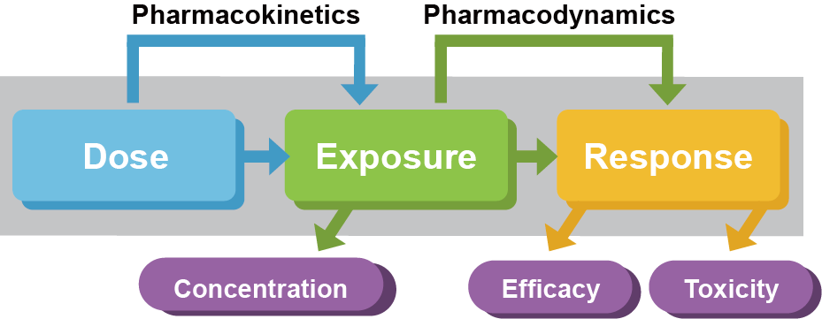
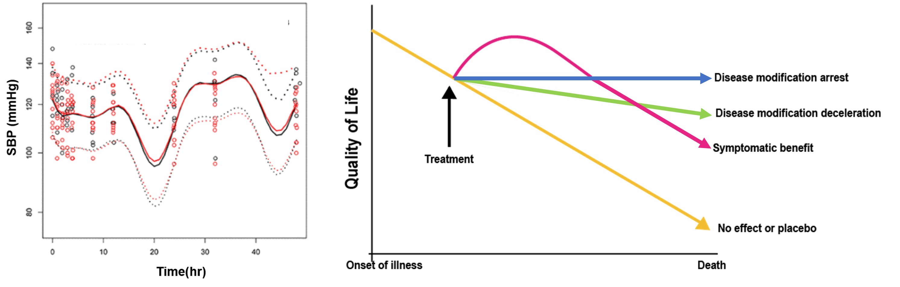
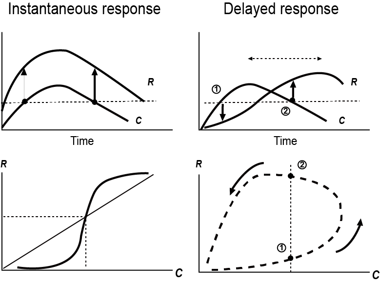

# 약동-약력(PK-PD) 모델링의 이론적 기초 {#basic-pkpd}

\Large\hfill
임동석
\normalsize

## 관련 개념

약효가 용량과 상관관계가 있다는 것은 정확히 말한다면 혈장 약물농도나 농도곡선하면적 등으로 표현되는 약물노출(exposure)과 약효가 상관 있고, 그 약물노출은 또 외부에서 투여한 약의 용량에 의해 결정된다는 것이다. 이는 너무도 당연한 것이라고 볼 수도 있으나, 용량-노출, 노출-약효의 상관관계가 단순한 정비례 관계가 아니라, 인체의 약물제거 능력, 수용체와 약물의 복잡한 상호작용(약력학), 시간이라는 변수 등이 관련되고 또 개인간의 차이까지 관여되므로 이 관계를 잘 파악하고 정량화하는 것은 적절한 효과를 얻기 위해 얼마의 용량을 얼마 간격으로 주어야 하는가를 결정하기 위해 반드시 필요한 과정이다.

```{r, fig.cap = '용량-노출, 노출-약효의 상관관계'}

```

신약개발에 있어 임상약리학의 핵심적 역할은 최적의 약효를 얻기 위한 용량용법을 찾는 것이라 할 수 있다. 용량과 노출의 관련성을 탐구하는 것이 약동학이고, 넓게 정의한다면 약물의 효과를 탐구하는 모든 연구분야를 약력학이라 할 수 있겠지만, 임상약리학에서는 약물노출과 생체에서 측정된 약효의 관련성을 탐구하는 것이 약력학(pharmacodynamics)이다. 이러한 약동학과 약력학을 연결하여 설명할 수 있다면 적절한 용량용법을 찾아낼 수 있는 것이다.

여기서 약효와 관련된 다양한 용어들을 살펴볼 필요가 있다.

약에 대한 response란 약을 주고 나서 측정할 수 있는 모든 종류의 값들(혈당치, EFV1.0)을 포괄적으로 의미한다면 effect란 response 값이 약 주기 전의 기저값으로부터 얼마나 변했는지 그 크기를 따지는 것이다. 이에 반해 efficacy는 약으로부터 얻을 수 있는 최대의 effect를 말한다. Potency는 최대효과의 50%를 나타내게 해 주는 용량이나 농도를 의미하며 이 값이 낮을수록 potency가 높다고 한다. Effectiveness 란 효과가 있다 없다와 같이 이분법으로 구분한 판단이며 정량적인 의미는 없다.

## 약력학(PD) 및 약동-약력(PK-PD) 데이터의 특성

### PD 데이터

많은 경우 PD 데이터는 약동학 데이터(혈장약물농도)에 비해 숫자가 적고, 잔차(측정오차 등)가 크고, 측정된 시점도 사람마다 차이가 날 수 있다. 또 혈장약물농도는 측정된 최고 값과 최저 값이 수 백 배 이상 차이 나는 경우가 많지만, 약력학 데이터는 그보다는 변동범위가 훨씬 좁은 편이다. (대게 수 십 배 이하) 따라서 혼합효과 모델링할 때 잔차에 대하여 가법오차(additive error) 모델을 쓰는 편이다.\index{가법오차 / additive error}\index{additive error / 가법오차}\index{잔차 / residual error}\index{residual error / 잔차}

PD 데이터는 혈장에서 측정되는 바이오마커 농도처럼 연속형 변수일 수도 있고, 이외 많은 임상적 측정치들의 경우처럼 이진형, 범주형 변수와 기타 다른 형태의 변수들이 있다.(표 \@ref(tab:pd-data-property)) 변수의 성격에 따라 NONMEM에서의 $ESTIMATION 의 옵션도 달라져야 한다.\index{\$ESTIMATION (\$EST)}

\index{-2LL}\index{\$ESTIMATION (\$EST)}\index{IPRED}\index{LAPLACIAN}\index{LIKELIHOOD}\index{PRED}\index{IPRED}\index{PRED}

```{r pd-data-property}
tribble(~"PD 데이터의 종류", ~'특징', ~'모델링할 때의 주의점',
'Continuous response (interval or ratio)', 
'관찰값들의 크기가 비교 가능하고 일정한 간격 단위로 측정되므로 Mean, SD 등으로 요약 가능
1) 간격척도(Interval scale): 체온 등(절대적 0의 값 없음)
2) 비척도(Ratio scale): 체중, 혈압, 농도 등 (절대적 0의 값 있음)',
'IPRED나 PRED 가 DV 값 자체와 얼마나 비슷한지가 중요(가장 흔히 쓰는 방식)',
'Binary / categorical response', "이진(binary): 증상의 유/무 등\n3가지 이상 범주(categorical): \n-Simple categorical: 인종, 혈액형 등\n-Ordered categorical: 병기(stage), VAS(visual analog scale)\n관찰값들 간의 간격의 크기를 알 수 없어 비교 불가\nMean, SD 등으로 나타내기 부적절", "관찰된 DV 값 자체가 아닌 그 값이 관찰될 확률에 대해 평가하므로 \\$ESTIMATION 블록에서 LIKELIHOOD 나 -2LL 옵션써서 해야 함. LAPLACIAN 방법을 흔히 씀. 그러므로 PRED 값은 해당 시점의 DV 값이 나올 확률을 의미하고, IPRED는 따로 구할 수 없음. ",
"Count data", "질병의 발현을 숫자로 셀 수 있을 때 (뇌전증의 발작 횟수 등)", "",
"Time to event data", "예) 수면유도제의 효과: 잠들 때까지의 시간", "") %>% 
  mutate_all(linebreak) %>%
  kable(caption = "PD 데이터의 종류", booktabs=TRUE, escape=FALSE) %>% 
  column_spec(1, width = "3.0cm") %>% 
  column_spec(2, width = "5.5cm") %>% 
  column_spec(3, width = "4.5cm") #%>% 
  #collapse_rows(1, valign = 'bottom')
  #collapse_rows(3, valign = "top")
```

PD 데이터만이 갖는 또 다른 특징은 약동학 데이터와는 달리 약을 주기 전에도 이미 측정할 수 있는 값이란 사실이다. 약을 주고 나서 그 값이 약효에 의해 변동되지만, 투약하지 않은 상태에서도 기저값(baseline)이 존재하고 그 기저값은 시간에 따라 일정한 주기를 가지고 변동되거나, 질병의 진행에 따라 증가 또는 감소할 수 있다. 그러므로 측정되는 약력학적 데이터는 약과 무관하게 환자의 내인적 요인으로 변동에 약에 의한 영향이 더해진 값이며, 온전히 약의 영향만을 평가하려면, 약을 쓰지 않은 상태의 환자(위약군)에서 측정된 약력학적 데이터와 비교하여야 한다.(그림 \@ref(fig:pd-time-course))

```{r pd-time-course, fig.cap="(ref:pd-time-course)", out.width='100%'}

```

(ref:pd-time-course) PD의 시간에 따른 변화의 사례 [@dementia]

*왼쪽: 혈압강하제의 약효와 혈압 자체의 일중변동을 모두 반영한 모델 [@lee2013pharmacokinetic], 오른쪽: 알츠하이머병의 평생에 걸친 따른 질병악화와 치료제의 기전에 따른 변화. 시간에 따른 질병의 진행을 모델에 반영하여야 약효를 정확히 기술할 수 있다.*


### PK-PD 데이터

NONMEM으로 PK-PD 모델링을 수행할 경우, 대개 DV는 혈장약물농도(PK)와 PD 데이터의 두 가지로 나뉜다. 따라서 데이터셋에도 두 종류의 DV를 구분해 넣어주어야 하므로 주로 구획(compartment)의 번호를 달리하는 방법을 쓴다. 물론 구획의 번호는 모델 구조에 따라 적절히 넣어주면 된다. 한 번 채혈한 말초혈액 시료에서 혈장약물농도도 측정하고, 어떤 바이오마커도 측정하여 이를 PK와 PD 데이터로 쓴다면, 측정시간이 동일하겠지만, 많은 경우 PD 데이터들을 얻는 시점은 혈장약물농도를 얻기 위한 채혈과는 다르다. 이는 연구자가 PD 데이터로 간주할 수 있는 데이터의 종류가 혈액검사로서 측정되는 바이오마커 이외에도 매우 다양하고, 이를 측정할 수 있는 적절한 간격이 PK 채혈을 위한 시간간격보다는 훨씬 긴 경우가 많아서이다. 예컨데, 만성적 질병상태를 의사가 종합적으로 평가한 임상적 점수, CT검사로 측정한 종양의 크기 등은 한 달에 한 번 정도 이상 빈번히 측정해야 할 필요가 없기 때문이다.\index{dependent variable(DV) / 종속변수(DV)}

또, 두 데이터의 종류가 다르므로 단위도 다르고 구체적으로 기입되는 수치의 단위도 몇 자리 이상 차이가 나는 경우도 흔하다.  따라서 개인간차, 잔차 등도 PK와 PD 데이터에 대해 제각기 다른 Ω와 Σ값들을 주고 모델링해야 한다.\index{잔차 / residual error}\index{residual error / 잔차}

### PD 데이터를 모델링할 때 고려할 점

앞에서도 나왔듯이 PD 데이터의 기저치와 개일리듬(circadian rhythm)의 존재여부, 농도와 효과 간의 이미 알려진 작용기전의 존재여부, 시간차(time delay), 설명할 수 있는 모델의 선택 등을 먼저 고려해야 한다. 또한 PK와 PD 모델링을 PK를 먼저, PD는 다음에 하는 식으로 순차적으로 수행할지, 동시에 할지, 순차적으로 한다면 PK 모델의 정보를 어느 선까지 PD 모델링 단계에서 쓸지 등을 고려해야 한다.

데이터셋을 만들 때 PK와 PD 자료를 한꺼번에 넣으려 하면 혼란이 생길 수 있어서 Dosing 데이터셋, PK 데이터셋, PD 데이터셋을 각각 만든 후 병합하는 것을 추천한다. 또 실제 관찰한 시간 이외에도 이후 모델 진단 등을 위해 time after dose(TAD, 여러 번 투약 시 직전 투약시간 이후 경과시간을 표시한 것) 칼럼도 함께 넣어주는 것이 좋다.\index{time after dose / time after dose}\index{time after dose / time after dose}

## PK와 PD의 관계

혈장약물농도와 약효(또는 바이오마커)의 관계는 이 책의 다음 장들에서 자세히 나와 있다. 약물농도와 약효의 관계는 시험관내 실험에서 약효가 포화되는 Emax, sigmoid Emax, 또는 비례적인 선형관계 등이 있지만, 이와 같은 관계만으로 생체 내에서의 혈장약물농도와 약효의 관계를 설명하기에 충분치 않다. 이 책의 이어지는 장들에서 자세히 나오겠지만, 많은 약들의 경우 그림 \@ref(fig:conc-hysteresis)와 같이 혈장농도의 상승, 하강보다 약효의 상승, 하강이 더 늦게 나타나는 현상이 나타나고 이를 설명하고 예측하기 위한 다양한 모델들 중 가장 적절한 것을 선택하는 것이 PK-PD 모델링의 핵심이다. 이 중에서 많이 쓰이는 것들이 생리학적 모델(또는 turnover 모델)과 약효구획모델(effect compartment 모델)이다.

일정하게 유지되고 있던 물질의 인체 내에서의 생성속도와 제거속도에 약이 영향을 미쳐서 그 물질의 농도가 높아지거나 낮아지게 만들 수 있는데 그 물질의 농도 자체를 약효(또는 약효를 반영하는 바이오마커)라고 간주한다면, 그러한 새로운 평형상태에 도달하는데 걸리는 시간으로 인해 농도-약효 간의 시간차가 발생하는 것을 설명하는 것이 PK-PD 모델 중 생리학적 모델이다. Warfarin의 예를 들면 혈액응고를 저해하는 효과는 간에서 비타민 K를 억제하여 응고인자 생성을 막는 것인데 이미 만들어져 있는 응고인자들이 소모되어 없어져야 warfarin의 약효가 완전히 나타나게 되어 INR 값이 최대가 될 것이다.  응고인자는 간에서 일정한 속도로 만들어지고, 일정한 속도로 제거되면서 인체의 혈액응고기능이 일정한 수준으로 유지되는데, 그 생성속도를 떨어뜨려 혈액응고기능을 떨어뜨리는 방향으로 새로운 균형을 찾기까지 시간이 걸리는 것이다.

이에 반해 약효구획모델은 이러한 내인성 물질들의 turnover로 설명되지 않는, 이유를 모르는 약효의 시간적 뒤쳐짐을 설명하기 위해 쓸 수 있다. 약효변화가 혈장농도의 변화보다 늦어지는 이유를 약이 중심구획(혈장)에서부터 약효 구획이라는 가상의 구획으로 분포하는데 걸리는 시간 때문으로 설명하고자 하는 방법이며 그 구획으로 이동하는 약의 양은 실제 중심구획에 있는 약의 양에 영향을 미치지 않는 극히 소량이라고 가정한다.

```{r conc-hysteresis, fig.cap = "(ref:conc-effect-time-course)"}

```

(ref:conc-effect-time-course) 혈장약물농도와 약효의 시간적 관계 [@dementia]

약효의 변화가 약물농도의 변화보다 늦게 나타날 경우 오른쪽 아래 그림과 같은 반시계방향 히스테레시스 현상이 나타나게 된다.


