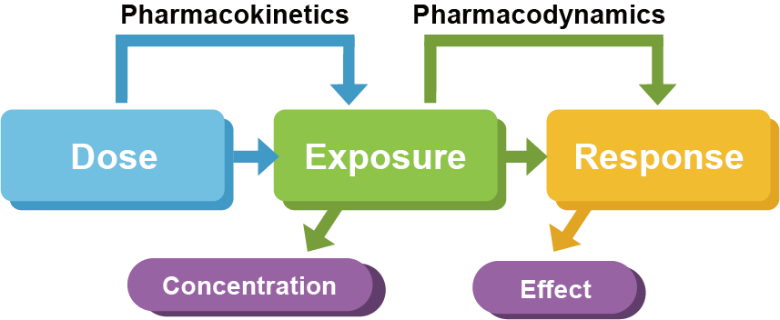
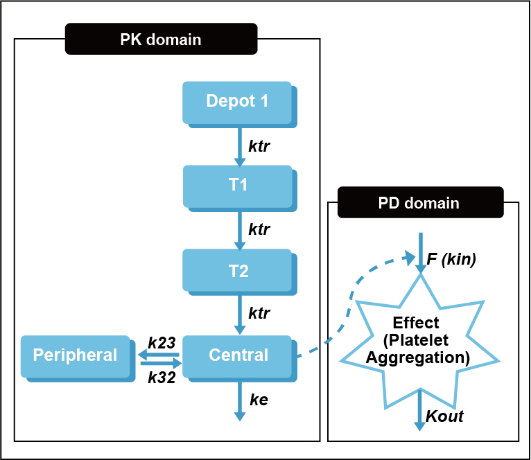
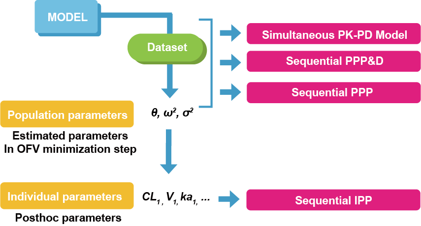
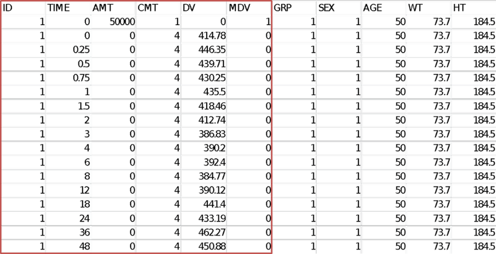
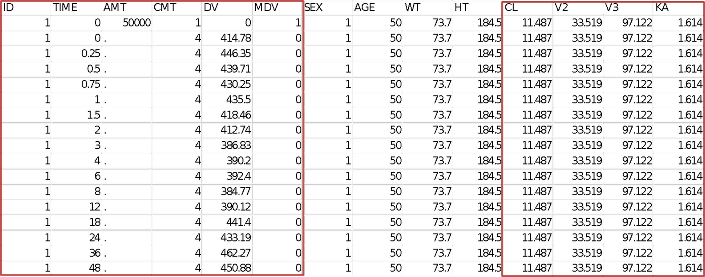
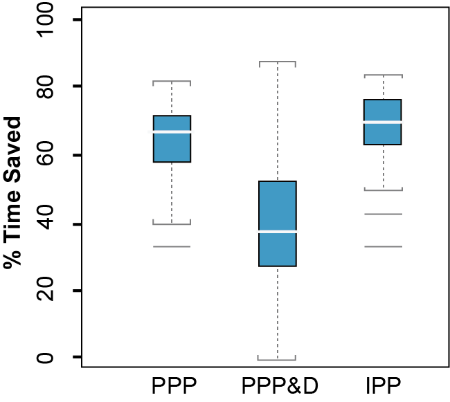
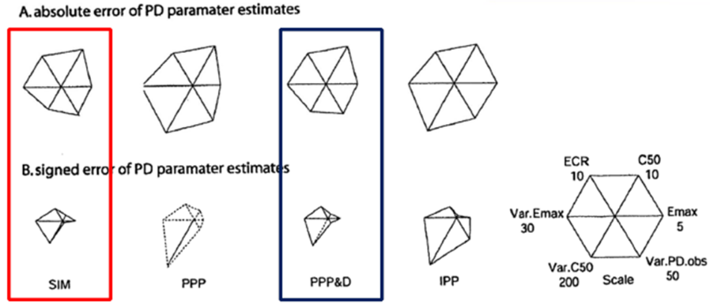

# PK-PD 연결 방법과 적합법 {#pkpd-link}

\Large\hfill
이소진
\normalsize


---

약물의 개발과 임상적 활용에 있어 궁극적으로 얻고자 하는 정보는 약물의 안전성과 유효성에 대한 정보이며, PK-PD 모델링을 통해 우리가 임상에서 알고자 하는 관심 질문에 대한 답변을 얻을 수 있다. 내가 가진 데이터의 특성과 얻고자 하는 답변이 무엇인가에 따라 모델을 구현하는 방법이 정해지며, 대표적으로 약물의 유효용량 범위 또는 시간에 따른 약물의 효과를 예측하고자 하는 경우 PK-PD 모델링 및 시뮬레이션을 많이 사용한다.\index{시뮬레이션 / simulation}\index{simulation / 시뮬레이션}

첫 단계로 PK 모델링을 수행하는 큰 이유 중 하나는 이를 PD 모델과 연결시켜 약물의 효과를 예측하기 위함이다. 따라서 PD 모델링을 위해서 먼저 PK 데이터와 PK 모델을 확보해야 하며 이를 통합적으로 PK-PD 모델링이라고 부른다. PK-PD 모델링을 통해 용량–약물노출–효과 간의 관계를 정량적으로 설명할 수 있다. (그림 \@ref(fig:pkpd-link))

이 장에서는 PK-PD 모델을 연결하는 다양한 방법(PK-PD linking method)과 각 방법의 특징에 대하여 소개한다.

```{r pkpd-link, fig.cap="(ref:pkpd-link)"}

```
(ref:pkpd-link) PK-PD의 연결고리

## PD 데이터 및 PD 모델의 특징

PK-PD 모델링을 수행하는 경우, 우선적으로 PK 모델이 구축되어 있어야 하며 PD 데이터를 획득하여 PK 모델과 PD 모델을 ‘동시에’ 또는 ‘순차적으로’ 적합 시킬 수 있다.

PD 모델링을 위해서 PD 데이터의 특성을 파악하는 것이 중요하며, 모델링 결과를 유용하게 활용하기 위해서는 충분한 효과를 보이는 것으로 알려진 약력학적 기준 (PD threshold 또는 target level)을 선정하는 것이 중요하다.

우선, PD 데이터의 특성을 살펴보자. PD 데이터는 대부분 환자 또는 동물 질환모델에서 얻어진 관측값이며, 질병의 경과와 약물의 작용의 복잡한 과정으로 인해 개인(개체) 간 변이에 대한 원인을 정확히 설명할 수 없는 경우가 많다. 따라서 PD 데이터는 약물의 효과는 PK와의 관계, 반응의 기저치, 일중변동, 질병 진행, 내성 발현 등과 같은 많은 요소들의 영향이 합쳐져서 나타나는 결과이다. [@kelly] 이와 같은 영향들을 고려하기 위해 위약군에서의 PD 데이터를 측정하기도 한다. 또한, 환자 간 PD 모델은 본질적으로 PK 모델에 비해 복잡한 특성을 지니며, PD 모델링 시의 고려할 점은 아래와 같다. PD 파라미터의 기저치 값이 존재하는지(또는 위에 언급된 PD 데이터에 영향을 주는 다양한 요인들에 의한 영향을 어떻게 고려할지), 약물농도의 증가에 따라 PD 측정값이 증가(또는 감소)하는지, 약물 농도와 효과 간에 이미 알려진 기전이 있는지, 농도-효과 간의 시간 지연(time delay)이 있는지, 농도-효과 간의 관계를 어떤 모델로 설명할 것인지(예를 들어, Emax 모델 등), PK 및 PD 파라미터 추정을 동시에 진행할 것인지 또는 순차적으로 진행할 것인지(순차적으로 수행할 경우 PK 데이터 및 PK 모델을 얼마만큼 활용할 것인지) 등에 대한 고려가 필요하다. [@ette;@gabrielsson] PK 와 PD 모델을 적합하는 다양한 방법에 대해서는 \@ref(pkpd-link-method)에서 자세히 다루도록 한다.

## PK-PD 데이터를 다룰 때 고려할 점

PK-PD 모델링을 수행하는 과정에서 우리는 PK 와 PD 데이터를 모두 다루게 된다. 이 경우, 주의해야할 점이 몇 가지 있다.  데이터셋에 구획 정보를 포함하여 두 종류의 데이터를 구분하여 주어야 한다.

예를 들어 아래의 clopidogrel PK-PD 모델의 구조를 살펴보면, 'Central' 구획에서 관측되는 값은 clopidogrel의 PK 데이터이고, 'Effect' 구획에서 관측되는 값은 PD 데이터로, 이 경우 platelet aggregation을 나타낸다(그림 \@ref(fig:clopidogrel)). [@lee2012population] 구획 번호는 모델의 구조에 맞추어 변경하여 진행한다.

또한 PK 와 PD 가 같은 대상자(또는 같은 질환 모델 개체)에서 얻어진 값인지 파악해야 한다. PK 데이터와 PD 데이터는 다른 시간에서 얻어질 수 있으며, 각각의 관측치의 차이의 폭(scale)이 다를 수 있음을 염두해야 두어야 한다.

```{r clopidogrel, fig.cap="(ref:clopidogrel)"}

```

(ref:clopidogrel) Clopidogrel의 PK-PD 모델 구조 [@lee2012population]

## PK-PD 연결 방법 (적합법) {#pkpd-link-method}

PK-PD 연결 방법(적합법)은 크게 두 가지로 구분될 수 있다. 적합법 선택에 있어 고려하는 요소는 데이터의 특성, 모델링 과정에 소요되는 시간, 최종 파라미터 추정값의 정밀도 등이 있으며, 이 요소들 간의 적절한 균형을 고려하여 적합법을 선택할 수 있다.

첫 번째 방법은 PK-PD 모델의 동시적합법(SIM, simultaneous fitting)으로, 이는 PK 모델과 PD 모델을 동시에 데이터에 적합시켜 PK 파라미터와 PD 파라미터를 동시에 추정하는 방법이다. 다른 방법은 PK 모델을 적합시킨 후, 추정된 PK 파라미터를 PD 모델에 대한 입력값으로 사용하여 PD 파라미터를 추정하는 순차적합법(sequential fitting)이 있다. [@kelly;@zhang1;@zhang2] \index{동시적합법 / simulatneous fitting}\index{순차적합법 / sequential fitting}\index{sequential fitting / 순차적합법}\index{simulatneous fitting / 동시적합법}

순차적합법은 PD 모델의 추정방법에 따라(어떤 데이터에 비중을 두고 PD 모델링을 진행할지에 따라) 최소 세가지로 나눌 수 있다.  이 세가지 방법은 PPP\&D (Population PK Parameter & Data), PPP (Population PK Parameter), 그리고 IPP (Individual PK Parameters)로, 이 이름들은 각 방법에 대한 간단한 설명으로 생각할 수 있다. [@zhang1;@zhang2]\index{순차적합법 / sequential fitting}\index{sequential fitting / 순차적합법}

우선, 순차적합법 중 첫번째 방법인 PPP\&D는 PK 파라미터 집단 대표값을 고정하고, PK 데이터와 PD 데이터를 모두 데이터셋에 포함하여 개인의 PK 파라미터 및 PD 파라미터를 추정하는 방법이다.\index{순차적합법 / sequential fitting}\index{sequential fitting / 순차적합법}

순차적합법 중 두 번째 방법은 PPP로 PK 파라미터의 집단 대표값을 고정하고, 오로지 PD 데이터만을 데이터셋에 포함하여, 이를 근거로 개인의 PK 파라미터와 PD 파라미터를 추정한다. 산출된 개인 PK 파라미터는 오로지 PD 데이터에 의존하여 산출되었다는 점에서 이전 방법과 다르다. 따라서 개인의 PD 데이터가 상대적으로 높은 값을 가지는 경우, 개인의 혈장약물농도는 높게 측정된 PD 데이터를 설명하기 위해 실제보다 높게 예측될 수 있다. 따라서 이 방법은 PD 데이터에 더 큰 비중을 둔 방법이라고 할 수 있다.\index{순차적합법 / sequential fitting}\index{sequential fitting / 순차적합법}

마지막 방법은 IPP로 PK 파라미터 개인 추정치를 고정하고, 이를 PD 데이터와 함께 데이터셋에 포함시켜, PD 파라미터만을 추정하는 방법이다. 이 방법은 개인의 PK 관측값과 PD 관측값을 일대일로 대응시키는 방법으로 같은 개체에서 PK 와 PD 데이터가 얻어진 것을 전제로 한다.

위에 설명된 4가지의 PK-PD 적합법(SIM, PPP\&D, PPP, IPP)의 공통점은 PD 데이터가 데이터셋에 모두 포함된다는 것과, 모든 방법에서 항상 PD 파라미터를 추정한다는 것이다. 개인 PK 파라미터는 IPP 방법에서는 새로이 추정하지 않으며, 나머지 세가지 방법에서는 추정한다. 이 세가지 방법 중 PPP\&D와 PPP에서는 이미 얻어진 집단 PK 파라미터 대표값을 모델에 고정하여 사용한다. SIM에서는 PK 모델을 통해 미리 PK 파라미터를 추정하지 않으며, 모든 PK 파라미터와 PD 파라미터를 동시에 추정한다는 점이 다른 방법들과 다르다. 이와 같은 내용은 아래의 표에 정리되어 있다(표 \@ref(tab:pk-pd-link-methods)).

```{r pk-pd-link-methods}
readxl::read_excel("data-raw/fig-tab.xlsx", sheet="187", range="B2:F6") %>% 
  kable(booktabs=TRUE, caption = "PK-PD 연결 방법들") %>% 
  column_spec(1, width = "2cm") %>%
  column_spec(2, width = "3.5cm") %>%
  column_spec(3, width = "1.0cm") %>%
  column_spec(4, width = "2cm") %>%
  column_spec(5, width = "3.5cm") %>%
  collapse_rows(1, valign = "top")
```

아래의 그림은 각 방법이 가지는 PK 정보의 정도(level of information)를 도식화한 그림이다(그림 \@ref(fig:level-info)).  순차적합법 중 PPP\&D 와 PPP는 PK 모델에서 얻은 PK 파라미터 추정치(θ, ω, σ)에 대한 정보를 담고 있다. IPP 방법은 집단 PK 파라미터 추정치에서 한 단계 더 나아가 posthoc 파라미터라고 불리는 개인 PK 파라미터 추정치(CL, V2, V3 등)에 대한 정보를 담고 있다.\index{순차적합법 / sequential fitting}\index{sequential fitting / 순차적합법}

```{r level-info, fig.cap="(ref:level-info)"}
 # fig 3
```

(ref:level-info) PK-PD 연결 방법과 그에 관련된 정보의 수준

## 직접효과 PK-PD 모델의 예(Examples of direct effect PK-PD model) {#direct-pkpd}

\index{직접 효과 모델 / direct-effect model}\index{direct-effect model / 직접 효과 모델}

### 동시적합법(SIM, Simultaneous fitting) 

\index{동시적합법 / simulatneous fitting}\index{simulatneous fitting / 동시적합법}

PK-PD 모델링을 수행을 위해 각 적합법에 따라 필요한 데이터셋 구성과 제어구문 파일의 구조를 살펴보도록 하겠다.

\@ref(direct-pkpd)의 예시는 약물을 IV 로 투여 시 약동학이 1 구획 PK 모델을 따르고, 약력학은 Emax 모델을 따르는 경우이다. PK 와 PD가 시간지연 양상을 보이지 않으며, 직접효과를 나타내는 모델로 설명되었다.\index{직접 효과 모델 / direct-effect model}\index{direct-effect model / 직접 효과 모델}

SIM 방법으로 PK-PD 모델링 수행시 데이터셋에는 PK 데이터와 PD 데이터가 모두 포함되어 있어야 한다. CMT 칼럼의 값이 1이면 PK 데이터, 2이면 PD 데이터가 기재되어 있다. IV 투여로 용량 정보는 CMT 1에 들어가 있다. PK 와 PD 데이터가 다른 구획에서 관측된 것이라는 것을 이와 같이 CMT로 구분한다(그림 \@ref(fig:SIM-dataset)).\index{CMT}

제어구문 파일을 살펴보면, \$PK 제어구문에는 하나의 구획으로 구성된 PK 모델 구조를 확인할 수 있으며, PD 도메인에 해당되는 EC50 및 Emax 값을 추정한다. \$DES는 ADVAN 6 이상(ADVAN 6, 8, 9, 13)에서 nonlinear ADVAN을 사용할 때 쓰는 제어구문으로, 구획 하나 당 하나의 미분방정식을 기재한다. PK-PD가 직접 효과를 나타내어, CMT 1에서 만들어지는 혈중농도에 따라 EMAX 양상으로 바로 효과가 나타난다고 생각할 수 있다. 이 경우 PD 모델(Emax 모델)을 \$ERROR 블록 내 표현할 수 있다. 오차 모델(Error model)은 PK에 대한 오차모델과 PD에 대한 오차모델 두가지로 나뉘어져 있다. SIMULTANEOUS 방법에서는 PK, PD 파라미터를 동시에 추정하기 때문에 \$THETA 이하의 제어구문에서 어떠한 파라미터 값도 고정하지 않고 모델링을 진행한다(코드 \@ref(exm:SIM-control)).\index{직접 효과 모델 / direct-effect model}\index{direct-effect model / 직접 효과 모델}\index{\$DES}\index{\$ERROR}\index{\$PK}\index{\$THETA}\index{CMT}

```{r SIM-dataset, fig.cap = "(ref:SIM-dataset)", out.width='50%'}
 # fig4
```

(ref:SIM-dataset) SIM 방법의 데이터셋의 예

```{example, SIM-control, echo = TRUE}
SIM 방법의 제어구문의 예 <!--fig5-->
```
\vspace{-5ex} 
```r
$PK 
CL = THETA(1) * EXP(ETA(1)) 
V1 = THETA(2) * EXP(ETA(2)) 
K = CL / V1 
EMAX = THETA(3) * EXP(ETA(3)) 
EC50 = THETA(4) * EXP(ETA(4))

$DES 
CP = A(1) / V1 
DADT(1) = -K * A(1)

$ERROR 
Y1 = CP 
Y2 = EMAX*CP / (EC50+CP) 
IF (CMT.LE.1) Y = Y1 + ERR(1) 
IF (CMT.EQ.2) Y = Y2 + ERR(2)

$THETA 
(0, 1) 
(0, 10) 
(0, 15) 
(0, 20)

$OMEGA 
0.1 
0.15 
0.2 
0.25

$SIGMA 
0.025 
0.04
```

아래의 제어구문은 NONMEM을 기본적으로 수행시키기 위해 \$PK 위에 들어가는 명령어라고 볼 수 있다.\index{\$PK}

```r
$PROB 1 comp IV Emax model 
$INPUT ID TIME AMT DV MDV CMT 
$DATA DATAFILENAME.csv IGNORE=@ 
$SUBROUTIN ADVAN6 TOL=3 
$MODEL 
COMP (CENT, DEFDOSE, DEFOBS) 
COMP (PD)
```

추가적으로 R 소프트웨어의 xpose4 패키지를 사용하여 적합도 플롯(goodness of fit plot)을 그리고자 하는 경우, IWRES 값이 필요하며, 코드 \@ref(exm:SIM-control)에서 제시한 단순화된 오차모델 대신 아래와 같은 오차모델을 사용하여 PK-PD 모델링을 진행할 수 있다. 아래의 예시에는 PK 오차모델에는 가법오차와 비례오차를 모두 주었고, PD 오차모델에는 가법오차 만을 주었다.\index{가법오차 / additive error}\index{비례오차 / proportional error}\index{additive error / 가법오차}\index{proportional error / 비례오차}\index{적합도 / goodness of fit}\index{goodness of fit / 적합도}\index{IWRES}\index{RES}\index{WRES}

```r
$ERROR 
IF (CMT.EQ.1) THEN 
  IPRED = CP 
  W = SQRT(THETA(10)**2 + THETA(11)**2 * IPRED**2) 
  IRES = DV - IPRED 
  IWRES = IRES / W 
  Y = IPRED + W * EPS(1) 
IF (CMT.EQ.2) THEN 
  IPRED = EMAX*CP/(EC50+CP) 
  W = THETA(12) 
  IRES = DV - IPRED 
  IWRES = IRES / W 
  Y = IPRED + W * EPS(2) 
ENDIF
```

### 순차적합법 (Sequential fitting)
\index{순차적합법 / sequential fitting}\index{sequential fitting / 순차적합법}

#### PPP\&D (Population PK Parameters & Data)

PPP\&D는 SIM 방법과 마찬가지로 PK 데이터 및 PD 데이터가 모두 포함된다. 따라서, SIM에서 사용한 데이터셋의 구조와 동일하다(그림 \@ref(fig:pppd)). PPP\&D에서는 PK 모델을 통해 얻어진 집단 PK 파라미터 추정치를 고정하여 진행하며, 이는 \$THETA, \$OMEGA, \$SIGMA 블록 내의 θ1~CL~, θ~V1~, ω~CL~~2~, ω~V1~~2~그리고 σ~1~~2~에 해당한다(코드 \@ref(exm:pppd-code)).\index{\$OMEGA}\index{\$SIGMA}\index{\$THETA}

```{r pppd, fig.cap="(ref:pppd)", out.width='50%'}
 # fig 6
```

(ref:pppd) PPP&D 방법의 데이터셋의 예


```{example, pppd-code, echo=TRUE}
PPP\&D 방법의 제어구문의 예
```
\vspace{-5ex} 
```r
$PK 
CL = THETA(1) * EXP(ETA(1)) 
V1 = THETA(2) * EXP(ETA(2)) 
K = CL / V1 
EMAX = THETA(3) * EXP(ETA(3)) 
EC50 = THETA(4) * EXP(ETA(4))

$DES 
CP = A(1) / V1 
DADT(1) = -K * A(1)

$ERROR 
Y1 = CP 
Y2 = EMAX*CP / (EC50+CP) 
IF (CMT.LE.1) Y = Y1 + ERR(1) 
IF (CMT.EQ.2) Y = Y2 + ERR(2)

$THETA 
1 FIX
10 FIX
(0, 15) 
(0, 20)

$OMEGA 
0.1 FIX 
0.15 FIX
0.2
0.25

$SIGMA 
0.025 FIX
0.04
```


#### PPP (Population PK Parameters)

PPP로 PK-PD 모델링 수행 시 PPP\&D 와 마찬가지로 PK 모델을 통해 얻어진 집단 PK 파라미터 추정치를 고정하여 진행한다. 이는 $THETA, $OMEGA 블록 내의 θ1~CL~, θ~V1~, ω~CL~~2~, ω~V1~~2~에 해당한다.\index{\$OMEGA}\index{\$THETA}

PPP는 PD 데이터만을 데이터셋에 포함하며(CMT 2에 표시됨) 이전 방법에서 CMT 1에 표시된 PK 데이터는 포함되지 않는다(그림 \@ref(fig:PPP-dataset)). 이전 방법에서는 오차 모델이 PK 와 PD에 대하여 각각 들어갔으나, PPP 방법은 이와 다르게 PD 데이터만을 사용하여 PK-PD 모델을 연결하고 PD 모델링을 수행하기 때문에, PD에 대한 오차모델 하나만 사용한다(코드 \@ref(exm:control-ppp)).\index{CMT}

```{r PPP-dataset, fig.cap = "(ref:PPP-dataset)", out.width='50%'}
 # fig 8
```

(ref:PPP-dataset) Example of dataset for PPP


```{example, control-ppp, echo=TRUE}
Example of control file for PPP
```
\vspace{-5ex} 
```r
$PK 
CL = THETA(1) * EXP(ETA(1)) 
V1 = THETA(2) * EXP(ETA(2)) 
K = CL / V1 
EMAX = THETA(3) * EXP(ETA(3)) 
EC50 = THETA(4) * EXP(ETA(4))

$DES 
CP = A(1) / V1 
DADT(1) = -K * A(1)

$ERROR 
EFF = EMAX*CP / (EC50+CP) 
Y = EFF + ERR(1)

$THETA 
1 FIX 
10 FIX 
(0, 15) 
(0, 20)

$OMEGA 
0.1 FIX 
0.15 FIX 
0.2 
0.25

$SIGMA 
0.04
```

### IPP (Individual PK Parameters)

순차적합법 중 마지막으로 소개할 방법은 IPP이며 이는 개인 PK 파라미터 추정치를 데이터셋 상에서 고정하여 PD 모델에 대한\index{순차적합법 / sequential fitting}\index{sequential fitting / 순차적합법} 입력값으로 사용하여 PD파라미터를 추정한다. IPP에서 사용하는 데이터셋은 PPP 데이터셋 구조와 기본적으로 동일하며 PD 데이터를 포함한다. 데이터셋에서 추가되는 부분은 PK 모델링을 통해 얻은 개인의 파라미터 추정치로 이 경우 각 해당 대상자의 CL, V1 값에 해당된다. 개인의 CL, V1과 같은 posthoc 파라미터 값은 PK 모델링 수행 시 제어구문 파일의 $TABLE 블록 내에 IPRED를 기재하여 생성된 표에서 IPRED 결과를 얻을 수 있다.\index{\$TABLE}\index{IPRED}\index{PRED}

그림 \@ref(fig:ipp-dataset-ex)에서 CL 와 V1에 해당하는 데이터 항목 레이블 (데이터셋 첫 행)은 ICL 과 IV이며, 기존 NONMEM이 지정하여 사용하는 파라미터 이름과 혼동되지 않도록 구분된 명칭을 써야 한다. 예시에서 우리는 Individual의 첫 알파벳 I를 파라미터 앞에 붙여 ICL 및 IV 로 명명하여 데이터셋 및 제어구문 파일에 사용하였다. IPP 역시 PPP 와 마찬가지로 PD 데이터 만을 데이터셋에 포함시키므로, 오차 모델 또한 PD에 대한 오차모델만을 가진다(그림 \@ref(exm:IPP-example)).

```{r ipp-dataset-ex, fig.cap = "(ref:ipp-dataset-ex)", out.width='50%'}
include_graphics("./assets/media-18/image8.png")
```

(ref:ipp-dataset-ex) IPP 방법의 데이터셋의 예

```{example, IPP-example, echo = TRUE}
IPP 방법의 제어구문의 예
```
\vspace{-5ex} 
```r
$PK
  CL = ICL
  V1 = IV
  K = CL / V1
  EMAX = THETA(3) * EXP(ETA(3))
  EC50 = THETA(4) * EXP(ETA(4))

$DES
  CP = A(1) / V1
  DADT(1) = -K * A(1)

$ERROR
  EFF = EMAX*CP / (EC50+CP)
  Y = EFF + ERR(1)

$THETA
  (0, 15)
  (0, 20)

$OMEGA
  0.2
  0.25

$SIGMA
  0.04
```

## 간접효과 PK-PD 모델의 예 (Examples of PK-PD model with Indirect response) {#indirect-pkpd}

### SIM과 PPP\&D 데이터셋 및 제어구문

이 장에서는 앞서 소개한 \@ref(direct-pkpd) 예시보다는 조금 복잡한 경우의 PK-PD 모델링에 필요한 데이터셋과 제어구문 파일의 구조를 살펴보자. 본 예시는 약물이 경구투여되어 나타나는 PK, PD 양상을 2구획 PK모델과 효과구획이 포함된 PD모델로 설명하였다. 따라서, 구획은 흡수, 중심, 말초, 효과의 총 4개의 구획으로 나뉘어지며, PD는 단순 Emax 모델을 따르고, PK 와 PD 간의 간접효과 모델을 사용(시간지연이 보인다고 가정)하여 약물의 농도가 효과 생성에 억제(Kin을 inhibit 시키는 것을 가정) 시키는 것을 나타냈다.

SIM과 PPP\&D방법에서 사용하는 데이터셋 형태는 동일하며 아래와 같다(그림 \@ref(fig:sim-pppd-dataset)). 경구투여 시 용량정보는 CMT 1, PK 데이터는 CMT2, PD 데이터는 CMT 4에 기입한다. PK 와 PD 데이터가 다른 구획에서 관측된 값이라는 것을 이와 같이 CMT로 구분한다.\index{CMT}

```{r sim-pppd-dataset, fig.cap = "(ref:sim-pppd-dataset)", out.width='100%'}
include_graphics("./assets/media-18/image9.png") # fig 12
```

(ref:sim-pppd-dataset) SIM 방법과 PPP\&D 방법을 쓸 때의 PK-PD 데이터셋의 예


이전 제어구문 파일 예시와 다른 점은 $DES 블록 내에 시간에 따른 PD 관측값의 변화를 설명하는 미분방정식(DADT(4))이 포함되어 있으며, 약물의 효과를 단순 Emax와 간접효과 모델로 설명하고 있다. SIM과 PPP\&D 방법은 PK 데이터 및 PD 데이터를 모두 활용하기 때문에 오차모델은 PK에 대한 오차모델과 PD에 대한 오차모델 두가지를 포함한다(코드 \@ref(exm:sim-pppd-similarity)).\index{\$DES}

제어구문 파일에서 SIM과 PPP\&D를 구분할 수 있게 해 주는 부분은 $ERROR 뒤에 이어지는 $THETA, $OMEGA, $SIGMA제어구문이며, 이 때 집단 PK 파라미터 추정치를 고정하지 않고 진행하는 것이 SIM방법이고, 고정하여 진행하는 것이 PPP\&D 방법이라고 할 수 있다.\index{\$ERROR}\index{\$OMEGA}\index{\$SIGMA}\index{\$THETA}

```{example, sim-pppd-similarity, echo = TRUE}
(ref:sim-pppd-similarity)
```
\vspace{-5ex} 
```r
$PROB HO_PO_2comp
$DATA SIM_S.csv IGNORE=@
$INPUT ID TIME AMT DMT DV MDV SEX AGE WT HT

$SUBROUTINE ADVAN6 TOL=3

$MODEL NCOMP=4
  COMP(DEPOT, DEFDOSE)
  COMP(CENT)
  COMP(PERI)
  COMP(EFFE, DEFOBS)

$PK
;---- PK FIXED EFFECT ----
  TVCL = THETA(1)
  TVV2 = THETA(2)
  TVV3 = THETA(3)
  TVQ  = THETA(4)
  TVKA = THETA(5)

;---- PK RANDOM EFFECT ----
  CL   = TVCL * EXP(ETA(1))
  V2   = TVV2 * EXP(ETA(2))
  V3   = TVV3 * EXP(ETA(3))
  Q    = TVQ  * EXP(ETA(4))
  KA   = TVKA * EXP(ETA(5))

;---- PK PARAMETER RELATIONSHIP ----
  S2   = V2
  K23  = Q/V2
  K32  = Q/V3
  KE   = CL/V2
```

(ref:sim-pppd-similarity) SIM 방법과 PPP\&D 방법 쓸 때 제어구문의 공통된 부분 <!--fig13-->

### PPP의 데이터셋 및 제어구문

PPP 방법을 사용할 때의 데이터셋 형태는 아래와 같다(그림 \@ref(fig:ppp-pkpd-dataset)). 데이터셋은 PK 데이터를 제외한 용량 정보와 PD 데이터만을 포함하며, 이와 같은 경우 PD 데이터를 CMT 4에 기입한다. 기존 SIM 및 PPP\&D 방법을 사용하여 PK-PD 모델링을 수행한 바 있고 이 때의 데이터셋(그림 \@ref(fig:sim-pppd-dataset))을 활용하고자 한다면, 제어구문 파일에서 간단한 제어구문을 통해 PPP에 적합한 데이터셋으로 변형하여 사용할 수 있다. 이는 \$DATA 제어구문내의 ‘IGNORE’이라는 명령어를 사용하여 CMT 2에 해당하는 PK 데이터를 받아들이지 않고, 그 외의 정보(용량 정보 및 PD 데이터)만을 받아들이게 할 수 있다(\$DATA 내의 `IGNORE=(CMT.EQ.2)`를 추가함). 이 명령어를 사용하지 않는다면, 물론 엑셀 상에서 데이터셋 자체를 PPP 방법에 적합하도록 수정하여 사용할 수 있다.\index{\$DATA}\index{CMT}\index{IGNORE}

PPP의 제어구문은 위의 코드 \@ref(exm:sim-pppd-similarity)과 동일한 형태로 사용될 수 있으며, 다만 다른 점은 $ERROR에서 PK(CMT 2)에 대한 오차모델이 삭제되고, PD (CMT 4)에 대한 오차모델만 남아있다고 생각하면 된다.\index{\$ERROR}\index{CMT}

```{r ppp-pkpd-dataset, fig.cap ="(ref:ppp-pkpd-dataset)", out.width='100%'}
 # fig14
```

(ref:ppp-pkpd-dataset) PPP 방법 쓸 때의 PK-PD 데이터셋의 기본 구조

### IPP의 데이터셋 및 제어구문

IPP 방법의 데이터셋은 PPP와 마찬가지로 용량정보와 PD 데이터를 포함한다. 다만, PK 모델을 통해 얻은 개인의 파라미터 추정치(예를 들어, CL, V2, V3, KA)를 바로 데이터셋에 기입해 준다. IPP에 적합한 데이터셋 형태는 아래와 같다(그림 \@ref(fig:ipp-dataset)).

이 방법으로 PK-PD 모델링을 수행시, PK 파라미터는 각 개인의 값으로 고정하며, 이를 제어구문 파일에 $PK 내에 ICL, IV2, IV3, IKA 와 같이 나타낸다(코드 \@ref(exm:ipp-control-stream)). 이와 같이 파라미터 이름을 명명한 이유는 NONMEM이 사용하는 기존 PK 파라미터 이름들과 구분지음으로써 계산 시 오류가 나타나지 않도록 하기 위함이다. 이 경우, 임의로 individual의 첫 자인 ‘I’를 파라미터 이름 앞에 붙여주었으며, 이외의 다른 이름으로도 표기가 가능하다 (예를 들어, ACL, AV2, AV3, AKA 등). 오차모델은 IPP에서는 PPP에서와 마찬가지로 PD 데이터만을 가지고 모델링을 수행하는 단계이기 때문에 PD에 대한 오차모델만 존재한다.\index{\$PK}

```{r ipp-dataset, fig.cap="(ref:ipp-dataset)", out.width='100%'}

```

(ref:ipp-dataset) IPP 방법 쓸 때의 PK-PD 데이터셋의 기본 구조

```{example, ipp-control-stream, echo = TRUE}
IPP 방법의 제어구문의 예
```
\vspace{-5ex} 
```r
$PROB HO_PO_2comp
$DATA IPP_S.csv IGNORE=@
$INPUT ID TIME AMT CMT DV MDV SEX AGE WT HT ICL IV2 IV3 IKA

$SUBROUTINE ADVAN6 TOL=3

$MODEL NCOMP=4
  COMP(DEPOT, DEFDOSE)
  COMP(CENT)
  COMP(PERI)
  COMP(EFFE, DEFOBS)
 
$PK

  CL    = ICL
  V2    = IV2
  V3    = IV3
  Q     = 4.97
  KA    = IKA
  
  S2    = V2
  
  K23   = Q/V2
  K32   = Q/V3
  
  KE    = CL/V2
  
  EMAX  = THETA(1) * EXP(ETA(1))
  EC50  = THETA(2) * EXP(ETA(2))
  KIN   = THETA(3) * EXP(ETA(3))
  BASE  = THETA(4) * EXP(ETA(4))
  A_0(4)= BASE
  KOUT  = KIN/BASE

```

## PK-PD 연결방법(적합법) 비교

### 각 방법의 장점 및 단점

위에서 PK-PD를 연결시키는 네 가지 방법(동시적합법: SIM, 순차적합법: PPP\&D, PPP, IPP)과 이 때 사용하는 데이터셋 형태 및 제어구문 구조에 대해 살펴보았다. 이 장에서는 각 방법의 장점 및 단점과 어떤 경우에 어떤 방법을 사용하는 것이 적합한지에 대해 살펴보도록 하자.\index{동시적합법 / simulatneous fitting}\index{순차적합법 / sequential fitting}\index{sequential fitting / 순차적합법}\index{simulatneous fitting / 동시적합법}

앞서 소개한 순서에 따라 SIM, PPP\&D, PPP, IPP 방법으로 갈수록 PK 정보를 세세하게 고정하여 사용하기 때문에, PK와 PD 간의 양방향의 상호작용에 대한 고려가 줄어들고, PD 모델의 유연성(flexibility)은 낮아진다고 할 수 있다. 그리고 이에 따라 시간적으로는 효율성이 더 높은 PD 모델링이 가능하다.

SIM 방법은 전산적으로 가장 계산이 복잡하며, 시간이 가장 많이 소요되는 방법이다. 많은 PK 및 PD 파라미터를 동시에 추정하기 때문에 안정적으로 추정이 어려울 수 있으며, 따라서 실행시간이 길어질 수 있다. 하지만 모든 파라미터를 동시에 추정 가능할 정도의 충분한 데이터가 확보된 경우라면 SIM 방법은 PK와 PD 파라미터 간의 양방향의 상호작용이 가능하다는 점에서 문헌에서는 가장 이상적인 방법이라고 말하고 있다. [@zhang1;@zhang2] 하지만, 현실적으로 모델링에 소요되는 시간을 절약할 수 있고 파라미터들의 안정적인 추정이 가능한 순차적합법이 많이 사용된다.\index{순차적합법 / sequential fitting}\index{sequential fitting / 순차적합법}

PPP\&D와 PPP 방법에서는 집단 PK 파라미터 추정치를 입력값으로 사용하여 PD 파라미터를 추정한다. 이 둘의 차이점은 PPP\&D에서는 PK 데이터를 기반으로 개인의 PK 파라미터를 추정한다는 것이고, PPP에서는 PD데이터를 기반으로 개인의 PK 파라미터를 추정한다는 것이다. 따라서 PPP 방법은 PD 데이터에 더 신뢰도 및 중요도를 두고 있는 방법이라고 할 수 있다.

IPP 방법은 약물의 PK가 잘 못 측정될 가능성이 PD가 잘 못 측정될 가능성보다 작다고 보는 경우라고 할 수 있으며, 따라서 개인의 PK 파라미터 추정치를 충분히 믿을 만한 값으로 고려하고, 이를 고정하여 PD 파라미터를 추정하는 방법이다. IPP에서는 개인 PK 파라미터 추정치와 개인의 PD 데이터를 일대일로 대응시키기 때문에, PK와 PD 데이터를 얻은 대상자(또는 개체)는 동일하다는 전제가 있다(같은 ID로 설명함). 만약 PK와 PD 데이터를 얻은 대상자(또는 개체)가 다를 경우, 다른 연결방법, 즉 집단의 PK 파라미터 추정치를 기반으로 PD 파라미터를 추정하는 방법(PPP\&D 또는 PPP)을 선택하여 진행하는 것이 적합하다.\index{ID}

### 각 방법의 소요시간 및 정밀도 비교

SIM 방법과 비교하여 순차적합법 사용 시 NONMEM에서 파라미터 추정에 소요되는 시간(estimation time)이 대략 40 – 75% 가량 절약된다. 그 중 IPP 방법은 목적함수를 최소화하는 시간을 대략 75% 절약할 수 있는 것으로 나타났다(그림 \@ref(fig:time-comparison)). [@zhang1] \index{목적함수 / objective function}\index{순차적합법 / sequential fitting}\index{objective function / 목적함수}\index{sequential fitting / 순차적합법}

또한, PD 파라미터 추정의 성공 빈도와 정밀도 면에서 순차적합법이 SIM 방법보다 나은 것으로 나타났으며, 순차적합법 중 IPP\index{순차적합법 / sequential fitting}\index{sequential fitting / 순차적합법}
방법이 성공률이 가장 높은 것으로 나타났다. [@zhang1] 

```{r time-comparison, fig.cap = "(ref:time-comparison)"}

```

(ref:time-comparison) 순차적 방법과 SIM 방법 쓸 때의 절약되는 시간 비교 (N=200) [@zhang1]

그림 \@ref(fig:absolute-signed)은 네 가지의 PK-PD 연결방법 사용시 얻은 PD 파라미터 추정치들(Emax, EC50 등)의 각각의 오차의 크기를 보여준다. 이를 통해 전체적으로 SIM 과 PPP\&D 방법으로 얻은 PD 파라미터 추정치들의 오차가 다른 방법에 비해 적은 것을 확인할 수 있다. [@zhang1]

```{r absolute-signed, fig.cap = "(ref:absolute-signed)"}

```

(ref:absolute-signed) Average absolute (A) and signed error (B) of PD parameter estimates [@zhang1]

## PK-PD 연결방법(적합법) 요약 및 결론

이번 장에서는 총 네 가지의 PK-PD 연결방법을 살펴보았다. 보유한 데이터의 특성과 모델링의 목적에 맞게 적절한 방법을 선택하여 PK-PD 모델링을 진행해야 한다. 풍부한 PK 및 PD 데이터를 보유하였을 경우, 위의 네 가지 방법으로 얻은 결과는 유사할 것으로 생각되며, 어떠한 방법으로 모델링을 진행하여도 정밀도가 높은 PD 파라미터 추정치가 나올 것으로 생각된다.

하지만, PK 또는 PD 데이터가 촘촘하지 않을 경우 각 상황에 따라 적합한 방법을 선택하여 모델링을 진행하여야 한다. 예컨데 PK 데이터가 촘촘하지 않은 경우라면 PK 모델링을 수행하여 개인의 PK 파라미터 추정치를 얻은 후 IPP로 모델링을 진행했다고 하여도, 이 결과를 충분히 믿을 수 있을 지 알 수 없다. 따라서, 이와 같은 경우는 SIM 방법을 시도해 볼 수 있겠다. SIM 방법은 이상적일 수 있으나 모델의 수렴 시간이 오래 걸리고, 많은 파라미터를 동시에 예측함으로 실제 파라미터 값이 잘 구해지지 않을 수 있다.

실제로 일반적인 PK 데이터는 시간에 따라 연속적으로 촘촘하게 얻어져 있는 경우가 많으며, 따라서 시간적 효율성이 높은 IPP 방법을 많이 사용하여 PK-PD 모델링을 진행한다. 다만 이 경우는 PK와 PD 데이터를 측정한 대상자(또는 개체)가 동일한 경우 사용한다. 동일한 개체가 아닐 경우, PPP\&D 또는 PPP 방법을 사용하는 경우가 많다. PK 데이터가 조금 더 신뢰도가 높은 경우는 PPP\&D를 선택하여 사용할 수 있고, PK 데이터는 존재하지만 PD 데이터의 신뢰도가 더 높은 경우에는 PPP 방법을 사용하는 모델링을 진행할 수 있다.

각 네 가지 PK-PD 연결방법을 아래의 표에 요약하였다(표 \@ref(tab:pkpd-link-summary)). SIM 및 PPP\&D 방법은 데이터셋에 PK 데이터와 PD 데이터를 모두 포함하며, PPP와 IPP는 PD 데이터만을 포함한다. PPP\&D 와 PPP 방법은 집단 PK 파라미터 추정치를 고정하여 PD 파라미터를 구하는 방법이다. SIM, PPP\&D, PPP에서는 데이터셋에 준 정보를 기반으로 개인의 PK 파라미터를 예측하며, IPP는 이미 수행된 PK 모델링을 통해 얻은 개인 PK 파라미터를 기반으로 이를 데이터셋에 포함하여 PD 파라미터를 구한다.

```{r pkpd-link-summary}
tibble::tribble(
~Method, ~SIM, ~"PPP&D", ~PPP, ~IPP,
'Population PK parameter estimation', 'Y', 'N', 'N', 'N',
'Use of PK data: needs 2 types of DV', 'Y', 'Y', 'N', 'N',
'Individual PK parameter estimation: Ind. parameter estimates are not included', "Y", 'Y', "Y", "N") %>% 
  kable(caption = "PK-PD 연결 방법의 요약", booktabs=TRUE, escape=TRUE) %>%
  column_spec(1, width = "6cm") %>%
  column_spec(2:5, width = "1.5cm")
```

우리는 이와 같은 다양한 PK-PD 모델링 방법을 사용하여 궁극적으로 PD 파라미터 값을 얻을 수 있다. 내가 가진 데이터의 성격을 탐색하여 상황에 따라 적절한 PK-PD 연결방법을 선택하여 사용하는 것이 가장 이상적이라고 할 수 있다. PK-PD 모델링을 통해 얻은 PD 파라미터 값을 기반으로 시뮬레이션을 하여 다양한 용량 별 시간에 따른 효과의 변화를 예측할 수 있다. 결론적으로, 이 결과를 가지고 우리는 임상에서 알고자 하는 약물의 효과에 대한 질문의 답을 얻을 수 있다.\index{시뮬레이션 / simulation}\index{simulation / 시뮬레이션}

<!--
1.  Owen, Joel S., and Jill Fiedler-Kelly. *Introduction to population
    pharmacokinetic/pharmacodynamic analysis with nonlinear mixed
    effects models*. John Wiley & Sons, 2014.

2.  Ette, Ene I., and Paul J. Williams, eds. *Pharmacometrics: the
    science of quantitative pharmacology*. John Wiley & Sons, 2013.

3.  Gabrielsson, Johan, and Daniel Weiner. *Pharmacokinetic and
    pharmacodynamic data analysis: concepts and applications*. CRC
    Press, 2001.

4.  Lee, Joomi, et al. "Population pharmacokinetic/pharmacodynamic
    modeling of clopidogrel in Korean healthy volunteers and stroke
    patients." *The Journal of Clinical Pharmacology* 52.7 (2012):
    985-995.

5.  Zhang, Liping, Stuart L. Beal, and Lewis B. Sheiner. "Simultaneous
    vs. sequential analysis for population PK/PD data I: best-case
    performance." *Journal of pharmacokinetics and
    pharmacodynamics* 30.6 (2003): 387-404. [@zhang1]

6.  Zhang, Liping, Stuart L. Beal, and Lewis B. Sheiner. "Simultaneous
    vs. sequential analysis for population PK/PD data II: robustness of
    methods." *Journal of pharmacokinetics and pharmacodynamics* 30.6
    (2003): 405-416. [@zhang2]
-->
