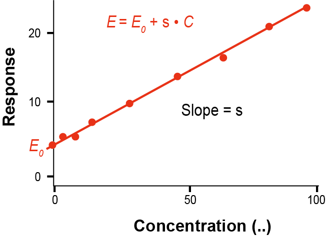
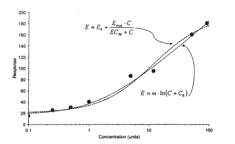
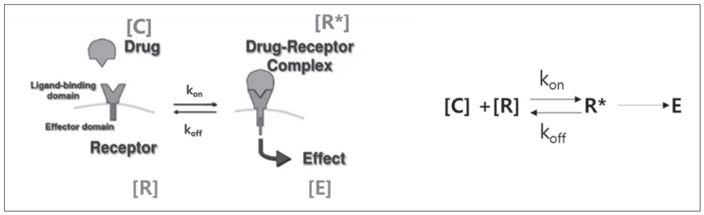
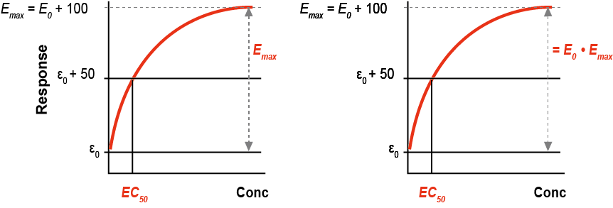
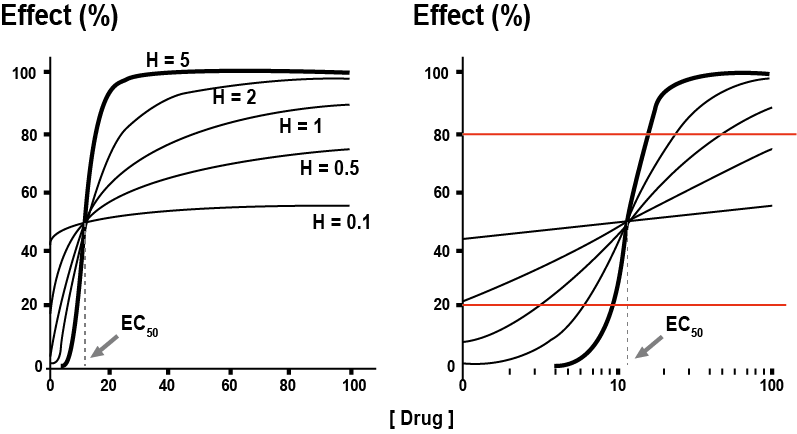
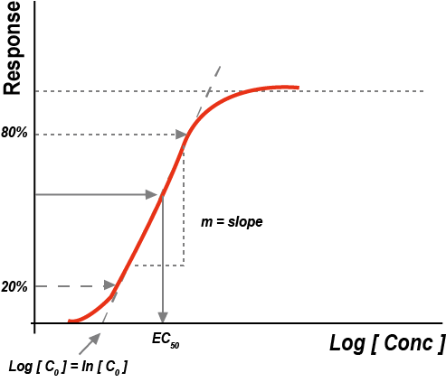
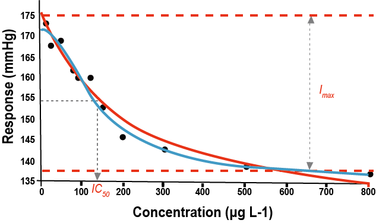
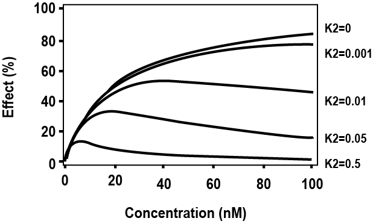

# 다양한 약물효과 모델링 {#effect-model}

\Large\hfill
배수현
\normalsize

---

약을 투여한 후 그 결과는 효과와 부작용으로 나타날 수 있으며, 다양한 형태로 표현될 수 있기 때문에 약물농도와 효과와의 관계를 설명하는 PD 모델은 PK 모델에 비해 복잡하며, PK/PD 모델링을 위해 PD 데이터 특성뿐만 아니라 PK와의 관계, 질병의 진행 등을 고려하여야 하므로 보다 높은 수준의 모델링 기술이 요구된다. 이 장에서는 약물 효과와 혈중농도와의 관계를 설명하는 PD 모델을 소개한다.

## PD 모델의 종류 {#pd-model}

PD 모델은 혈중농도와 약효와의 관계를 설명하기 위하여 사용된다. 약효를 설명하는 데이터의 종류 및 특성에 따라 PD 모델을 선택하며, 정확한 모델을 만들기 위해서는 PD 데이터의 특성을 잘 파악하여야 한다. PD 데이터는 혈압, 혈당 및 약물이 결합하는 특정 수용체(receptor)의 농도 변화 등과 같은 연속적인 데이터와 통증점수(pain score), 치료성공(0) 또는 실패 (1) 등과 같은 비연속적인 데이터로 구분될 수 있다. 이 단원에서는 연속적인 데이터를 설명하는 PD 모델의 종류에 대하여 소개한다.

### 선형모델(linear model)

선형모델은 약효와 약물농도를 일차식으로 설명하는, PD 모델 중 가장 단순한 모델이다. 약물농도와 약효가 단순 비례 또는 반비례 관계에 있어 약물농도 증가에 따라 일정 비율로 약효가 증가 또는 감소하는 경우이다.
\begin{equation}
E = E_0 + S \cdot C
(\#eq:linear)
\end{equation}

여기서 E는 약효, E~0~는 기저치(baseline), C는 약물농도를 나타내며, S는 기울기이다. 약효를 나타내는 반응에 있어 반응의 최대치(R~max~)가 존재하지 않으므로, 효소나 리간드의 결합과 같이 생리학적으로 반응의 최대치가 존재하여 포화과정이 일어나는 PD 데이터를 설명하기에는 적합하지 않은 모델이다. 약물의 작용기전을 고려할 때, 고농도에서 반응이 포화된다고 하더라도 가지고 있는 데이터가 선형성을 나타낸다면, 제한적으로 사용할 수 있으나, 구축된 선형모델을 이용하여 더 높은 농도에서의 약효 예측(extrapolation)에는 사용할 수 없다. 또한, 기저치가 존재한다면, E~0~ 값을 고정 또는 추정할 수 있다.\index{기울기 / gradient}\index{gradient / 기울기}

```{r linear-pd, fig.cap="(ref:linear-pd)", out.width = '70%'}

```

(ref:linear-pd) 선형 PD 모델 (dots: 관찰값, line: 예측값)

### 로그-선형모델(log-linear model)

농도범위가 큰 경우, 약효와 농도와의 관계가 로그-선형모델을 따를 수 있다. 이 경우, 농도(x 축)를 로그로 바꾸어 나타내면 아래와 같다.
\begin{equation}
E = m \cdot ln(C+A_0)
(\#eq:log-linear)
\end{equation}

여기서 기저치는 $E_0 = m \cdot ln(A_0)$로 쓸 수 있다. 로그-선형모델에서 약효는 지수적으로 증가하며 반응의 최대치(R~max~)는 존재하지 않는다. 약물의 기전상 약효가 R~max~에 도달하더라도, 관찰값에서 R~max~를 확인할 수 없으면 선형-로그모델을 사용할 수 있다. 이론상으로 E~max~ 모델(19.2.3 참고)을 따르는 경우라도, R~max~의 80% 범위 이내의 약효 데이터를 이용하여 PD 모델링을 한다면 반응과 농도와의 관계를 선형-로그모델로 설명할 수 있다.

```{r log-linear-model, fig.cap="(ref:log-linear-model)"}

```

(ref:log-linear-model) 로그-선형 모델 (dots: 관찰값, line: 선형로그모델의 예측값, dotted line: Emax모델의 예측값)

그림 \@ref(fig:log-linear-model)의 관찰값을 보면, 측정 농도 내에서 plateau가 보이지 않으며, 선형-로그모델을 이용한 예측선이 E~max~ 모델을 이용한 경우보다 고농도에서의 데이터를 더 잘 설명한다. 한가지 고려할 점은, $E_0 = m \cdot ln(C) + A_0$로 위 식을 사용하게 되면, 혈중농도가 1이하의 경우 효과가 음수로 나올 수 있으므로 주의하여야 한다. 또한, 선형 모델처럼, 모델 구축에 이용한 농도보다 더 높은 농도에서의 약효 예측(extrapolation)에는 사용할 수 없다.

### E~max~ model

약물 반응은 혈중 약물농도와 수용체와 약물간의 결합력에 따라 달라지며, 혈중 약물농도가 증가하면 반응은 그에 비례하여 증가하며, 일정 농도 이상이 되면 반응의 증가폭은 점점 감소하다가 반응의 최대치(R~max~)에 도달하게 된다. ^[참고로, R~max~는 약효를 설명하는 데이터 즉, 관찰값의 최대치를 말하며, E~max~는 약물농도에 따른 최대약물효과를 말한다.]

\begin{equation}
E = \frac{E_{max} \cdot [C]}{EC_{50} + [C]}
(\#eq:emax-model)
\end{equation}

E~max~ 모델을 이용하여 약물(또는 리간드)과 수용체의 결합에 따른 약효를 설명할 수 있다. E~max~ 모델의 수식 유도과정은 약물-수용체 결합을 참고 바란다.

```{block2, note-text, type='rmdtip', echo=TRUE}

**약물-수용체 결합**



수용체-리간드 반응을 통해 약효를 나타내며, 이 과정에는 몇 가지 가정이 존재한다.

1. 약물 [D], 수용체 [R], 약물-수용체 복합체 [R*]은 평형상태에 있으며, 이 반응은 가역적이다.
2. 약물과 수용체는 1:1로 결합한다. (예, 약물 1 mole이 수용체 1 mole과 결합한다)
3. 약물-수용체 복합체 [R*]은 약효(E)와 비례한다.

가정 1.에 의해,
\begin{equation}
\begin{split}
  C \cdot R \cdot k_{on} & = R \cdot k_{off} \\
  K_D & = \frac{k_{off}}{k_{on}} = \frac{[C][R]}{[R^*]} \\
  \frac{dR^*}{dt} & = k_{on} \cdot C \cdot R - k_{off} \cdot R^*
\end{split}
(\#eq:rate)
\end{equation}

(K~D~: 평형상태에서 약물-수용체 복합체의 해리상수)

가정 2.에 의하여 $[R^*]=[CR]$  이며, $[R_T] = [R] + [R^*]$이며, 
\begin{equation}
\begin{split}
  k_{on} \cdot C \cdot (R_T - R^*) - k_{off} \cdot R^* &= 0 \\
  C \cdot R_T - C \cdot R^* - K_D \cdot R^* &= 0 \\
  R^* = \frac{C \cdot R_T}{C + K_D} & 
\end{split}
(\#eq:rstar)
\end{equation}

가정 3.에 의하여 $E=\alpha \cdot [R^*]$이므로,
\begin{equation}
E = \alpha \cdot R^* = \frac{\alpha \cdot R_T \cdot C}{C + K_D}
(\#eq:alpha-rt)
\end{equation}

$E_{max} = \alpha \cdot [R_T]$라 하면,
\begin{equation}
E = \frac{E_{max} \cdot C}{C + K_D}
(\#eq:emax-alpha-rt)
\end{equation}

여기서, K~D~의 단위는 농도이며 (C와 동일), 약물 수용체의 50%가 결합한 상태에서의 약효(EC~50~)는 Emax/2 가 된다. 이를 위의 식에 대입하면,
\begin{equation}
\frac{E_{max}}{2} = \frac{E_{max} \cdot EC_{50}}{K_D + EC_{50}}
(\#eq:ec50-emax-half)
\end{equation}

이고 이를 정리하면, $K_D = EC_{50}$이다. 결국 다시 정리하면, Emax 모델은 다음과 같다.
\begin{equation}
E = \frac{E_{max} \cdot [C]}{EC_{50} + [C]}
(\#eq:final-emax-model)
\end{equation}

C는 수용체와 결합하는 약물 농도이나, 수용체가 존재하는 특정 부위의 약물농도를 직접적으로 측정하기 어려우므로, 혈중 약물농도와 상관관계가 있다고 가정하고 혈중약물농도 C로 대체한다. 경우에 따라, 수용체와 결합하는 조직의 약물농도를 설명하는 구획(compartment)을 PD 모델에 반영하면, C는 C~T~ (특정조직에서의 약물농도)로 대체할 수 있다. 

```

약물농도가 EC~50~에 비하여 매우 작으면 (EC~50~ \>\>C), 약효는 혈중 약물농도에 비례하지만 (E = (E~max~/EC~50~) · C), 약물농도가 EC~50~보다 크면(EC~50~ \<\< C), 약효는 포화되어, 약물농도에 관계없이 일정한 값을 가진다(E~max~). 그림 \@ref(fig:emax-model)에서 E~max~는 약물의 효능(efficacy)을 나타내며, EC~50~은 약물의 효력(potency)를 나타내는 지표이다. 또한, 약물농도를 로그로 치환하면 EC~50~을 명확하게 확인할 수 있으며, 데이터에 기저치가 존재하면 다음과 같이 나타낼 수 있다.
\begin{equation}
E \approx E_{0} + \frac{\ E_{\max}\lbrack C\rbrack}{EC_{50} + \lbrack C\rbrack}
(\#eq:base-final-emax-model)
\end{equation}

```{r emax-model, fig.cap="(ref:emax-model)"}
knitr::include_graphics("./assets/media-19/image5.png")
```

(ref:emax-model) Emax model (좌)선형농도, (우)로그농도

이 때, R~max~ = E~0~+100이며, EC~50~일 때 약물반응은 E~0~+50 이다. 만약, E~max~ 모델을 다음과 같이 나타내면,
\begin{equation}
E \approx E_{0} \cdot (1 + \frac{\ E_{\max}\left\lbrack C \right\rbrack}{EC_{50} + \left\lbrack C \right\rbrack})
(\#eq:rmax-e0)
\end{equation}

R~max~ = E~0~+100일때, 모델의 최대약물효과는 E~0~·E~max~가 된다 (그림 \@ref(fig:emax-comparison) (우)).

```{r emax-comparison, fig.cap="(ref:emax-comparison)"}

```

(ref:emax-comparison) E~max~ 모델의 비교 (좌) $E \approx E_{0} + \frac{\ E_{\max}\lbrack C\rbrack}{EC_{50} + \lbrack C\rbrack}$ (우) $E \approx E_{0} \cdot (1 + \frac{\ E_{\max}\left\lbrack C \right\rbrack}{EC_{50} + \left\lbrack C \right\rbrack})$

(ref:anta-emax) 길항제의 E~max~ 모델

```{r anta-emax, fig.cap="(ref:anta-emax)"}
knitr::include_graphics("./assets/media-19/image7.png")
```

PD 모델에 사용되는 약물이 길항제로 작용하는 약물이라면, 혈중약물농도와 약효와의 관계는 그림 \@ref(fig:anta-emax)와 같으며, 그때의 약효(E)는 다음과 같다.
\begin{equation}
E \approx E_{0} - \frac{\ I_{\max}\lbrack C\rbrack}{IC_{50} + \lbrack C\rbrack}
(\#eq:anta-emax-effect)
\end{equation}

### Sigmoid E~max~ model (Hill 방정식)

Sigmoid E~max~ model은 여러 결합부위를 가지고 있는 수용체와 약물 간의 관계를 설명하기 위해 사용된다. 약물과 수용체의 1:1 결합을 가정하는 일반적인 E~max~ model과 달리 n개의 약물 분자가 수용체의 작용부위와 결합한다.
\begin{equation}
E = \frac{\ E_{\max}{\lbrack C\rbrack}^{n}}{EC_{50}^{n} + {\lbrack C\rbrack}^{n}}
(\#eq:hill-n-molecule)
\end{equation}

여기서 n은 수용체와 결합하는 약물분자의 수를 의미하며, Hill 계수(Hill coefficient, H)라고도 한다.

```{r sigmoid-emax, fig.cap="(ref:sigmoid-emax)"}

```

(ref:sigmoid-emax) Sigmoid E~max~ model. H에 따른 E~max~ model의 형태 변화

Hill 계수는 농도와 효과의 비를 결정한다. 농도를 로그농도로 치환한 그림 \@ref(fig:sigmoid-emax) (우)에서, E~max~의 20\~80% 범위에서 약효는 직선성을 가진다. Hill 계수가 1이면, 일반적인 효과(E)는 E~max~ model을 따르며, n\>1이면, 곡선의 선형부분의 기울기가 가파르며, n\<1이면, 곡선의 선형부분의 기울기가 완만하다. 로그농도-효과 그래프에서 n은 직선범위의 기울기(m=n·E~max~/4)를 이용하여 구할 수 있다. (\* Sigmoid E~max~ model에서 n 구하기 참고) Hill 계수의 값에 관계없이 EC~50~은 동일하다.\index{기울기 / gradient}\index{gradient / 기울기}

(ref:sigmoid-emax-block2) Sigmoid E~max~ model: 로그농도-반응 그래프

```{r sigmoid-emax-block2, fig.cap="(ref:sigmoid-emax-block2)", out.width = '50%'}

```

```{block2, sigmoid-emax-block, type='rmdtip', echo=TRUE}

**Sigmoid E~max~ model에서 n 구하기**

로그농도 그래프(그림 \@ref(fig:sigmoid-emax-block2))에서
\begin{equation}
\begin{split}
E &= \frac{E_{max} \cdot e^{n \cdot ln(C)}}{EC_{50}^{n} + e^{n \cdot ln(C)}} \\
\frac{dE}{dln ( C )} &= \frac{\ n \cdot E_{max}  \cdot EC_{50}^{n} \cdot C^{n}}{\left( EC_{50}^{n} + C^{n} \right)^{2}}
\end{split}
(\#eq:log-conc)
\end{equation}

직선부위의 기울기를 m이라고 하고, C=EC~50~일 때의 m을 계산하면,\index{기울기 / gradient}\index{gradient / 기울기}
\begin{equation}
\begin{split}
  m &= \frac{{dE}}{{dln}\left( C \right)}\ = \frac{\ n \cdot E_{max } \cdot {EC}_{50}^{2n}}{\left( {EC}_{50}^{n} + {EC}_{50}^{n} \right)^{2}} = \ \frac{n \cdot E_{\max}}{4} \\
  n &= \frac{4 \cdot m}{E_{\max}}
\end{split}
(\#eq:ec50-m)
\end{equation}

```

## PD 모델의 적용

\@ref(pd-model)에서 PD 모델의 종류에 대하여 알아보았다. 몇 가지 예를 통하여 데이터의 종류와 상황에 따라 PD 모델을 어떻게 적용할지
살펴보자.

### 일반적인 I~max~ model vs. Sigmoid I~max~ model

그림 \@ref(fig:sigmoid-imax)은 혈중 약물농도의 변화에 따른 저해반응을 그래프로 나타내었다. 동일한 관찰값을 이용하여 각각 I~max~ model과 sigmoid I~max~ model을 사용하여 각 파라미터를 추정하고, 예측값을 그려보면, 그림에서 알 수 있듯이, sigmoid I~max~ model은 좀 더 유연성을 지니며, 데이터의 곡률을 더 잘 포착한다. 데이터의 특성(약물농도와 반응 관계가 약물의 기전상 1:1의 관계인지 아닌지) 등을 잘 파악하여, 모델 구축의 목적에 맞게 모델을 선정해야 할 것이다.

```{r sigmoid-imax, fig.cap="(ref:sigmoid-imax)"}

```

(ref:sigmoid-imax) 일반적인 I~max~ model(빨강)과 sigmoid I~max~ model(파랑)의 비교

### 다중 약물결합 모델(multiple binding site model)

약물이 결합하는 결합부위가 여러 개인 경우에 약효(E)는 다음과 같이 나타낼 수 있다.

$$
\require{mhchem}
\begin{equation}
  [C] + [R] 
  \xrightleftharpoons[k_{-1}]{k_1}
  [CR] + [C] 
  \xrightleftharpoons[k_{-2}]{k_2}
  [C2R]
(\#eq:multiplebinding3)
\end{equation}
$$

\begin{equation}
\begin{split}
Effect &= \frac{R_T \cdot Conc}{k_D + Conc + K_2 \cdot Conc^2} \\
R_T &= \text{total receptor content} \\
k_D &= \frac{k_{-1}}{k_1} \\ 
K_2 &= \frac{k_2}{k_{-2}}
\end{split}
(\#eq:multiplebinding2)
\end{equation}

여기서 R~T~는 총 수용체 수, K~d~는 약물-1차 수용체 복합체 해리상수(k~-1~/k~1~), K~2~는 약물-2차 수용체 복합체 결합상수(k~2~/k~-2~)를 의미한다. K~2~=0이면, 위의 식은 E~max~ model과 동일하며, K~2~의 값이 커질수록 2차 결합이 빨라지므로, E~peak~값이 작아지며, 농도가 증가할수록 효과(E)의 크기도 더 많이 감소한다 (그림 \@ref(fig:K2)).

```{r K2, fig.cap="(ref:K2)"}

```

(ref:K2) K~2~의 변화에 따른 약물농도-약효와의 관계

## 결론

올바른 PD 모델의 선정을 위해서는 무엇보다도 모델 구축에 사용될 데이터의 특성을 잘 파악해야 한다. 작용기전에 따른 약물반응의 관계를 명확하게 알고 있다면, PD 모델 선정이 비교적 쉬울 수 있으나, 그렇지 않은 경우이거나 희박 데이터(sparse data)를 사용할 경우, 잘못된 모델 선정을 통해 오류를 범하지 않도록 주의하여야 한다. 또한, 적절한 PD 모델을 선정하였다 하더라도 혈중농도와 약물반응의 관계에 시간지연 등이 있는지를 고려하여, 궁극적으로 가장 적절한 PK/PD 모델링을 수행해야 할 것이다.\index{sparse data / 희박자료}\index{sparse data / 희박자료}

<!--
참고문헌

1.  Gabrielsson J and Weiner D. Pharmacokinetic and pharmacodynamic data analysis. Concepts and Applications. 5~th~ edition. Apotekarsocieteten, 2016.
-->
