# 지연효과 모델

*김정렬／임동석*

## 지연효과 개요

약물 투여 시 기대하는 반응의 시간에 따른 양상이 해당 약물의 유효성분 혈중 농도 양상과 유사하게 나타나기도 하지만, 최대 혈중
농도 이후 상당한 시간이 경과한 시점에 최대 반응이 발생하는 경우도 있다. 이러한 지연효과는 투여 약물의 체내 노출을 대변하는
약동학(PK) 측면뿐만 아니라 그 노출에 따른 약리작용을 설명하는 약력학(PD) 측면의 여러 원인으로 발생할 수 있다.

우선 약동학적으로 혈액 내 존재하는 유효성분이 관찰된 반응과 관련된 부위(수용체 등)로 분포하는데 시간이 걸리는 경우를 생각할 수
있다. 또한 반응을 나타내는데 필수적인 약물-수용체 상호작용에 있어 최대 반응이 나타나는데 시간적인 지연이 있을 수 있다. 한편
약물이 목표로 하는 대상이 반응과 직접적으로 관련되기 보다는 그 반응을 증가시키거나 감소시키는데 필요한 것을 촉진하거나
억제함으로써 궁극적으로 시간에 따른 반응 양상을 조절하는 경우도 혈중 농도와 반응간 지연효과를 보이게 된다.

약물을 경구로 투여하면 투약 시점과 비교 시 혈중 농도가 지연되어 보이는 것처럼 수용체와 같은 약물이 목표로 하는 부위에서의
농도도 혈중 농도에 비해 지연될 수 있다. 그런데 혈중 농도와 달리 목표 부위에서의 농도는 쉽게 측정할 수 없어 이러한
지연 현상을 직접적으로 확인하기 어려운 경우가 대부분이다. 또한 목표 수용체 수준에서의 약물에 의한 조절로 인하여 시간에 따른
바이오마커 변화 양상이 지연되어 관찰될 수 있다. 한편 이러한 바이오마커의 변화가 직접적으로 임상적 변화를 초래하지 못하는
경우도 있다.

## 시간에 따른 PK-PD 관계

시간에 따른 PK-PD 관계가 즉시효과를 보이는 경우, 시간에 따른 농도와 효과간 관계를 도식화하면 최대 농도에서 최대 효과를
보이는 등 변화 양상이 유사하다. 이를 동일한 시점에서의 농도와 효과간 관계로 도식화하면 동일한 농도에서는 동일한 효과를
보이게 된다. 이에 반해, 지연효과를 보이는 약물의 경우 최대 농도와 최대 효과를 보이는 시점간 시간적인 지연이 발생한다.
또한 동일한 농도에서의 효과가 한가지로 정해져 있지 않고 농도가 증가하는 시점과 감소하는 시점에서 각각 다르게 나타나는
현상을 보인다 (그림 1).

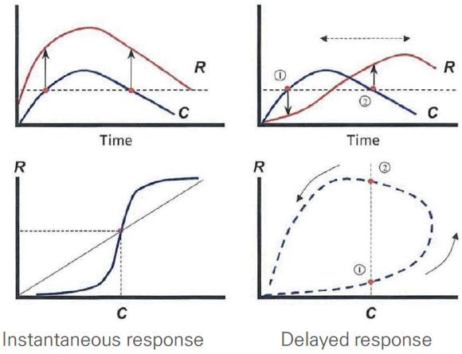

그림 1 PK와 PD의 관련성 \[1\]

이렇게 동일한 농도에서 관찰되는 효과가 농도가 증가하는 시점과 감소하는 시점에서 다르게 관찰되는 현상은 크게 두 종류로 나눌 수
있다. 이중 농도가 증가하는 시점에서의 효과가 감소하는 시점보다 작게 관찰되는 경우를 히스테레시스(hysteresis)라고
하며, 농도-효과 관계의 양상이 시간이 흐름에 따라 반시계방향으로 그려진다. 반면 농도가 증가하는 시점에서의 효과가
감소하는 시점보다 큰 양상을 보이는 경우 프로테레시스(proteresis)라 하며, 농도-효과 관계의 양상이
시계방향으로 그려진다. (그림 2)

약물이 목표 수용체 부위까지 분포하는데 시간이 걸리거나 기전적으로 약리작용을 나타나는데 지연이 있거나 수용체
up-regulation 현상이 발생하는 경우 hysteresis 현상을 관찰할 수 있다. 한편 해당 약물에 내성이 발생하거나
활성 대사체가 동일 수용체에 길항제로 작용하는 경우 프로테레시스 현상을 관찰할 수 있다.

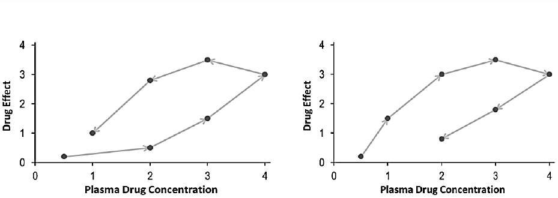

그림 2. 히스테레시스(반시계방향 히스테레시스)와 프로테레시스(시계방향 히스테레시스)

## 효과구획 모델

약물의 체내 노출을 대변하는 농도 중에서 혈중 농도는 쉽게 측정할 수 있는 반면 수용체처럼 약물이 실제 작용을 나타내는 부위에서의
농도는 측정하는데 현실적 제약이 많다. 그런데 직접 측정하지 않았더라도 약물이 작용 부위로 분포한다는 점에 착안하여 이 부위를
가상의 공간인 효과구획으로 설정한 모델을 구축할 수 있으며, 이를 효과구획 모델이라고
한다. 약이 혈액에서 효과구획까지 분포되는데 시간이 걸려서 혈중농도의 변화보다 약효의 변화가 느리게 나타나는 반시계방향 히스테레시스가 발생한다고 설명하는 것이 효과구획 모델이다． 예컨데 아래 그림과 같이 말초정맥에 ｂｏｌｕｓ로 약을 주사했을 때， 약효구획의 약물농도 （Ｃｅ）는 천천히 변화하며， 그 Ｃｅ와 약효와의 관계가 ｓｉｇｍｏｉｄ Ｅｍａｘ를 따를 때 관찰되는 약효의 시간에 따른 변화는 맨 우측과 같게 된다．(그림
3)

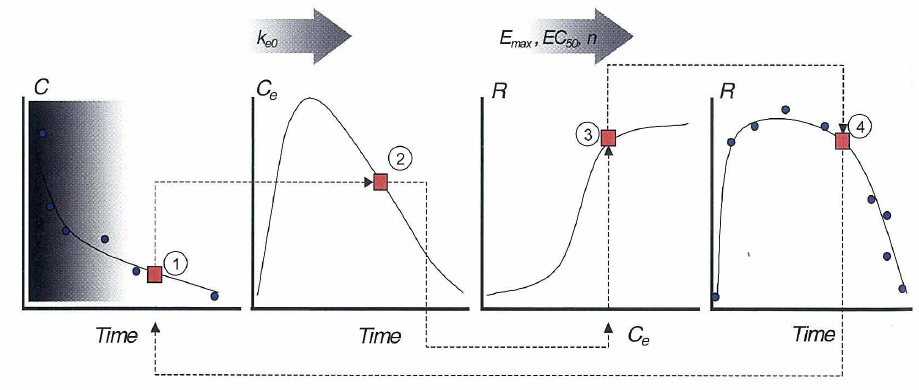

그림 3. 효과구획의 도식 (C: plasma concentration (Actually observed), Ce: effect
compartment concentration (NOT observed, produced), R: response
(Actually observed) \[1\]

이 효과구획 모델에서 시간에 따른 혈중 농도와 효과의 관계는 지연효과가 있어 보이지만, 약물의 실제 작용 부위 농도와 효과의
관계는 지연이 없는 즉시효과 양상을 보이는 경우가 많다. 이 모델을 NONMEM에서 구현하는
방법은 여러 가지가 있는데 １구획 모델로 분포하는 약이라고 가정할 때， 두 가지 예를 소개한다． 아래 코드의 핵심은 중앙구획에서 효과구획으로의 약물의 이동이 극히 소량（Ｋ１２＝０．００１＊Ｋ）이어서 혈장농도 모델링에 영향이 극히 미미하고，효과구획으로의 분포가 완료되면 혈장과 효과구획에서의 약물농도가 동일하게 된다는 것이다．(그림
4) 

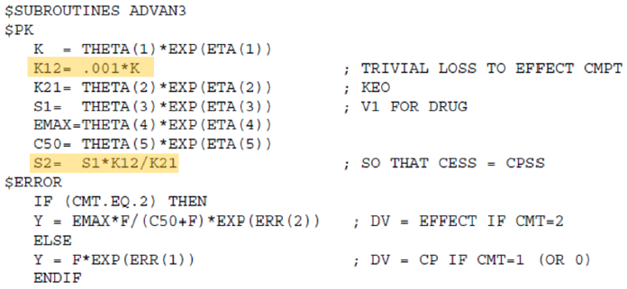

그림 4. 효과구획 모델 코드: PREDPP Linear Model (ADVAN3, Two compartment) \[2\]

또다른 방식으로는 아래 코드(그림
5)와 같이 중심구획에서 약물이 제거되는 속도는 Ｋ１０으로 표현되지만， 중심구획의 약물의 양이나 농도가 효과구획으로 약물이 분포하는 것으로 인해 영향을 받는 현상이 아예 일어나지 않도록 해 놓고（ＤＡＤＴ（１）의 수식에 Ｋ１０이외에 다른 속도상수가 나타나지 않고 있음）대신 효과구획의 약물농도는 Ｋ２０이라는 속도상수에 의해 중심구획으로부터 들어와서 올라가고， 같은 속도상수로 제거된다고 가정한다． 위에 예시된 코드와의 또다른 차이는 효과구획에서 약이 중심구획으로 되돌아가지 않고 아예 사라져 버린다고 가정하는 것인데，이는 결국 중심구획의 약물농도에 어떤 영향도 끼치지 않는다는 가정에 충실하기 위한 것이다． 아래 코드의 Ａ（２）는 효과구획의 약물의 양이 아니라 농도임을 유의해야
한다．  

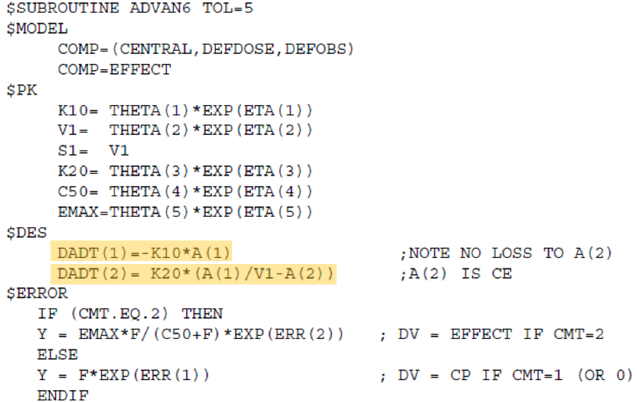

그림 5. 효과구획 모델 코드: Using General Nonlinear model (ADVAN6) \[2\]

## 직접효과 vs. 간접효과

관찰된 반응이 약물-수용체 상호작용에 의해 직접적으로 설명할 수 있을 때 직접효과 양상이라고 말하고, 상호작용 후 이차적인 작용에
의한 경우라면 간접효과 양상을 보인다고 한다. 특히 간접효과 양상에서는 관찰된 반응 자체가 아닌 그 반응을 증가 또는 감소시키는
역할을 하는 대상이 약물에 의한 약리작용의 직접적인 목표인 경우가 흔하다 (그림 6).

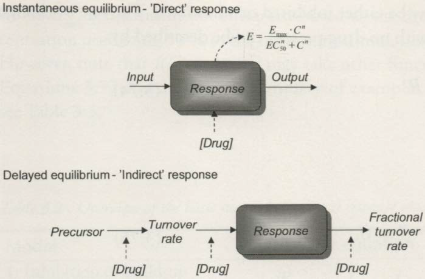

그림 6. 직접효과와 간접효과의 모식도 \[1\]

## Turnover 모델

약물 투여 후 관찰된 반응 자체가 아닌 이를 조절하는 대상이 약물의 직접적인 목표이고 이를 통해 궁극적으로 반응이 증가되거나
감소되는 간접효과 양상은 turnover 모델로 설명할 수 있다. 아래 미분방정식에서 R은 특정 시점에서 관찰된 반응을
뜻하고, Kin은 반응을 증가시키는 속도를 설명하는 0차 속도상수이며, kout은 반응을 감소시키는데 관여하는 1차 속도상수를
의미한다.

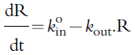

관찰되는 반응을 증가시키거나 감소시키는 두 가지 방향이 있고 이러한 반응이 나타나도록 조절하는 대상에 대하여 각각 촉진하거나
억제하는 두 가지 작용을 생각할 수 있으므로, 이를 조합하면 간접효과 모델은 아래 그림 7에서 보듯 4가지 형태로
구분된다.

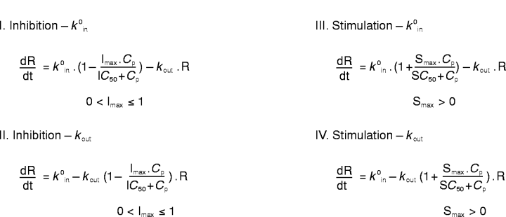

그림 7 Turnover 모델(간접효과 모델)의 네 가지 \[3\]

### Inhibition on production (Model I)

관찰된 반응이 증가되는 걸 약물이 억제하는 경우를 말하며, H2 수용체 길항제에 의한 위산분비 억제를 예로 들 수 있다.
생리적으로 H2 수용체 자극에 의해 위산 분비가 증가되는데 약물이 이러한 H2 수용체를 통한 상호작용을
차단함으로써 궁극적으로 위산 분비를 억제하게 된다. 이런 간접효과 모델은 반응 증가와 관련된 Kin에 억제
함수가 적용된 식으로 표현될 수 있고 아래와 같은 NONEMEM 코드를 사용할 수 있다. (그림 8)

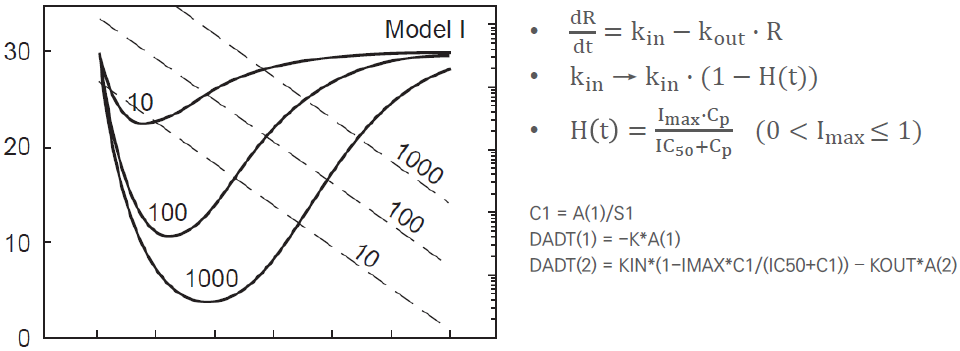

그림 8. Inhibition on production \[3\]

### Inhibition on loss (Model II)

관찰된 반응이 감소되는 걸 약물이 억제하는 경우를 말하며, 혈중 acetylcholine 농도 증가를 위해
cholinesterase 길항제를 투여하는 것이 이에 해당된다. 신경전달물질 역할을 하는 acetylcholine은
cholinesterase에 의해 분해되지만, 이 분해 효소의 기능을 억제함으로써 acetylcholine 농도를 높일 수 있다.
이런 간접효과 모델은 반응 감소와 관련된 Kout에 억제 함수가 적용된 식으로 표현될 수 있고 아래와 같은 NONEMEM 코드를
사용할 수 있다. (그림 9)

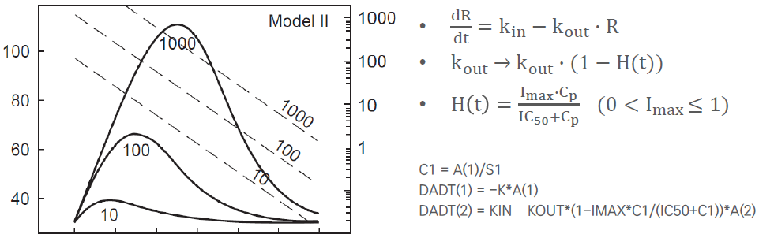

그림 9. Inhibition on loss \[3\]

### Stimulation on production (Model III)

관찰된 반응이 증가되는 걸 약물이 촉진하는 경우를 말하며, erythropoietin이 혈중 적혈구의 전구물질을 증가시켜
궁극적으로 적혈구를 증가시키는 현상이 이에 부합한다. 실제 관측한 것은 적혈구 수치인데
erythropoietin은 직접적으로 이 수치를 증가시키는 것이 아니라, 그 전구물질의 양을 증가시킴으로써 궁극적으로 적혈구
수치를 증가시키게 된다. 이런 간접효과 모델은 반응 증가와 관련된 Kin에 촉진 함수가 적용된 식으로 표현될 수 있고
아래와 같은 NONEMEM 코드를 사용할 수 있다. (그림 10)

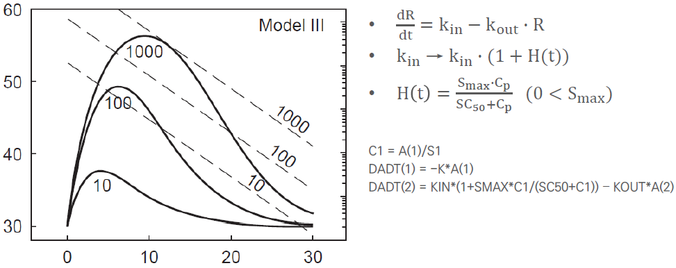

그림 10. Stimulation on production \[3\]

### Stimulation on loss (Model IV)

관찰된 반응이 감소되는 걸 약물이 촉진하는 경우를 말하며, PPARγ 작용제 투여로 인한 혈당 감소가 이에 해당된다고 볼 수
있다. PPARγ 주요 약리작용은 혈당을 직접 감소시키는 insulin의 작용을 증강시키는 것이다. 이런 간접효과 모델은
반응 감소와 관련된 Kout에 촉진 함수가 적용된 식으로 표현될 수 있고 아래와 같은 NONEMEM 코드를 사용할 수 있다.
(그림 11)

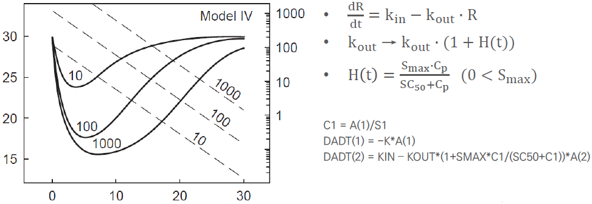

그림 11. Stimulation on loss [@sharma1998characteristics]

### 기저값

간접효과 모델에서 약물 투여 전 상태에서의 반응을 기저값으로 간주하며, 반응이 증가하거나 감소하는 정도가 동일하여 겉보기에는
변화가 없는 것처럼 보인다. 앞서 언급한 간접효과 미분방정식으로부터 유도한 기저값은 아래와 같다.

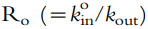

이러한 기저값은 Kin, Kout과 달리 관찰이 가능한 경우가 많기 때문에 모델링 과정에서 초기값을 설정하는데 유용할 수 있다.

참고문헌

1\. Pharmacokinetic and Pharmacodynamic Data Analysis: Concepts and
Applications, Fourth Edition 4th Edition by Johan Gabrielsson (Author),
Daniel Weiner

2\. NONMEM Users Guide Part VIII (Nov. 2013)

3\. Sharma A, Jusko WJ. Characteristics of Indirect Pharmacodynamic
Models and Applications to Clinical Drug Responses. Br J Clin Pharmacol.
45 (3), 229-39 Mar 1998
