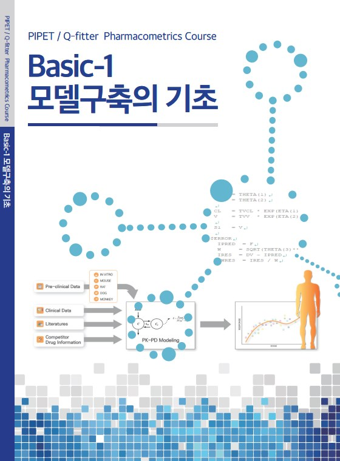

# 계량약리학 워크샵 - 초급 과정 

본 도서는 [부크크(bookk.co.kr)](http://www.bookk.co.kr/book/view/84646), [알라딘(aladin.co.kr)](http://aladin.kr/p/UNBXB), [YES24(yes24.com)](http://www.yes24.com/Product/Goods/91747331)에서 "계량약리학 워크샵"으로 검색하여 구입할 수 있습니다. (ISBN 979-11-372-1390-6)

## 도서 정보

혼합효과 모델링(mixed-effects modeling)은 신약개발과 임상시험, 시판허가 등의 주요 의사결정에 필수적으로 쓰이고 있는 계량약리학적 접근법의 핵심적인 기법으로서 그 기본개념을 익히는 것이 결코 쉽지 않습니다. 2009년부터 매년 개최해 온 PK/PD 워크샵의 내용 중에서 basic-1과 2의 교재를 입문자들이 스스로 학습할 수 있도록 한권의 책으로 펴냈습니다. 약동-약력학 모델링을 위해 가장 널리 사용하는 NONMEM 소프트웨어를 활용하기 위에 알아야 하는 기본개념들과 그 사용법을 소개합니다.

## 목차

- I. 모델 구축의 기초
    - Chapter 01 계량약리학과 관련 개념들 - 임동석
    - Chapter 02 NONMEM 데이터셋 - 이소진
    - Chapter 03 모델 유형 별 NONMEM 제어구문 소개 - 배수현
    - Chapter 04 특수 ADVAN을 이용한 control stream의 코딩 - 전상일
    - Chapter 05 일반 ADVAN을 이용한 control stream의 코딩 - 홍태곤
    - Chapter 06 기타 ADVAN - 임동석
    - Chapter 07 $PRED: ADVAN을 쓰지 않는 코딩 - 임동석
    - Chapter 08 초기추정값 - 한승훈
    - Chapter 09 파라미터 추정 방법 및 세팅 - 김정렬
    - Chapter 10 NONMEM 실행결과 해석 및 Xpose4 사용법 - 전상일
    - Chapter 11 공변량 분석 - 한승훈
- II. 모델 진단 및 약동학-약력학 연계 모델
    - Chapter 12 모델 진단평가 개론 - 한승훈
    - Chapter 13 모델 적합 상태에 대한 진단 - 전상일
    - Chapter 14 NONMEM의 $COVARIANCE - 배균섭
    - Chapter 15 모델 파라미터의 적절성 - 전상일
    - Chapter 16 모델의 예측성능 평가 - 한성필
    - Chapter 17 약동-약력(PK-PD) 모델링의 이론적 기초 - 임동석
    - Chapter 18 약동,약력학 연결 방법 - 이소진
    - Chapter 19 다양한 약물효과 모델 - 배수현
    - Chapter 20 지연효과 모델 - 김정렬, 임동석

## 저자 소개

임동석, MD, PhD  
가톨릭의대 약리학교실

이소진, PharmD  
Q-fitter

배수현, PhD  
Q-fitter

전상일, MD, PhD  
Q-fitter

홍태곤, MD, PhD  
서울부민병원 임상시험센터

한승훈, MD, PhD  
가톨릭의대 약리학교실

김정렬, MD, PhD   
삼성서울병원 임상약리학과

배균섭, MD, PhD   
서울아산병원 임상약리학과

한성필, MD, PhD   
가톨릭의대 약리학교실

## PIPET

> 가톨릭계량약리학연구소, Pharmacometrics Institute for Practical Education & Training

임상약리학의 중추적 영역인 계량약리학(Pharmacometrics) 분야를 주요 연구 주제로 하는 우리나라 최초의 연구소로 2014년 개소하였습니다.
가톨릭의대 약리학교실 소속의 임상약리학 분야 교수진은 이전에도 다수의 계량약리학 관련 연구 및 산학연계 프로젝트 등을 수행하고 있지만, 국내 신약 개발 산업 확대, 임상 상황에서 개인별 약물요법의 중요성 증대 등 급증하는 계량약리학 수요에 부응하고자, 보다 선진적인 서비스 제공 및 신뢰성 있는 전문가 양성이라는 목적으로 PIPET을 설립하게 되었습니다.

현재 PIPET은 계량약리학 연구 방법론 개선, 선진 계량약리학 기법 도입, 사용자 친화적 계량약리학 소프트웨어 개발, 신약 개발 및 임상 상황에서 약물 요법에 대한 정량적 근거 마련 등의 업무를 수행하고 있으며, 학위 과정, 제약사 인력 교육 프로그램, 주기적 계량약리학 워크샵 개최 등을 통해 전문가를 적극 양성하고 있습니다.

또한, 서울성모병원 임상약리과와 함께 데이터 확보와 해석이 동시에 이루어질 수 있는 효율적인 연구 체계를 구축하고 있으며, 이를 기반으로 국내 신약 연구 및 약물요법 개선을 위해 노력하고 있습니다.

## Author Guidelines

### 편집 관련

1. Rmarkdown (`*.Rmd`) 형식으로 원고를 작성합니다. `01.Rmd`, `02.Rmd`, `03.Rmd` 등으로 파일 이름을 작성합니다.
    - 마이크로소프트 워드를 사용할 수도 있으나 pandoc을 사용하여 변환하는 과정을 거쳐야 하므로 피치 못할 경우에 사용한다.
2. 그림 파일은 파워포인트로 작업하여 pdf 형태로 저장하는 것을 우선시 합니다.
    - 폰트는 Arial, 나눔고딕을 선호합니다.
3. 표 파일은 엑셀로 작업하여 csv 형태로 저장하는 것을 우선시 합니다.
    - 복잡한 표 형태에 대해서는 `kableExtra` 패키지를 사용해야 합니다.
    - 예: 표에서 Footnote 사용: 03.Rmd

### Adobe Acrobat Pro DC를 통한 부크크 전달 파일 생성

- LaTeX krantz.cls를 통해 제작된 pdf 파일의 크기는 A4입니다. 
- Trim Mark 등을 제거하고, A5 (`148 x 210 mm`, 148/210 = 0.705) 와 같은 비율을 얻어야 합니다.
- 이를 위해 `177 x 252 mm`, 177/252=0.702의 Adobe Acrobat DC (접속정보: cmccpt@catholic.ac.kr / P****7***!)을 사용합니다.
- Crop margin - final : 14 31 13 20mm (홀) 14 31 20 13mm (짝) 각각 전체 페이지에 적용합니다.
- (부크크용 PDF 제작시에만 적용) 이후 A5 용지로 PDF 프린트 하며, 80% 비율로 프린트 한다.

## Cover 제작용 비율 

```r
(back <- 16.235) # 268 페이지
(width <- 3+100+148+back+148+100+3)
(height <- 3+210+3)

(width <- 3+100+148+back+148+100+3)
# [1] 518.235
(height <- 3+210+3)
# [1] 216
width/height
# [1] 2.399236
```
